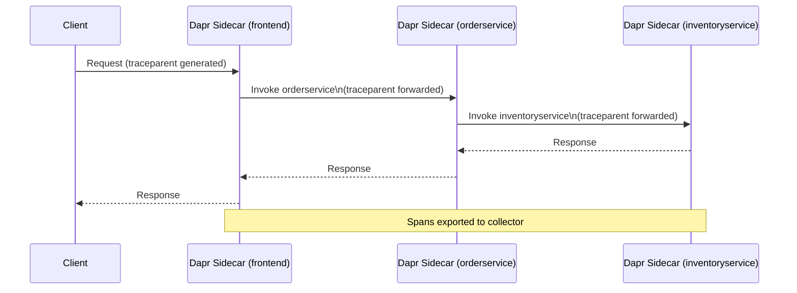

# How to Trace Service Invocation Calls Across Dapr Applications

Author: [nawazdhandala](https://www.github.com/nawazdhandala)

Tags: Dapr, Tracing, Observability, OpenTelemetry, Service Invocation

Description: Learn how to enable and visualize distributed tracing for Dapr service invocation calls using OpenTelemetry, Zipkin, and Jaeger across multiple applications.

---

## Introduction

Distributed tracing lets you follow a single request as it travels through multiple microservices. Dapr has built-in support for W3C TraceContext propagation and can export traces to any OpenTelemetry-compatible backend. This guide shows you how to enable tracing for service invocation calls and visualize the results in Zipkin or Jaeger.

## How Dapr Propagates Trace Context



Dapr automatically:
- Creates a root span for the first incoming request.
- Propagates `traceparent` and `tracestate` headers for all outgoing service invocation calls.
- Exports spans to the configured exporter.

## Enabling Tracing with a Dapr Configuration

### Zipkin

Deploy Zipkin:

```bash
docker run -d -p 9411:9411 openzipkin/zipkin
```

Create a Dapr Configuration resource:

```yaml
apiVersion: dapr.io/v1alpha1
kind: Configuration
metadata:
  name: tracing-config
  namespace: default
spec:
  tracing:
    samplingRate: "1"
    zipkin:
      endpointAddress: http://zipkin:9411/api/v2/spans
```

`samplingRate: "1"` traces 100% of requests. In production, use `"0.1"` for 10%.

### OpenTelemetry Collector

```yaml
apiVersion: dapr.io/v1alpha1
kind: Configuration
metadata:
  name: tracing-config
  namespace: default
spec:
  tracing:
    samplingRate: "1"
    otel:
      endpointAddress: http://otel-collector:4317
      isSecure: false
      protocol: grpc
```

Apply the configuration to your deployments:

```yaml
annotations:
  dapr.io/enabled: "true"
  dapr.io/app-id: "frontend"
  dapr.io/config: "tracing-config"
```

## Self-Hosted: Enabling Tracing with dapr run

Create a local configuration file `config.yaml`:

```yaml
apiVersion: dapr.io/v1alpha1
kind: Configuration
metadata:
  name: tracing-config
spec:
  tracing:
    samplingRate: "1"
    zipkin:
      endpointAddress: http://localhost:9411/api/v2/spans
```

Run your app referencing the config:

```bash
dapr run \
  --app-id frontend \
  --app-port 3000 \
  --config ./config.yaml \
  -- node app.js
```

## Viewing Trace Data in Zipkin

After running a few service invocation calls:

```bash
# Trigger the trace
curl http://localhost:3500/v1.0/invoke/orderservice/method/orders \
  -H "Content-Type: application/json" \
  -d '{"item": "laptop"}'

# Open Zipkin UI
open http://localhost:9411
```

Search for traces by service name (`frontend`) and you will see the full call tree across all Dapr applications.

## Jaeger Setup

Deploy Jaeger all-in-one:

```bash
kubectl apply -f https://raw.githubusercontent.com/jaegertracing/jaeger-operator/main/deploy/crds/jaegertracing.io_jaegers_crd.yaml
kubectl apply -f - <<EOF
apiVersion: jaegertracing.io/v1
kind: Jaeger
metadata:
  name: jaeger
EOF
```

Point Dapr to Jaeger's OTLP endpoint:

```yaml
spec:
  tracing:
    samplingRate: "1"
    otel:
      endpointAddress: http://jaeger-collector:4317
      isSecure: false
      protocol: grpc
```

## Adding Custom Spans in Your Application

Dapr propagates the W3C trace headers, so you can extend the trace with your own spans using any OpenTelemetry SDK:

```python
from opentelemetry import trace
from opentelemetry.propagate import extract

tracer = trace.get_tracer("orderservice")

def handle_order(request):
    # Extract trace context from Dapr-forwarded headers
    context = extract(request.headers)
    with tracer.start_as_current_span("process-order", context=context) as span:
        span.set_attribute("order.item", request.json["item"])
        # ... process order
        return {"orderId": "abc-123"}
```

## Trace Headers Dapr Uses

| Header | Purpose |
|--------|---------|
| `traceparent` | W3C TraceContext - carries trace ID and span ID |
| `tracestate` | Vendor-specific trace state |
| `X-B3-TraceId` | Zipkin B3 (also supported) |
| `X-B3-SpanId` | Zipkin B3 span ID |

## Verifying Trace Propagation

```bash
# Check that Dapr sidecar is exporting spans
kubectl logs deployment/frontend -c daprd | grep -i "trace"

# Verify configuration is loaded
kubectl get configuration tracing-config -o yaml

# Test a service invocation and watch Zipkin
curl http://localhost:3500/v1.0/invoke/orderservice/method/health
```

## Sampling Strategies

```yaml
spec:
  tracing:
    # Sample all requests (development)
    samplingRate: "1"

    # Sample 10% (production)
    # samplingRate: "0.1"

    # Disable tracing
    # samplingRate: "0"
```

## Summary

Dapr automatically propagates W3C TraceContext headers across all service invocation calls, requiring zero code changes in your applications. Enable tracing by creating a Dapr Configuration resource pointing to Zipkin, Jaeger, or an OpenTelemetry Collector. Set an appropriate `samplingRate` for your environment, annotate deployments with `dapr.io/config`, and use OpenTelemetry SDKs in your application code to add custom spans. The result is a complete distributed trace spanning every Dapr sidecar in your call chain.
