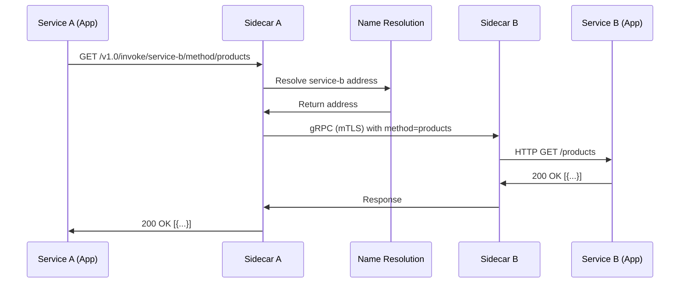

# How to Use Dapr Service Invocation to Call Other Services

Author: [nawazdhandala](https://www.github.com/nawazdhandala)

Tags: Dapr, Service Invocation, Microservice, HTTP, Service Discovery

Description: Learn how to use Dapr service invocation to call other microservices with built-in service discovery, retries, mTLS, and distributed tracing.

---

## What Is Dapr Service Invocation?

Dapr service invocation allows microservices to call each other using a logical app ID instead of hardcoded hostnames or IP addresses. The Dapr sidecar handles service discovery, load balancing, retries, timeouts, and mTLS automatically. Your application calls `localhost:3500` and Dapr routes the request to the correct service.

## How Service Invocation Works



## Prerequisites

- Dapr CLI installed and initialized
- Two applications running with Dapr sidecars
- Default components configured

## Calling a Service with HTTP

The invocation endpoint follows this pattern:

```text
POST/GET/PUT/DELETE http://localhost:3500/v1.0/invoke/{app-id}/method/{method-name}
```

The HTTP method and body are forwarded to the target service.

### Example: calling a checkout service from an order service

```bash
curl -X POST http://localhost:3500/v1.0/invoke/checkout/method/orders \
  -H "Content-Type: application/json" \
  -d '{"orderId": "123", "items": [{"sku": "ABC", "qty": 2}]}'
```

## Building the Target Service

The target service needs to expose an HTTP endpoint. It receives the call as a regular HTTP request.

### Python (Flask) target service

```python
from flask import Flask, request, jsonify

app = Flask(__name__)

@app.route('/orders', methods=['POST'])
def create_order():
    order = request.get_json()
    print(f"Received order: {order}")
    return jsonify({"status": "created", "orderId": order["orderId"]}), 201

if __name__ == '__main__':
    app.run(port=5001)
```

Start it with Dapr:

```bash
dapr run --app-id checkout --app-port 5001 -- python checkout.py
```

### Node.js (Express) target service

```javascript
const express = require('express');
const app = express();
app.use(express.json());

app.post('/orders', (req, res) => {
  const order = req.body;
  console.log('Order received:', order);
  res.status(201).json({ status: 'created', orderId: order.orderId });
});

app.listen(3001, () => console.log('Checkout service on port 3001'));
```

```bash
dapr run --app-id checkout --app-port 3001 -- node checkout.js
```

## Calling a Service with Code

### Python caller

```python
import requests
import os

DAPR_HTTP_PORT = os.environ.get("DAPR_HTTP_PORT", "3500")

def create_order(order_data):
    url = f"http://localhost:{DAPR_HTTP_PORT}/v1.0/invoke/checkout/method/orders"
    response = requests.post(url, json=order_data)
    response.raise_for_status()
    return response.json()

result = create_order({"orderId": "456", "items": [{"sku": "XYZ", "qty": 1}]})
print(result)
```

### Go caller

```go
package main

import (
    "bytes"
    "encoding/json"
    "fmt"
    "net/http"
    "os"
)

func invokeService(appID, method string, body interface{}) (*http.Response, error) {
    port := os.Getenv("DAPR_HTTP_PORT")
    if port == "" {
        port = "3500"
    }
    url := fmt.Sprintf("http://localhost:%s/v1.0/invoke/%s/method/%s", port, appID, method)
    data, _ := json.Marshal(body)
    return http.Post(url, "application/json", bytes.NewBuffer(data))
}

func main() {
    order := map[string]interface{}{
        "orderId": "789",
        "items":   []map[string]interface{}{{"sku": "DEF", "qty": 3}},
    }
    resp, err := invokeService("checkout", "orders", order)
    if err != nil {
        panic(err)
    }
    fmt.Println("Status:", resp.Status)
}
```

## Passing Headers and Query Parameters

Headers are forwarded to the target service. Query parameters are appended to the method path:

```bash
curl "http://localhost:3500/v1.0/invoke/catalog/method/products?category=electronics&limit=10" \
  -H "Authorization: Bearer mytoken"
```

## Invoking via the Dapr SDK

### Python SDK

```python
from dapr.clients import DaprClient

with DaprClient() as client:
    response = client.invoke_method(
        app_id='checkout',
        method_name='orders',
        data=b'{"orderId": "123"}',
        content_type='application/json',
        http_verb='POST'
    )
    print(response.text())
```

## Configuring Resiliency

You can configure retry and circuit breaker policies for service invocation using a Resiliency resource:

```yaml
apiVersion: dapr.io/v1alpha1
kind: Resiliency
metadata:
  name: myresiliency
spec:
  policies:
    retries:
      retryThreeTimes:
        policy: constant
        duration: 5s
        maxRetries: 3
    circuitBreakers:
      simpleCB:
        maxRequests: 1
        interval: 8s
        trip: consecutiveFailures >= 5
  targets:
    apps:
      checkout:
        retry: retryThreeTimes
        circuitBreaker: simpleCB
```

## Summary

Dapr service invocation provides a location-transparent way for microservices to call each other. By routing calls through the local sidecar at `localhost:3500/v1.0/invoke/{app-id}/method/{method}`, Dapr handles service discovery, mTLS encryption, retries, and distributed tracing without any changes to your application logic.
