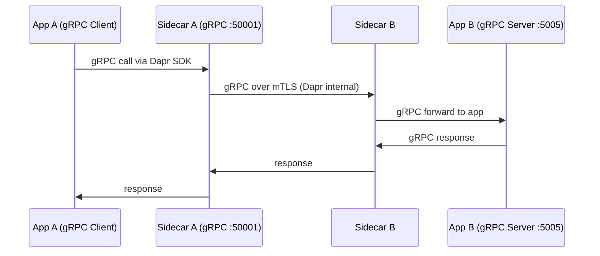

# How to Set Up Dapr Service-to-Service Communication with gRPC

Author: [nawazdhandala](https://www.github.com/nawazdhandala)

Tags: Dapr, gRPC, Service Invocation, Microservice, Protobuf

Description: Configure Dapr service-to-service communication using gRPC for high-performance, typed inter-service calls with automatic mTLS and service discovery.

---

## Overview

Dapr supports gRPC as a first-class protocol for service-to-service invocation. When your app exposes a gRPC server, the Dapr sidecar proxies gRPC calls between services in the same way it handles HTTP, with mTLS, service discovery, retries, and distributed tracing built in.

## How gRPC Service Invocation Works



## Prerequisites

- Dapr CLI initialized
- Protocol Buffers compiler (`protoc`) installed
- gRPC libraries for your language
- Two apps with Dapr sidecars

## Step 1: Define the Protobuf Service

```protobuf
// greeter.proto
syntax = "proto3";

package greeter;

option go_package = "./greeter";

service Greeter {
  rpc SayHello (HelloRequest) returns (HelloReply);
}

message HelloRequest {
  string name = 1;
}

message HelloReply {
  string message = 1;
}
```

Generate Go code:

```bash
protoc --go_out=. --go-grpc_out=. greeter.proto
```

## Step 2: Build the gRPC Server (Service B)

```go
// server/main.go
package main

import (
    "context"
    "log"
    "net"

    pb "github.com/example/greeter"
    "google.golang.org/grpc"
)

type server struct {
    pb.UnimplementedGreeterServer
}

func (s *server) SayHello(ctx context.Context, req *pb.HelloRequest) (*pb.HelloReply, error) {
    return &pb.HelloReply{Message: "Hello, " + req.Name + "!"}, nil
}

func main() {
    lis, err := net.Listen("tcp", ":5005")
    if err != nil {
        log.Fatalf("failed to listen: %v", err)
    }
    s := grpc.NewServer()
    pb.RegisterGreeterServer(s, &server{})
    log.Printf("gRPC server listening on :5005")
    if err := s.Serve(lis); err != nil {
        log.Fatalf("failed to serve: %v", err)
    }
}
```

Start with Dapr using `--app-protocol grpc`:

```bash
dapr run \
  --app-id greeter-service \
  --app-port 5005 \
  --app-protocol grpc \
  --dapr-grpc-port 50002 \
  -- go run server/main.go
```

## Step 3: Call the gRPC Service via Dapr

### Option A: Using the Dapr gRPC Proxy

The Dapr sidecar exposes a gRPC proxy on port `50001`. Clients connect to the sidecar and call the target service as if they were calling it directly, but they add metadata to identify the target app.

```go
// client/main.go
package main

import (
    "context"
    "fmt"
    "log"

    pb "github.com/example/greeter"
    "google.golang.org/grpc"
    "google.golang.org/grpc/metadata"
)

func main() {
    // Connect to the local Dapr gRPC sidecar
    conn, err := grpc.Dial("localhost:50001", grpc.WithInsecure())
    if err != nil {
        log.Fatal(err)
    }
    defer conn.Close()

    client := pb.NewGreeterClient(conn)

    // Add dapr-app-id metadata to route to the correct service
    ctx := metadata.AppendToOutgoingContext(
        context.Background(),
        "dapr-app-id", "greeter-service",
    )

    resp, err := client.SayHello(ctx, &pb.HelloRequest{Name: "Alice"})
    if err != nil {
        log.Fatal(err)
    }
    fmt.Println(resp.Message)
}
```

Start the client with Dapr:

```bash
dapr run \
  --app-id greeter-client \
  --dapr-grpc-port 50001 \
  -- go run client/main.go
```

### Option B: Using the Dapr Go SDK

```go
package main

import (
    "context"
    "fmt"
    "log"

    dapr "github.com/dapr/go-sdk/client"
)

func main() {
    client, err := dapr.NewClient()
    if err != nil {
        log.Fatal(err)
    }
    defer client.Close()

    resp, err := client.InvokeMethodWithContent(
        context.Background(),
        "greeter-service",
        "SayHello",
        "grpc",
        &dapr.DataContent{
            ContentType: "application/json",
            Data:        []byte(`{"name": "Bob"}`),
        },
    )
    if err != nil {
        log.Fatal(err)
    }
    fmt.Println(string(resp))
}
```

## Python gRPC Example

Generate Python stubs from the proto file:

```bash
python -m grpc_tools.protoc -I. --python_out=. --grpc_python_out=. greeter.proto
```

Server:

```python
# server.py
import grpc
from concurrent import futures
import greeter_pb2
import greeter_pb2_grpc

class GreeterServicer(greeter_pb2_grpc.GreeterServicer):
    def SayHello(self, request, context):
        return greeter_pb2.HelloReply(message=f"Hello, {request.name}!")

def serve():
    server = grpc.server(futures.ThreadPoolExecutor(max_workers=10))
    greeter_pb2_grpc.add_GreeterServicer_to_server(GreeterServicer(), server)
    server.add_insecure_port('[::]:5005')
    server.start()
    print("gRPC server started on port 5005")
    server.wait_for_termination()

if __name__ == '__main__':
    serve()
```

Client (calling via Dapr sidecar):

```python
# client.py
import grpc
import greeter_pb2
import greeter_pb2_grpc

def run():
    # Connect to local Dapr gRPC sidecar
    channel = grpc.insecure_channel('localhost:50001')
    stub = greeter_pb2_grpc.GreeterStub(channel)

    # Send dapr-app-id metadata
    metadata = [('dapr-app-id', 'greeter-service')]
    response = stub.SayHello(
        greeter_pb2.HelloRequest(name='Alice'),
        metadata=metadata
    )
    print(response.message)

if __name__ == '__main__':
    run()
```

## Kubernetes Deployment

Set the app protocol annotation for gRPC services:

```yaml
annotations:
  dapr.io/enabled: "true"
  dapr.io/app-id: "greeter-service"
  dapr.io/app-port: "5005"
  dapr.io/app-protocol: "grpc"
```

## Configuring gRPC Proxying

To enable gRPC proxying (transparent pass-through), add the following to your Dapr configuration:

```yaml
apiVersion: dapr.io/v1alpha1
kind: Configuration
metadata:
  name: daprconfig
spec:
  features:
  - name: proxy.grpc
    enabled: true
```

## Summary

Dapr supports gRPC service-to-service invocation by acting as a transparent proxy on port `50001`. Clients add the `dapr-app-id` metadata header to route calls to the correct service. The sidecar handles service discovery, mTLS, and distributed tracing identically to HTTP invocation, making gRPC a fully supported protocol for high-performance inter-service communication.
