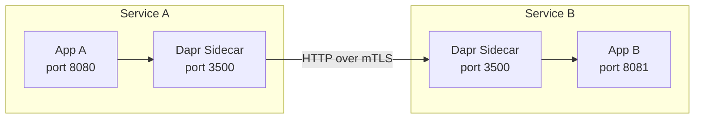

# How to Set Up Dapr Service-to-Service Communication with HTTP

Author: [nawazdhandala](https://www.github.com/nawazdhandala)

Tags: Dapr, HTTP, Service Invocation, Microservice, Service-to-Service

Description: Configure Dapr service-to-service HTTP communication between microservices with automatic service discovery, mTLS, and observability built in.

---

## Overview

Dapr service-to-service HTTP communication lets microservices call each other using logical app IDs. HTTP calls are routed through the Dapr sidecar, which handles name resolution, mTLS encryption, retries, and tracing. Both services continue to expose plain HTTP endpoints.

## How HTTP Service Invocation Works



## Prerequisites

- Dapr CLI initialized (`dapr init`)
- Two application processes with Dapr sidecars
- Application IDs (`--app-id`) configured at startup

## Step 1: Build Service B (the callee)

Service B exposes a standard HTTP endpoint. It has no Dapr-specific code.

```python
# service_b.py
from flask import Flask, jsonify, request

app = Flask(__name__)

@app.route('/hello', methods=['GET'])
def hello():
    return jsonify({"message": "Hello from Service B!"})

@app.route('/greet', methods=['POST'])
def greet():
    data = request.get_json()
    return jsonify({"greeting": f"Hello, {data['name']}!"})

if __name__ == '__main__':
    app.run(host='0.0.0.0', port=8081)
```

Start Service B with Dapr:

```bash
dapr run \
  --app-id service-b \
  --app-port 8081 \
  --dapr-http-port 3501 \
  -- python service_b.py
```

## Step 2: Build Service A (the caller)

Service A uses the Dapr HTTP API to invoke Service B by its app ID.

```python
# service_a.py
import os
import requests
from flask import Flask, jsonify

app = Flask(__name__)
DAPR_HTTP_PORT = os.environ.get("DAPR_HTTP_PORT", "3500")

def invoke_service_b(method, path, body=None, http_method="GET"):
    url = f"http://localhost:{DAPR_HTTP_PORT}/v1.0/invoke/{method}/method/{path}"
    headers = {"Content-Type": "application/json"}
    if http_method == "GET":
        return requests.get(url, headers=headers)
    return requests.post(url, json=body, headers=headers)

@app.route('/call-hello')
def call_hello():
    response = invoke_service_b("service-b", "hello")
    return jsonify(response.json())

@app.route('/call-greet')
def call_greet():
    response = invoke_service_b("service-b", "greet", {"name": "Alice"}, "POST")
    return jsonify(response.json())

if __name__ == '__main__':
    app.run(host='0.0.0.0', port=8080)
```

Start Service A with Dapr:

```bash
dapr run \
  --app-id service-a \
  --app-port 8080 \
  --dapr-http-port 3500 \
  -- python service_a.py
```

## Step 3: Test the Communication

Trigger Service A to call Service B:

```bash
curl http://localhost:8080/call-hello
# {"message": "Hello from Service B!"}

curl http://localhost:8080/call-greet
# {"greeting": "Hello, Alice!"}
```

Or call via Dapr's API directly:

```bash
curl http://localhost:3500/v1.0/invoke/service-b/method/hello
```

## Passing HTTP Headers

All headers sent in the invoke request are forwarded to the target service. This is useful for authorization tokens:

```bash
curl http://localhost:3500/v1.0/invoke/service-b/method/protected \
  -H "Authorization: Bearer eyJhbGc..."
```

On the receiving end, Service B reads the header as normal:

```python
@app.route('/protected')
def protected():
    auth = request.headers.get('Authorization')
    # validate token...
    return jsonify({"status": "ok"})
```

## Query Parameters

Append query parameters to the method path:

```bash
curl "http://localhost:3500/v1.0/invoke/service-b/method/search?q=laptop&limit=5"
```

## Namespace-Aware Invocation

On Kubernetes with multiple namespaces, specify the namespace in the app ID:

```bash
curl http://localhost:3500/v1.0/invoke/service-b.production/method/hello
```

Or use the full FQDN format:

```bash
curl "http://localhost:3500/v1.0/invoke/service-b/method/hello" \
  -H "dapr-app-id: service-b.production"
```

## Node.js Example

```javascript
const axios = require('axios');

const DAPR_PORT = process.env.DAPR_HTTP_PORT || 3500;

async function callServiceB(path, data = null) {
  const url = `http://localhost:${DAPR_PORT}/v1.0/invoke/service-b/method/${path}`;
  const method = data ? 'post' : 'get';
  const response = await axios({ method, url, data });
  return response.data;
}

// GET /hello
callServiceB('hello').then(console.log);

// POST /greet
callServiceB('greet', { name: 'Bob' }).then(console.log);
```

## Observability

Service-to-service calls are automatically traced. The sidecar injects W3C trace context headers and forwards traces to the configured exporter. No application changes are needed.

```yaml
# dapr config for tracing
apiVersion: dapr.io/v1alpha1
kind: Configuration
metadata:
  name: daprConfig
spec:
  tracing:
    samplingRate: "1"
    zipkin:
      endpointAddress: http://zipkin:9411/api/v2/spans
```

Apply on Kubernetes:

```bash
kubectl apply -f daprconfig.yaml
```

Reference it in pod annotations:

```yaml
annotations:
  dapr.io/config: "daprConfig"
```

## Summary

Dapr HTTP service-to-service communication requires no service mesh, no hardcoded endpoints, and no service discovery configuration. Both services expose plain HTTP APIs and communicate through their local Dapr sidecars. The sidecar handles discovery, encryption, retries, and tracing, letting developers focus on business logic.
