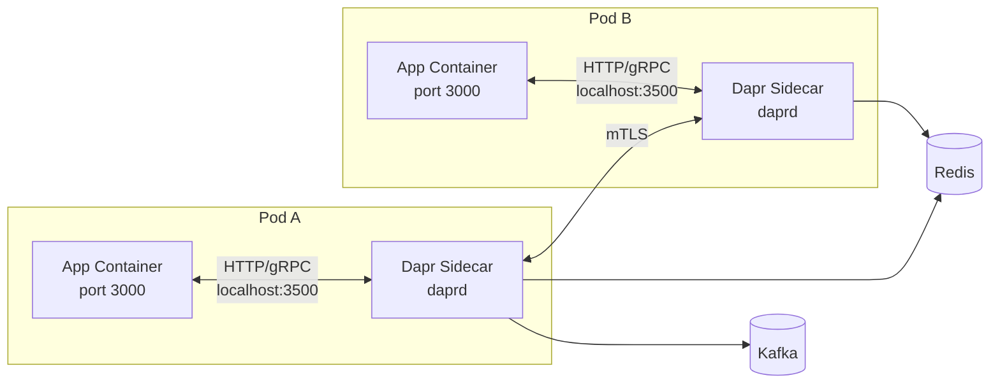
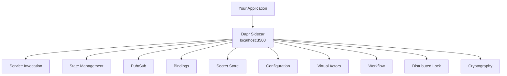
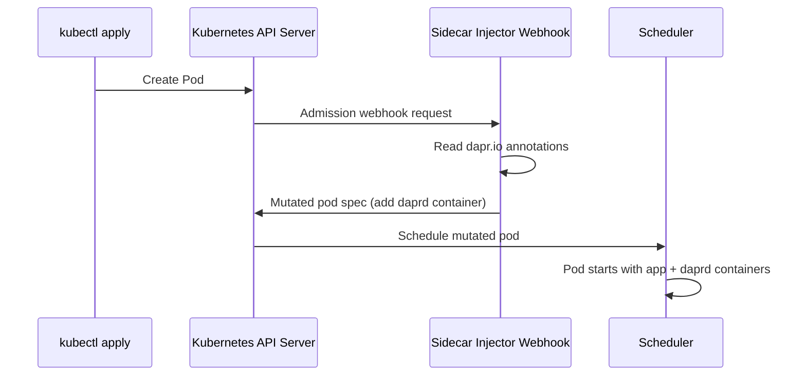
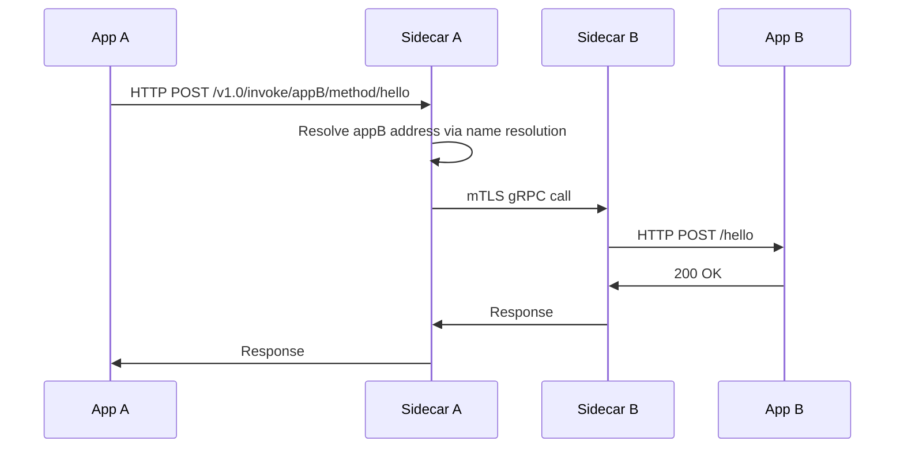

# How to Understand the Dapr Sidecar Architecture

Author: [nawazdhandala](https://www.github.com/nawazdhandala)

Tags: Dapr, Sidecar, Architecture, Microservice, Distributed System

Description: Understand how the Dapr sidecar pattern works, how your application communicates with the sidecar, and what the sidecar provides in terms of building blocks.

---

## What Is the Dapr Sidecar?

Dapr uses the sidecar pattern to decouple distributed system concerns from application code. Your application runs as-is, and a Dapr sidecar process (the `daprd` binary) runs alongside it. The sidecar handles service discovery, state management, pub/sub messaging, secret retrieval, and more.

This means you can write your application in any language and still access all Dapr building blocks through simple HTTP or gRPC calls to `localhost`.

## The Sidecar Pattern



## How the Application Communicates with the Sidecar

The sidecar exposes two API surfaces:

- **HTTP API** on port `3500` by default
- **gRPC API** on port `50001` by default

Your application sends requests to `http://localhost:3500/v1.0/...` or connects to `localhost:50001` via gRPC.

Example: calling the state API via HTTP from your app:

```bash
curl -X POST http://localhost:3500/v1.0/state/statestore \
  -H "Content-Type: application/json" \
  -d '[{"key": "name", "value": "Alice"}]'
```

## Sidecar Ports and Configuration

The sidecar is started by the Dapr CLI or the Kubernetes sidecar injector. Key ports include:

| Port | Purpose |
|------|---------|
| 3500 | Dapr HTTP API |
| 50001 | Dapr gRPC API |
| 50002 | Dapr internal gRPC (operator) |
| 9090 | Metrics (Prometheus) |
| 3501 | Health endpoint |

## The Dapr Building Blocks

The sidecar provides access to all Dapr building blocks through a single API surface:



## How the Sidecar Is Started in Self-Hosted Mode

When you run `dapr run`, the CLI starts two processes: your app and the sidecar.

```bash
dapr run --app-id myapp --app-port 3000 --dapr-http-port 3500 -- python app.py
```

The CLI starts `daprd` with the following flags:

```bash
daprd \
  --app-id myapp \
  --app-port 3000 \
  --dapr-http-port 3500 \
  --dapr-grpc-port 50001 \
  --components-path ~/.dapr/components \
  --config ~/.dapr/config.yaml
```

## How the Sidecar Is Injected on Kubernetes

The `dapr-sidecar-injector` webhook watches for pods with the `dapr.io/enabled: "true"` annotation. It mutates the pod definition to add the `daprd` container before the pod is scheduled.



## Sidecar Lifecycle: Startup and Shutdown

The sidecar waits for the application to be ready before processing incoming traffic. During shutdown, it drains in-flight requests before terminating.

You can control this behavior with annotations on Kubernetes:

```yaml
annotations:
  dapr.io/enabled: "true"
  dapr.io/app-id: "myapp"
  dapr.io/app-port: "3000"
  dapr.io/app-health-check-path: "/health"
  dapr.io/app-health-probe-interval: "3"
  dapr.io/graceful-shutdown-seconds: "5"
```

## Sidecar-to-Sidecar Communication

When service A calls service B, the flow is:



## Observability Built In

The sidecar automatically collects distributed traces, metrics, and logs without any application changes. Traces are forwarded to a configured exporter (Zipkin, Jaeger, OTLP) through the Dapr configuration:

```yaml
apiVersion: dapr.io/v1alpha1
kind: Configuration
metadata:
  name: tracing
spec:
  tracing:
    samplingRate: "1"
    zipkin:
      endpointAddress: http://zipkin:9411/api/v2/spans
```

## Summary

The Dapr sidecar pattern lets you add distributed system capabilities to any application without modifying its code. The sidecar runs as a co-located process (or container on Kubernetes), exposes HTTP and gRPC APIs on localhost, handles mTLS between services, and provides access to all Dapr building blocks including state, pub/sub, bindings, secrets, and actors.
