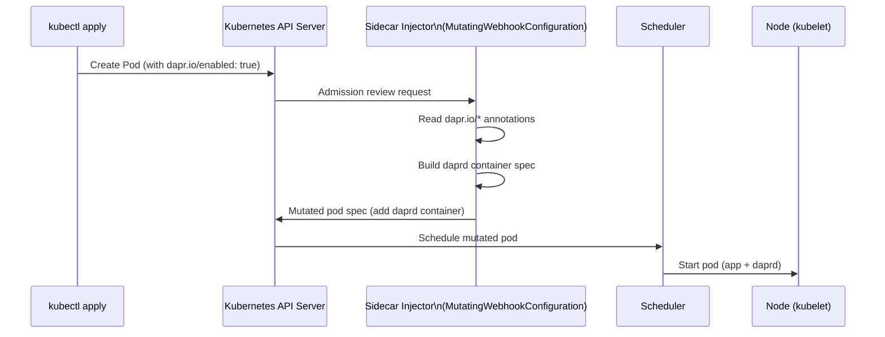

# How to Understand the Dapr Sidecar Injector on Kubernetes

Author: [nawazdhandala](https://www.github.com/nawazdhandala)

Tags: Dapr, Sidecar Injector, Kubernetes, Admission Webhook, Control Plane

Description: Learn how the Dapr Sidecar Injector webhook intercepts pod creation, reads Dapr annotations, and automatically adds the daprd sidecar container to your pods.

---

## What Is the Dapr Sidecar Injector?

The Dapr Sidecar Injector is a Kubernetes Mutating Admission Webhook that runs in the `dapr-system` namespace. When a pod with the `dapr.io/enabled: "true"` annotation is created, the injector intercepts the pod creation request and adds the `daprd` container to the pod spec before the pod is scheduled.



## How the Webhook Is Registered

The Sidecar Injector registers a `MutatingWebhookConfiguration` in Kubernetes:

```bash
kubectl get mutatingwebhookconfigurations
```

Output includes:

```text
NAME                             WEBHOOKS   AGE
dapr-sidecar-injector            1          30d
```

```bash
kubectl describe mutatingwebhookconfiguration dapr-sidecar-injector
```

The webhook fires on `CREATE` operations for pods where:
- The namespace has the label `dapr-enabled: true`, OR
- The pod has the annotation `dapr.io/enabled: "true"`

## What the Injector Adds to a Pod

When the injector processes a pod, it adds:

1. The `daprd` init container (for certificate setup, Dapr 1.13 and earlier)
2. The `daprd` sidecar container
3. Environment variables (`DAPR_HTTP_PORT`, `DAPR_GRPC_PORT`, `APP_ID`)
4. Volume mounts for certificates and components
5. Liveness and readiness probes for the sidecar

The resulting pod spec looks like:

```yaml
spec:
  initContainers:
  - name: dapr-init         # sets up certs (older versions)
    image: daprio/dapr:1.14.0
  containers:
  - name: order-service     # your app container (unchanged)
    image: myregistry/order-service:latest
  - name: daprd             # injected sidecar
    image: daprio/dapr:1.14.0
    args:
    - ./daprd
    - --app-id
    - order-service
    - --app-port
    - "3000"
    - --dapr-http-port
    - "3500"
    - --dapr-grpc-port
    - "50001"
    - --sentry-address
    - dapr-sentry.dapr-system.svc.cluster.local:50001
    - --control-plane-address
    - dapr-api.dapr-system.svc.cluster.local:80
    - --placement-host-address
    - dapr-placement-server.dapr-system.svc.cluster.local:50005
    ports:
    - name: dapr-http
      containerPort: 3500
    - name: dapr-grpc
      containerPort: 50001
    - name: dapr-internal
      containerPort: 50002
    - name: dapr-metrics
      containerPort: 9090
    livenessProbe:
      httpGet:
        path: /v1.0/healthz
        port: 3500
      initialDelaySeconds: 3
      periodSeconds: 6
    readinessProbe:
      httpGet:
        path: /v1.0/healthz
        port: 3500
      initialDelaySeconds: 3
      periodSeconds: 6
```

## Minimal Annotation to Enable Injection

The only required annotation is:

```yaml
metadata:
  annotations:
    dapr.io/enabled: "true"
    dapr.io/app-id: "order-service"
```

## Enabling Injection for an Entire Namespace

Label a namespace to automatically inject sidecars into all pods:

```bash
kubectl label namespace default dapr-enabled=true
```

With this label, every pod in the namespace receives a sidecar, even without the `dapr.io/enabled` annotation.

## Verifying Injection

After deploying a pod with the annotation:

```bash
# Check that the daprd container is present
kubectl get pod <pod-name> -o jsonpath='{.spec.containers[*].name}'
```

Expected output:

```text
order-service daprd
```

Check that the sidecar is running:

```bash
kubectl logs <pod-name> -c daprd --tail=20
```

## Troubleshooting Injection

### Sidecar Not Injected

1. Verify the annotation is present and correct:

```bash
kubectl describe pod <pod-name> | grep "dapr.io"
```

2. Check if the namespace is excluded:

```bash
kubectl describe mutatingwebhookconfiguration dapr-sidecar-injector | grep -A5 namespaceSelector
```

3. Check the injector logs:

```bash
kubectl logs -n dapr-system -l app=dapr-sidecar-injector --tail=50
```

### Pod Stuck in Init

```bash
kubectl describe pod <pod-name>
kubectl logs <pod-name> -c dapr-init
```

### Sidecar Crashing

```bash
kubectl logs <pod-name> -c daprd
```

## Injector Configuration

The injector is configured through the `dapr-system` ConfigMap or Helm values:

```yaml
# Helm values
dapr_sidecar_injector:
  replicaCount: 1
  image:
    name: daprio/dapr
  resources:
    requests:
      cpu: 100m
      memory: 64Mi
    limits:
      cpu: 500m
      memory: 256Mi
  webhookFailurePolicy: Ignore  # Ignore or Fail
```

Set `webhookFailurePolicy: Ignore` if you want pods to start even when the injector is unavailable (they will start without the sidecar).

## Sidecar Injector in High Availability

```bash
helm upgrade dapr dapr/dapr \
  --namespace dapr-system \
  --set dapr_sidecar_injector.replicaCount=2
```

Multiple replicas of the injector work independently; Kubernetes distributes admission requests across them.

## Summary

The Dapr Sidecar Injector is a Mutating Admission Webhook that intercepts pod creation requests. When a pod carries the `dapr.io/enabled: "true"` annotation, the injector adds the `daprd` container with all required ports, environment variables, probes, and control plane addresses. The injector reads the full set of `dapr.io/*` annotations to configure the injected sidecar. Pods can also inherit injection from namespace labels without individual annotation requirements.
