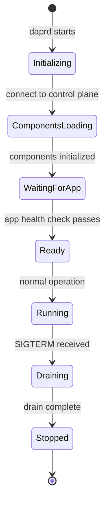
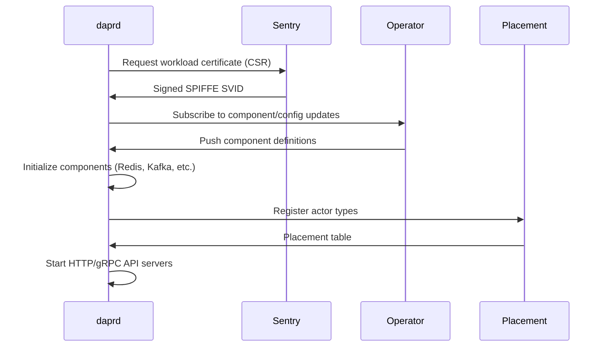

# How to Understand the Dapr Sidecar Lifecycle

Author: [nawazdhandala](https://www.github.com/nawazdhandala)

Tags: Dapr, Sidecar, Lifecycle, Startup, Shutdown

Description: Understand the complete lifecycle of the Dapr sidecar from startup initialization and readiness to graceful shutdown and drain, including health checks and ordering.

---

## Sidecar Lifecycle Overview

The Dapr sidecar goes through distinct phases: startup initialization, readiness signaling, steady-state operation, and graceful shutdown. Understanding these phases helps you configure health probes, startup ordering, and shutdown timeouts correctly.



## Startup Phase

### 1 - Control Plane Connection

On startup, `daprd`:
1. Connects to the Sentry service to request a workload certificate
2. Connects to the Operator to receive component and configuration CRDs (Kubernetes mode)
3. Connects to the Placement service to register actor types (if applicable)



### 2 - Component Initialization

The sidecar initializes each loaded component in parallel. If a component fails:
- With `ignoreErrors: false` (default): sidecar startup fails
- With `ignoreErrors: true`: sidecar continues without that component

```yaml
spec:
  type: state.redis
  version: v1
  ignoreErrors: true    # continue if Redis is unavailable
  initTimeout: 10s      # how long to wait for Redis to respond
```

### 3 - App Health Check

After components are loaded, the sidecar waits for your application to be healthy before processing incoming traffic. Configure this behavior:

```yaml
annotations:
  dapr.io/app-health-check-path: "/healthz"
  dapr.io/app-health-probe-interval: "3"       # check every 3 seconds
  dapr.io/app-health-probe-timeout: "500"      # timeout in ms
  dapr.io/app-health-threshold: "3"            # failures before marking unhealthy
```

The health check calls `GET http://localhost:<app-port>/healthz` (or your configured path).

## Readiness

The sidecar exposes its own health endpoint:

```bash
curl http://localhost:3500/v1.0/healthz
# Returns 204 No Content when ready
# Returns 500 or connection error when not ready
```

On Kubernetes, the injected sidecar container has:

```yaml
livenessProbe:
  httpGet:
    path: /v1.0/healthz
    port: 3500
  initialDelaySeconds: 3
  periodSeconds: 6
  failureThreshold: 3
readinessProbe:
  httpGet:
    path: /v1.0/healthz
    port: 3500
  initialDelaySeconds: 3
  periodSeconds: 6
  failureThreshold: 3
```

## Startup Ordering (Kubernetes)

The default startup order in a Dapr-enabled pod:

1. Init containers run first (if any)
2. Application container and sidecar container start in parallel
3. The sidecar polls your app's health endpoint
4. Once your app is healthy, the sidecar marks itself as ready

To ensure your app waits for the sidecar before processing:

```yaml
annotations:
  dapr.io/wait-for-sidecar-before-app-start: "false"  # default
```

Or in your app startup code:

```python
import requests, time

def wait_for_sidecar():
    dapr_port = os.getenv('DAPR_HTTP_PORT', '3500')
    for _ in range(60):
        try:
            r = requests.get(f"http://localhost:{dapr_port}/v1.0/healthz", timeout=1)
            if r.status_code == 204:
                print("Sidecar is ready")
                return
        except Exception:
            pass
        time.sleep(1)
    raise RuntimeError("Sidecar did not become ready")

wait_for_sidecar()
# Now safe to use Dapr APIs
```

## Steady-State Operation

During normal operation:

- The sidecar serves HTTP API requests on port `3500` and gRPC on `50001`
- Certificates are renewed automatically by Sentry before they expire (24h TTL)
- The Operator pushes component updates (if hot-reload is enabled)
- The sidecar maintains long-lived gRPC streams to the Operator, Placement, and Scheduler

## Graceful Shutdown

When a pod is terminated (SIGTERM), the sidecar enters drain mode:

1. Stop accepting new incoming requests
2. Drain in-flight requests (wait for them to complete)
3. Unsubscribe from pub/sub topics
4. Disconnect from Placement (actors are redistributed)
5. Exit

Configure drain timeout:

```yaml
annotations:
  dapr.io/graceful-shutdown-seconds: "5"   # default: 0 (no wait)
```

In self-hosted mode:

```bash
dapr run \
  --app-id myapp \
  --graceful-shutdown-seconds 10 \
  -- node app.js
```

## Drain Behavior for Pub/Sub

When the sidecar shuts down while processing a pub/sub message:

- If the message handler returns `200 OK` before shutdown completes: message is ACKed
- If shutdown completes before the handler returns: message is NAKed and redelivered

Set a generous drain timeout for services processing long messages:

```yaml
annotations:
  dapr.io/graceful-shutdown-seconds: "30"
```

## Actor Deactivation on Shutdown

When a sidecar hosting actors shuts down:
1. All active actor instances are deactivated
2. Actor state is saved to the state store
3. The Placement service redistributes actor assignments to other healthy hosts

## Monitoring Sidecar Lifecycle Events

```bash
# Watch sidecar logs for lifecycle events
kubectl logs <pod-name> -c daprd -f | grep -E "starting|ready|shutdown|component"
```

Key log messages:

```text
level=info msg="starting Dapr Runtime"
level=info msg="component initialized" component=statestore
level=info msg="dapr initialized. Status: Running"
level=info msg="shutdown initiated"
level=info msg="daprd shutdown gracefully"
```

## Summary

The Dapr sidecar lifecycle includes: connecting to the control plane and retrieving certificates, initializing components, waiting for the application health check to pass, serving API traffic during steady state with automatic certificate rotation, and draining in-flight requests gracefully on shutdown. Configure `app-health-check-path`, `graceful-shutdown-seconds`, and component `ignoreErrors` to tune the lifecycle for your application's requirements.
