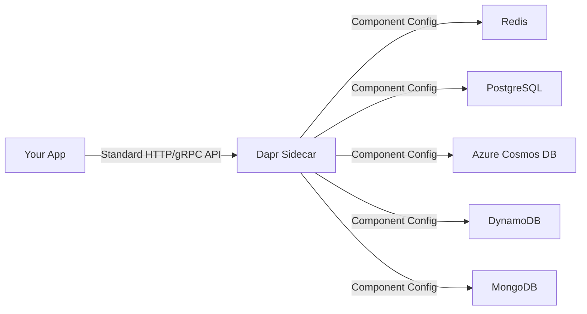

# How to Use State Management with Different Backend Stores

Author: [OneUptime](https://oneuptime.com)

Tags: Dapr, State Management, Redis, PostgreSQL, Cosmos DB, Microservice

Description: Learn how to configure and use Dapr State Management with different backend stores including Redis, PostgreSQL, Azure Cosmos DB, DynamoDB, and MongoDB.

---

## Introduction

Dapr's State Management API is backend-agnostic. Your application code stays the same whether you use Redis in development, PostgreSQL in staging, or Azure Cosmos DB in production. Only the component YAML changes. This guide shows you how to configure and switch between the most popular Dapr state store backends.

## Architecture: Backend-Agnostic State



## Redis

Best for development, caching, and session storage. High throughput, low latency.

```yaml
apiVersion: dapr.io/v1alpha1
kind: Component
metadata:
  name: statestore
  namespace: default
spec:
  type: state.redis
  version: v1
  metadata:
    - name: redisHost
      value: redis-master:6379
    - name: redisPassword
      secretKeyRef:
        name: redis-secret
        key: redis-password
    - name: enableTLS
      value: "false"
    - name: redisMaxRetries
      value: "3"
    - name: ttlInSeconds
      value: "86400"
```

Supports: Transactions, ETags, TTL, Bulk operations.

Does NOT support: Query API.

## PostgreSQL

Best for production workloads requiring durability, SQL queries, and ACID guarantees.

```yaml
apiVersion: dapr.io/v1alpha1
kind: Component
metadata:
  name: statestore
  namespace: default
spec:
  type: state.postgresql
  version: v2
  metadata:
    - name: connectionString
      value: "host=pg-primary port=5432 user=dapr password=secret dbname=dapr_state sslmode=require"
    - name: schema
      value: dapr_schema
    - name: tableName
      value: state
    - name: cleanupInterval
      value: "1h"
```

The PostgreSQL component creates its own table with columns: `key`, `value`, `isbinary`, `etag`, `expiredate`.

Supports: Transactions, ETags, TTL, Query API (via JSONB).

## Azure Cosmos DB

Best for globally distributed applications on Azure requiring multi-region writes.

```yaml
apiVersion: dapr.io/v1alpha1
kind: Component
metadata:
  name: statestore
  namespace: default
spec:
  type: state.azure.cosmosdb
  version: v1
  metadata:
    - name: url
      value: "https://myaccount.documents.azure.com:443/"
    - name: masterKey
      secretKeyRef:
        name: cosmosdb-secret
        key: masterKey
    - name: database
      value: ordersdb
    - name: collection
      value: state
    - name: partitionKey
      value: "/partitionKey"
```

Supports: Transactions (within partition), ETags, TTL, Multi-region reads.

Does NOT support: Cross-partition transactions.

## AWS DynamoDB

Best for serverless AWS applications requiring automatic scaling.

```yaml
apiVersion: dapr.io/v1alpha1
kind: Component
metadata:
  name: statestore
  namespace: default
spec:
  type: state.aws.dynamodb
  version: v1
  metadata:
    - name: table
      value: dapr-state
    - name: region
      value: us-east-1
    - name: accessKey
      secretKeyRef:
        name: aws-secret
        key: accessKey
    - name: secretKey
      secretKeyRef:
        name: aws-secret
        key: secretKey
    - name: ttlAttributeName
      value: expiresAt
```

Supports: ETags (conditional expressions), TTL (via DynamoDB TTL attribute).

Does NOT support: Server-side transactions in Dapr (client-side only).

## MongoDB

Best for document-oriented workloads with flexible schemas.

```yaml
apiVersion: dapr.io/v1alpha1
kind: Component
metadata:
  name: statestore
  namespace: default
spec:
  type: state.mongodb
  version: v1
  metadata:
    - name: host
      value: mongodb-svc:27017
    - name: username
      secretKeyRef:
        name: mongo-secret
        key: username
    - name: password
      secretKeyRef:
        name: mongo-secret
        key: password
    - name: databaseName
      value: dapr_state
    - name: collectionName
      value: state
    - name: writeconcern
      value: majority
    - name: readconcern
      value: majority
```

Supports: Transactions (replica set required), ETags, TTL, Query API.

## Feature Comparison

| Feature | Redis | PostgreSQL | Cosmos DB | DynamoDB | MongoDB |
|---------|-------|-----------|-----------|---------|---------|
| Transactions | Yes | Yes | Partial | No | Yes (replica set) |
| ETags | Yes | Yes | Yes | Yes | Yes |
| TTL | Yes | Yes | Yes | Yes | Yes |
| Query API | No | Yes | No | No | Yes |
| Bulk Get | Yes | Yes | Yes | Yes | Yes |
| Multi-region | No | Depends | Yes | Yes (global tables) | Yes (Atlas) |

## Switching Backends Without Code Changes

Your application code does not change between backends:

```python
# This code works identically against Redis, PostgreSQL, Cosmos DB, etc.
from dapr.clients import DaprClient

def save_order(order_id: str, order_data: dict):
    with DaprClient() as client:
        client.save_state(
            store_name="statestore",   # Same name regardless of backend
            key=order_id,
            value=json.dumps(order_data)
        )
```

Only the component YAML file changes when you switch backends.

## Using Multiple Backends Simultaneously

Deploy different backends for different use cases:

```yaml
# Fast cache for sessions
apiVersion: dapr.io/v1alpha1
kind: Component
metadata:
  name: session-store
spec:
  type: state.redis
  ...
---
# Durable store for orders
apiVersion: dapr.io/v1alpha1
kind: Component
metadata:
  name: order-store
spec:
  type: state.postgresql
  ...
```

```python
# Use the right store for each purpose
client.save_state("session-store", f"session-{sid}", session_data)
client.save_state("order-store", f"order-{oid}", order_data)
```

## Summary

Dapr State Management abstracts away the underlying storage backend completely. Configure the backend by writing a component YAML file and applying it to your Kubernetes cluster or local components directory. Your application code uses the same API regardless of whether the backend is Redis, PostgreSQL, Cosmos DB, DynamoDB, or MongoDB. This portability lets you use Redis in development, swap to PostgreSQL for production, and adopt a managed cloud service later without touching application code.
