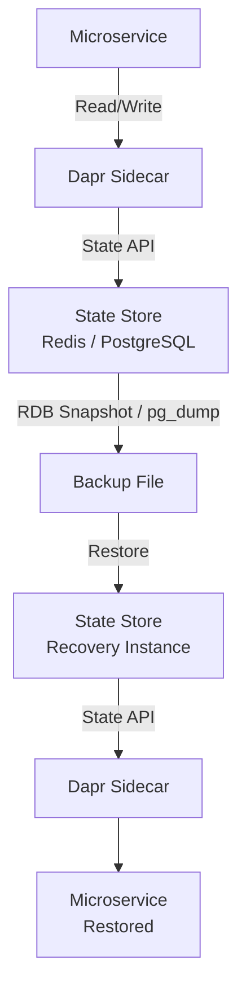

# How to Back Up and Restore Dapr State Data

Author: [nawazdhandala](https://www.github.com/nawazdhandala)

Tags: Dapr, State Management, Backup, Redis, Kubernetes

Description: Learn how to back up and restore Dapr state store data using Redis persistence, kubectl tools, and state migration scripts to protect stateful microservices.

---

## Why Back Up Dapr State

Dapr state stores hold the persistent data for your microservices. Without backups, node failures, accidental deletions, or broker migrations can cause irreversible data loss. Dapr itself does not provide a native backup command, so you rely on the underlying state store's native tools combined with Dapr's state HTTP API.

## Architecture Overview



## Prerequisites

- Dapr CLI and a running state store component
- Redis CLI (for Redis-backed state stores)
- `kubectl` access if running on Kubernetes

## State Store Component

```yaml
# statestore.yaml
apiVersion: dapr.io/v1alpha1
kind: Component
metadata:
  name: statestore
  namespace: default
spec:
  type: state.redis
  version: v1
  metadata:
  - name: redisHost
    value: "redis-master:6379"
  - name: redisPassword
    secretKeyRef:
      name: redis-secret
      key: redis-password
  - name: enableTLS
    value: "false"
```

## Exporting State via Dapr HTTP API

You can dump individual keys using the state GET endpoint. For bulk export, iterate over known keys:

```bash
# Get a single state key
curl http://localhost:3500/v1.0/state/statestore/order-123

# Save to a file
curl http://localhost:3500/v1.0/state/statestore/order-123 \
  -o order-123.json
```

For a scripted bulk export:

```bash
#!/bin/bash
# export-state.sh
KEYS=("order-1" "order-2" "order-3" "user-alice" "user-bob")
OUTPUT_DIR="./state-backup"
mkdir -p "$OUTPUT_DIR"

for KEY in "${KEYS[@]}"; do
  curl -s "http://localhost:3500/v1.0/state/statestore/${KEY}" \
    -o "${OUTPUT_DIR}/${KEY}.json"
  echo "Exported: $KEY"
done

echo "Backup complete: ${OUTPUT_DIR}"
```

## Redis Native Backup (RDB Snapshot)

For Redis-backed state stores, trigger a synchronous save:

```bash
# Trigger BGSAVE on the Redis instance
redis-cli -h redis-master -a "$REDIS_PASSWORD" BGSAVE

# Wait for it to complete
redis-cli -h redis-master -a "$REDIS_PASSWORD" LASTSAVE

# Copy the RDB file
cp /var/lib/redis/dump.rdb ./redis-backup-$(date +%Y%m%d%H%M%S).rdb
```

On Kubernetes using a Redis pod:

```bash
# Exec into Redis pod and trigger save
kubectl exec -n default redis-master-0 -- redis-cli BGSAVE

# Copy dump.rdb from pod
kubectl cp default/redis-master-0:/data/dump.rdb \
  ./redis-backup-$(date +%Y%m%d-%H%M%S).rdb
```

## Restoring State from Redis RDB

```bash
# Stop Redis (or use a replica for restore testing)
kubectl scale statefulset redis-master --replicas=0 -n default

# Copy backup RDB into pod volume
kubectl cp ./redis-backup-20260331.rdb \
  default/redis-master-0:/data/dump.rdb

# Restart Redis
kubectl scale statefulset redis-master --replicas=1 -n default

# Verify keys are restored
kubectl exec -n default redis-master-0 -- redis-cli KEYS "*"
```

## Restoring State via Dapr HTTP API

Restore individual keys using the state PUT endpoint:

```bash
# Restore a single key
curl -X POST http://localhost:3500/v1.0/state/statestore \
  -H "Content-Type: application/json" \
  -d '[
    {
      "key": "order-123",
      "value": {"orderId": "123", "status": "shipped", "total": 99.99}
    }
  ]'
```

Bulk restore from backup files:

```bash
#!/bin/bash
# restore-state.sh
BACKUP_DIR="./state-backup"

for FILE in "${BACKUP_DIR}"/*.json; do
  KEY=$(basename "$FILE" .json)
  VALUE=$(cat "$FILE")

  curl -s -X POST http://localhost:3500/v1.0/state/statestore \
    -H "Content-Type: application/json" \
    -d "[{\"key\": \"${KEY}\", \"value\": ${VALUE}}]"

  echo "Restored: $KEY"
done

echo "Restore complete"
```

## PostgreSQL State Store Backup

If you use `state.postgresql`, use `pg_dump` for backups:

```bash
# Backup
pg_dump \
  -h postgres-host \
  -U dapr_user \
  -d dapr_state \
  -t state \
  -F c \
  -f dapr-state-backup-$(date +%Y%m%d).dump

# Restore
pg_restore \
  -h postgres-host \
  -U dapr_user \
  -d dapr_state \
  -t state \
  dapr-state-backup-20260331.dump
```

## Verifying State Integrity After Restore

```bash
# List keys that match a pattern in Redis
kubectl exec -n default redis-master-0 -- \
  redis-cli KEYS "order-service||*"

# Fetch a state key through Dapr to confirm round-trip integrity
curl http://localhost:3500/v1.0/state/statestore/order-123

# Expected output:
# {"orderId":"123","status":"shipped","total":99.99}
```

## Automated Backup with Kubernetes CronJob

```yaml
# state-backup-cronjob.yaml
apiVersion: batch/v1
kind: CronJob
metadata:
  name: dapr-state-backup
  namespace: default
spec:
  schedule: "0 2 * * *"
  jobTemplate:
    spec:
      template:
        spec:
          containers:
          - name: backup
            image: redis:7-alpine
            env:
            - name: REDIS_PASSWORD
              valueFrom:
                secretKeyRef:
                  name: redis-secret
                  key: redis-password
            command:
            - /bin/sh
            - -c
            - |
              redis-cli -h redis-master -a $REDIS_PASSWORD BGSAVE
              sleep 5
              cp /data/dump.rdb /backup/dump-$(date +%Y%m%d%H%M%S).rdb
              echo "Backup completed"
            volumeMounts:
            - name: backup-storage
              mountPath: /backup
          volumes:
          - name: backup-storage
            persistentVolumeClaim:
              claimName: backup-pvc
          restartPolicy: OnFailure
```

Apply:

```bash
kubectl apply -f state-backup-cronjob.yaml
```

## Summary

Dapr does not provide a native backup command, so state data backup relies on the underlying store's native mechanisms. For Redis-backed stores, use `BGSAVE` and copy the RDB file. For PostgreSQL, use `pg_dump`. For selective key-level backup and restore, use the Dapr state HTTP API with `GET` and `POST` endpoints. Automate daily backups with a Kubernetes CronJob to protect against data loss in production environments.
