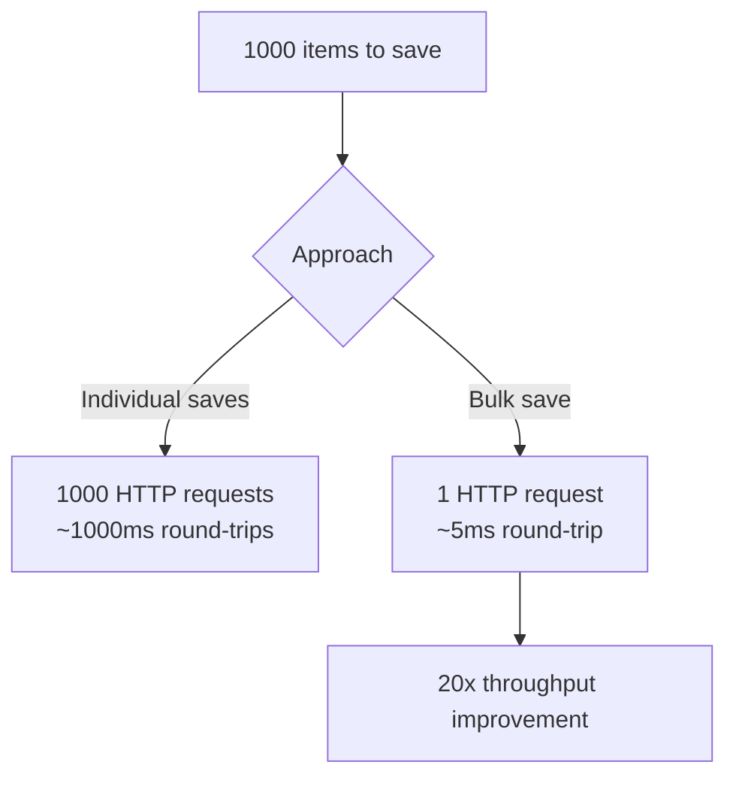

# How to Use Dapr State Bulk Operations

Author: [nawazdhandala](https://www.github.com/nawazdhandala)

Tags: Dapr, State Management, Bulk Operations, Performance, Throughput

Description: Use Dapr state bulk operations to save, get, and delete multiple state items in a single request, reducing network round-trips and improving throughput.

---

## What Are Dapr State Bulk Operations?

Bulk operations let you read or write multiple state items in a single HTTP call instead of making individual requests per key. This reduces network round-trips, decreases latency for batch workloads, and improves throughput when working with many state items.

Dapr supports three bulk operations:
- **Bulk Save** - Save multiple key-value pairs in one POST
- **Bulk Get** - Retrieve multiple keys in one POST
- **Bulk Delete** - Delete multiple keys in one POST

## Bulk Save

The standard save endpoint already accepts an array of items, making it inherently a bulk operation:

```bash
curl -X POST http://localhost:3500/v1.0/state/statestore \
  -H "Content-Type: application/json" \
  -d '[
    {"key": "product:001", "value": {"name": "Widget A", "price": 9.99, "stock": 50}},
    {"key": "product:002", "value": {"name": "Widget B", "price": 14.99, "stock": 30}},
    {"key": "product:003", "value": {"name": "Widget C", "price": 7.99, "stock": 100}},
    {"key": "product:004", "value": {"name": "Widget D", "price": 24.99, "stock": 15}},
    {"key": "product:005", "value": {"name": "Widget E", "price": 4.99, "stock": 200}}
  ]'
```

All items are saved atomically where supported, or as a batch otherwise.

## Bulk Get

Retrieve multiple keys in a single request:

```bash
curl -X POST http://localhost:3500/v1.0/state/statestore/bulk \
  -H "Content-Type: application/json" \
  -d '{
    "keys": ["product:001", "product:002", "product:003", "product:999"],
    "parallelism": 10
  }'
```

The `parallelism` field controls how many concurrent reads the sidecar performs against the state store. Higher values increase throughput for independent reads.

Response:

```json
[
  {
    "key": "product:001",
    "data": {"name": "Widget A", "price": 9.99, "stock": 50},
    "etag": "\"1\""
  },
  {
    "key": "product:002",
    "data": {"name": "Widget B", "price": 14.99, "stock": 30},
    "etag": "\"1\""
  },
  {
    "key": "product:003",
    "data": {"name": "Widget C", "price": 7.99, "stock": 100},
    "etag": "\"1\""
  },
  {
    "key": "product:999",
    "data": null,
    "etag": ""
  }
]
```

Missing keys return `data: null` without an error.

## Bulk Delete (via Transaction)

Dapr does not have a dedicated bulk delete endpoint, but you can delete multiple keys using the transaction endpoint:

```bash
curl -X POST http://localhost:3500/v1.0/state/statestore/transaction \
  -H "Content-Type: application/json" \
  -d '{
    "operations": [
      {"operation": "delete", "request": {"key": "product:001"}},
      {"operation": "delete", "request": {"key": "product:002"}},
      {"operation": "delete", "request": {"key": "product:003"}}
    ]
  }'
```

## Python Example

### Bulk Save

```python
import requests
import os

DAPR_HTTP_PORT = os.environ.get("DAPR_HTTP_PORT", "3500")
BASE_URL = f"http://localhost:{DAPR_HTTP_PORT}/v1.0"

def bulk_save(store_name, items):
    """
    items: list of dicts with 'key' and 'value'
    """
    payload = [{"key": item["key"], "value": item["value"]} for item in items]
    resp = requests.post(f"{BASE_URL}/state/{store_name}", json=payload)
    resp.raise_for_status()
    print(f"Saved {len(items)} items")

products = [
    {"key": f"product:{i:03d}", "value": {"name": f"Widget {i}", "price": i * 1.5}}
    for i in range(1, 101)
]
bulk_save("statestore", products)
```

### Bulk Get

```python
def bulk_get(store_name, keys, parallelism=10):
    payload = {"keys": keys, "parallelism": parallelism}
    resp = requests.post(f"{BASE_URL}/state/{store_name}/bulk", json=payload)
    resp.raise_for_status()
    results = resp.json()
    return {item["key"]: item["data"] for item in results if item["data"] is not None}

keys = [f"product:{i:03d}" for i in range(1, 11)]
products = bulk_get("statestore", keys)
for key, product in products.items():
    print(f"{key}: {product['name']} - ${product['price']}")
```

## Go Example

```go
package main

import (
    "bytes"
    "encoding/json"
    "fmt"
    "net/http"
    "log"
)

type BulkGetRequest struct {
    Keys        []string `json:"keys"`
    Parallelism int      `json:"parallelism"`
}

type BulkGetResponse struct {
    Key  string          `json:"key"`
    Data json.RawMessage `json:"data"`
    ETag string          `json:"etag"`
}

func bulkGetState(storeName string, keys []string) ([]BulkGetResponse, error) {
    req := BulkGetRequest{Keys: keys, Parallelism: 10}
    body, _ := json.Marshal(req)

    url := fmt.Sprintf("http://localhost:3500/v1.0/state/%s/bulk", storeName)
    resp, err := http.Post(url, "application/json", bytes.NewBuffer(body))
    if err != nil {
        return nil, err
    }
    defer resp.Body.Close()

    var results []BulkGetResponse
    json.NewDecoder(resp.Body).Decode(&results)
    return results, nil
}

func main() {
    keys := []string{"product:001", "product:002", "product:003"}
    results, err := bulkGetState("statestore", keys)
    if err != nil {
        log.Fatal(err)
    }
    for _, r := range results {
        if r.Data != nil {
            fmt.Printf("Key: %s, Data: %s\n", r.Key, r.Data)
        } else {
            fmt.Printf("Key: %s not found\n", r.Key)
        }
    }
}
```

## Using the Go SDK

```go
package main

import (
    "context"
    "encoding/json"
    "fmt"
    "log"

    dapr "github.com/dapr/go-sdk/client"
)

func main() {
    client, err := dapr.NewClient()
    if err != nil {
        log.Fatal(err)
    }
    defer client.Close()

    ctx := context.Background()

    // Bulk save using SaveBulkState
    items := []*dapr.SetStateItem{}
    for i := 1; i <= 5; i++ {
        data, _ := json.Marshal(map[string]interface{}{
            "name":  fmt.Sprintf("Product %d", i),
            "price": float64(i) * 10.0,
        })
        items = append(items, &dapr.SetStateItem{
            Key:   fmt.Sprintf("product:%03d", i),
            Value: data,
        })
    }
    client.SaveBulkState(ctx, "statestore", items...)

    // Bulk get using GetBulkState
    keys := []string{"product:001", "product:002", "product:003"}
    results, err := client.GetBulkState(ctx, "statestore", keys, nil, 10)
    if err != nil {
        log.Fatal(err)
    }
    for _, item := range results {
        fmt.Printf("%s: %s\n", item.Key, item.Value)
    }
}
```

## Performance Considerations



For best performance:
- Use bulk save for batch ingestion
- Set `parallelism` based on your state store's connection pool size
- Avoid bulk operations with more than a few thousand keys per request

## Summary

Dapr state bulk operations reduce latency and improve throughput by batching multiple reads and writes into single API calls. Bulk save accepts an array of items in the standard POST endpoint. Bulk get uses the `/bulk` endpoint with a `parallelism` hint to control concurrent reads. Bulk delete is achieved through the transaction endpoint. Both the HTTP API and language SDKs fully support bulk operations.
