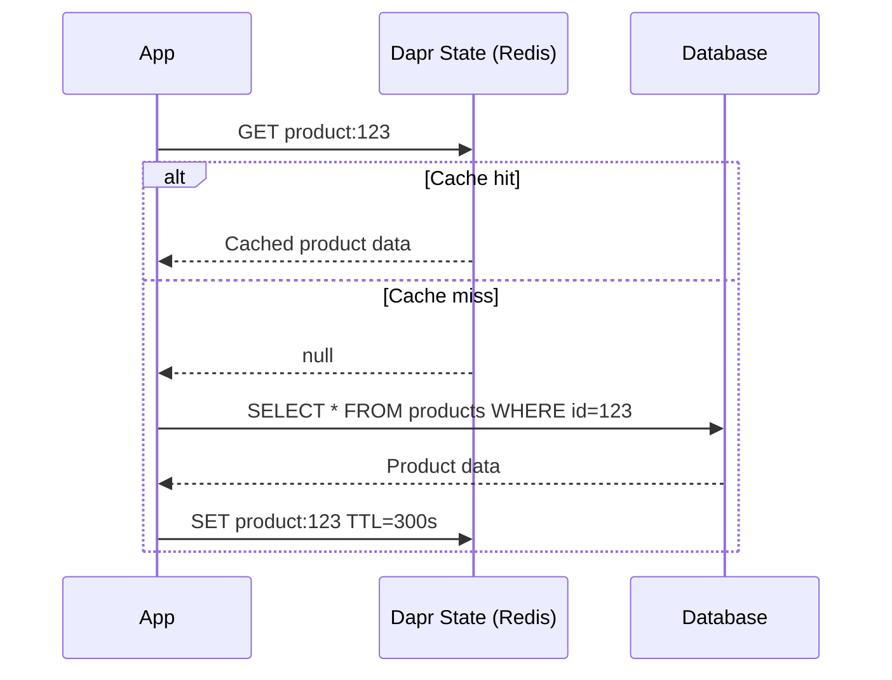

# How to Use Dapr State Management for Caching

Author: [nawazdhandala](https://www.github.com/nawazdhandala)

Tags: Dapr, State Management, Caching, Performance, Microservice

Description: Learn how to implement a cache-aside pattern with Dapr State Management and TTL to reduce database load and improve response times in microservices.

---

## Introduction

Caching reduces latency and protects downstream databases from excessive load. Dapr State Management, backed by Redis or another fast store, is a natural caching layer. Its TTL support, consistent API, and sidecar model make it easy to add caching to any microservice without coupling to a specific cache library or client.

## Cache-Aside Pattern



## State Store Component for Caching

```yaml
apiVersion: dapr.io/v1alpha1
kind: Component
metadata:
  name: cache
  namespace: default
spec:
  type: state.redis
  version: v1
  metadata:
    - name: redisHost
      value: redis-master:6379
    - name: redisPassword
      secretKeyRef:
        name: redis-secret
        key: redis-password
    - name: keyPrefix
      value: none       # Explicit key control for cache
    - name: ttlInSeconds
      value: "300"      # Default 5-minute TTL
```

## Implementing Cache-Aside in Python

```python
# cache.py
import json
from dapr.clients import DaprClient
from functools import wraps
import logging

logger = logging.getLogger(__name__)
CACHE_STORE = "cache"

class DaprCache:
    def get(self, key: str):
        with DaprClient() as client:
            result = client.get_state(CACHE_STORE, key)
            if result.data:
                return json.loads(result.data)
            return None

    def set(self, key: str, value, ttl_seconds: int = 300):
        with DaprClient() as client:
            client.save_state(
                store_name=CACHE_STORE,
                key=key,
                value=json.dumps(value),
                state_metadata={"ttlInSeconds": str(ttl_seconds)}
            )

    def delete(self, key: str):
        with DaprClient() as client:
            client.delete_state(CACHE_STORE, key)

    def get_or_set(self, key: str, loader, ttl_seconds: int = 300):
        """Cache-aside: get from cache or load and cache."""
        cached = self.get(key)
        if cached is not None:
            logger.debug(f"Cache hit: {key}")
            return cached
        logger.debug(f"Cache miss: {key}")
        value = loader()
        if value is not None:
            self.set(key, value, ttl_seconds)
        return value


cache = DaprCache()


def cached(key_fn, ttl_seconds: int = 300):
    """Decorator for caching function results."""
    def decorator(func):
        @wraps(func)
        def wrapper(*args, **kwargs):
            key = key_fn(*args, **kwargs)
            return cache.get_or_set(
                key,
                lambda: func(*args, **kwargs),
                ttl_seconds
            )
        return wrapper
    return decorator
```

## Using the Cache Decorator

```python
from cache import cached
from database import get_product_from_db, get_user_from_db

@cached(key_fn=lambda product_id: f"product:{product_id}", ttl_seconds=600)
def get_product(product_id: str) -> dict:
    return get_product_from_db(product_id)


@cached(key_fn=lambda user_id: f"user:{user_id}", ttl_seconds=120)
def get_user(user_id: str) -> dict:
    return get_user_from_db(user_id)
```

## Cache Invalidation

```python
def update_product(product_id: str, updates: dict):
    # Update database
    update_product_in_db(product_id, updates)
    # Invalidate cache
    cache.delete(f"product:{product_id}")
    print(f"Cache invalidated for product:{product_id}")


def bulk_invalidate(prefix: str):
    """Invalidate all cache keys matching a prefix.
    Note: Requires direct Redis access for pattern-based deletion."""
    import redis
    r = redis.Redis(host="redis-master", port=6379, password="secret")
    keys = r.keys(f"{prefix}*")
    if keys:
        r.delete(*keys)
        print(f"Invalidated {len(keys)} cache entries")
```

## Caching HTTP API Responses (Direct HTTP)

```bash
# Store a cached API response
curl -X POST http://localhost:3500/v1.0/state/cache \
  -H "Content-Type: application/json" \
  -d '[{
    "key": "exchange-rates:USD",
    "value": {"USD": 1.0, "EUR": 0.92, "GBP": 0.79},
    "metadata": {"ttlInSeconds": "60"}
  }]'

# Retrieve cached response
curl http://localhost:3500/v1.0/state/cache/exchange-rates:USD
```

## Caching Strategy Comparison

| Strategy | Description | Best For |
|----------|-------------|---------|
| Cache-aside (lazy) | Load on miss, write on load | Read-heavy, tolerate stale |
| Write-through | Write to cache and DB together | Read-heavy, need freshness |
| Write-behind | Write to cache first, DB async | Write-heavy, eventual consistency |
| Refresh-ahead | Proactively refresh before expiry | Predictable access patterns |

## Cache Stampede Protection

Prevent thundering herd when cache expires:

```python
import threading
import time

_lock_map = {}
_lock_map_lock = threading.Lock()

def get_with_stampede_protection(key: str, loader, ttl: int = 300):
    cached = cache.get(key)
    if cached:
        return cached

    # Only one thread fetches from DB
    with _lock_map_lock:
        if key not in _lock_map:
            _lock_map[key] = threading.Lock()

    with _lock_map[key]:
        # Double-check after acquiring lock
        cached = cache.get(key)
        if cached:
            return cached
        value = loader()
        cache.set(key, value, ttl)
        return value
```

## Monitoring Cache Performance

```bash
# Redis hit/miss ratio
redis-cli INFO stats | grep -E "keyspace_hits|keyspace_misses"

# Dapr metrics for cache component
curl http://localhost:9090/metrics | grep dapr_component_state
```

## Summary

Dapr State Management with a Redis backend and TTL support is an effective caching layer for microservices. Implement the cache-aside pattern using `get_or_set` helper methods, use per-key `ttlInSeconds` metadata to control expiry, and invalidate cache entries on writes to the source of truth. The Dapr abstraction lets you swap Redis for another backend without changing application code, and the sidecar model means no additional cache client library is needed in your service.
