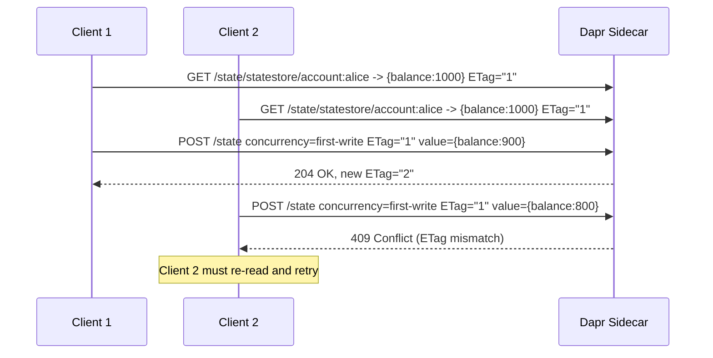

# How to Configure Dapr State Store Concurrency (First-Write-Wins vs Last-Write-Wins)

Author: [nawazdhandala](https://www.github.com/nawazdhandala)

Tags: Dapr, State Management, Concurrency, ETag, Optimistic Lock

Description: Configure Dapr state store concurrency modes - first-write-wins with ETag-based optimistic locking and last-write-wins - to control how concurrent state updates are handled.

---

## What Is State Concurrency in Dapr?

When multiple clients update the same state key simultaneously, a concurrency control mechanism determines which write wins. Dapr supports two modes:

- **Last-Write-Wins (LWW)**: The most recent write always succeeds and overwrites previous values. This is the default behavior.
- **First-Write-Wins (FWW)**: A write only succeeds if no other client has modified the value since it was last read. This uses ETags for optimistic locking.

## How ETags Enable Optimistic Locking



## Default: Last-Write-Wins

Without specifying options, the last write always wins:

```bash
# Both writes succeed - second one overwrites the first
curl -X POST http://localhost:3500/v1.0/state/statestore \
  -H "Content-Type: application/json" \
  -d '[{"key": "counter", "value": 100}]'

curl -X POST http://localhost:3500/v1.0/state/statestore \
  -H "Content-Type: application/json" \
  -d '[{"key": "counter", "value": 200}]'
# Result: counter = 200
```

Explicit LWW:

```bash
curl -X POST http://localhost:3500/v1.0/state/statestore \
  -H "Content-Type: application/json" \
  -d '[{
    "key": "counter",
    "value": 300,
    "options": {
      "concurrency": "last-write"
    }
  }]'
```

## First-Write-Wins with ETags

### Step 1: Read the current value and ETag

```bash
curl -i http://localhost:3500/v1.0/state/statestore/account:alice
```

Response:

```
HTTP/1.1 200 OK
ETag: "3"
Content-Type: application/json

{"balance": 1000, "currency": "USD"}
```

### Step 2: Update with the ETag

```bash
curl -X POST http://localhost:3500/v1.0/state/statestore \
  -H "Content-Type: application/json" \
  -d '[{
    "key": "account:alice",
    "value": {"balance": 900, "currency": "USD"},
    "etag": "\"3\"",
    "options": {
      "concurrency": "first-write"
    }
  }]'
```

If ETag matches: `204 No Content` (success)
If ETag does not match: `409 Conflict`

## Python Implementation

### Read-Modify-Write Pattern with Retry

```python
import requests
import os
import json
import time

DAPR_HTTP_PORT = os.environ.get("DAPR_HTTP_PORT", "3500")

def read_with_etag(store_name, key):
    url = f"http://localhost:{DAPR_HTTP_PORT}/v1.0/state/{store_name}/{key}"
    resp = requests.get(url)
    if resp.status_code == 200 and resp.text:
        etag = resp.headers.get("ETag", "")
        return resp.json(), etag
    return None, None

def save_with_etag(store_name, key, value, etag):
    url = f"http://localhost:{DAPR_HTTP_PORT}/v1.0/state/{store_name}"
    payload = [{
        "key": key,
        "value": value,
        "etag": etag,
        "options": {"concurrency": "first-write"}
    }]
    resp = requests.post(url, json=payload)
    return resp.status_code == 204

def atomic_decrement_balance(store_name, key, amount, max_retries=5):
    """Thread-safe balance deduction using optimistic locking."""
    for attempt in range(max_retries):
        balance, etag = read_with_etag(store_name, key)
        if balance is None:
            raise ValueError(f"Key {key} not found")

        if balance["balance"] < amount:
            raise ValueError("Insufficient balance")

        balance["balance"] -= amount

        if save_with_etag(store_name, key, balance, etag):
            print(f"Successfully deducted {amount}. New balance: {balance['balance']}")
            return balance
        else:
            print(f"Concurrent update detected. Retry {attempt + 1}/{max_retries}")
            time.sleep(0.05 * (attempt + 1))

    raise Exception("Max retries exceeded - too many concurrent updates")

# Initialize account
requests.post(
    f"http://localhost:{DAPR_HTTP_PORT}/v1.0/state/statestore",
    json=[{"key": "account:alice", "value": {"balance": 1000}}]
)

# Safely deduct
atomic_decrement_balance("statestore", "account:alice", 100)
```

## Go Implementation

```go
package main

import (
    "bytes"
    "encoding/json"
    "fmt"
    "net/http"
    "time"
    "log"
)

type Account struct {
    Balance float64 `json:"balance"`
}

func readWithETag(key string) (*Account, string, error) {
    url := fmt.Sprintf("http://localhost:3500/v1.0/state/statestore/%s", key)
    resp, err := http.Get(url)
    if err != nil {
        return nil, "", err
    }
    defer resp.Body.Close()

    etag := resp.Header.Get("ETag")
    var account Account
    json.NewDecoder(resp.Body).Decode(&account)
    return &account, etag, nil
}

func saveWithETag(key string, value *Account, etag string) (bool, error) {
    url := "http://localhost:3500/v1.0/state/statestore"
    payload := []map[string]interface{}{
        {
            "key":   key,
            "value": value,
            "etag":  etag,
            "options": map[string]string{
                "concurrency": "first-write",
            },
        },
    }
    body, _ := json.Marshal(payload)
    resp, err := http.Post(url, "application/json", bytes.NewBuffer(body))
    if err != nil {
        return false, err
    }
    return resp.StatusCode == 204, nil
}

func atomicDeduct(key string, amount float64, maxRetries int) error {
    for i := 0; i < maxRetries; i++ {
        account, etag, err := readWithETag(key)
        if err != nil {
            return err
        }
        account.Balance -= amount

        ok, err := saveWithETag(key, account, etag)
        if err != nil {
            return err
        }
        if ok {
            fmt.Printf("Deducted %.2f. New balance: %.2f\n", amount, account.Balance)
            return nil
        }
        time.Sleep(time.Duration(i+1) * 50 * time.Millisecond)
    }
    return fmt.Errorf("too many retries")
}

func main() {
    if err := atomicDeduct("account:alice", 50.0, 5); err != nil {
        log.Fatal(err)
    }
}
```

## Concurrency Options Summary

| Option | Behavior | Use Case |
|--------|----------|---------|
| `last-write` | Always overwrites | Counters, logs, non-critical updates |
| `first-write` + ETag | Rejects stale writes | Account balances, inventory, shared config |

## Consistency Levels

Concurrency control pairs with consistency settings:

```json
{
  "options": {
    "concurrency": "first-write",
    "consistency": "strong"
  }
}
```

`strong` consistency guarantees you read the latest value before updating, making optimistic locking more reliable.

## Summary

Dapr state concurrency control uses ETags for optimistic locking via the first-write-wins mode. Read the current value and ETag, modify the value, then save with the original ETag. If another client modified the value since your read, the save returns 409 Conflict, and you retry from scratch. Last-write-wins is simpler but can lead to lost updates in concurrent scenarios. Use first-write-wins for any shared mutable state like account balances, inventory counts, or configuration flags.
