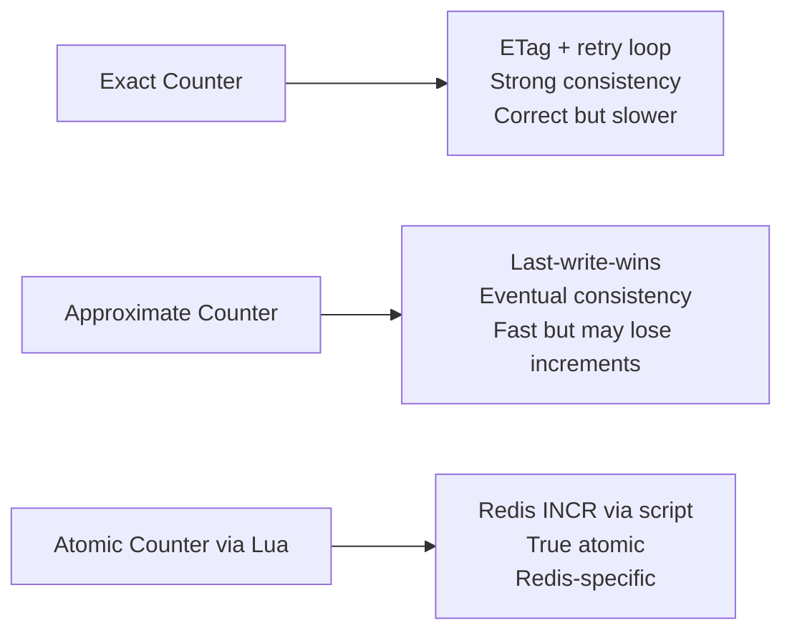

# How to Use Dapr State Management for Distributed Counters

Author: [nawazdhandala](https://www.github.com/nawazdhandala)

Tags: Dapr, State Management, Distributed Counter, Microservice, Redis

Description: Learn how to implement distributed counters using Dapr State Management with atomic increment patterns, approximate counting, and cross-service counter sharing.

---

## Introduction

Distributed counters track shared numeric state across multiple service replicas: page views, API call counts, inventory levels, rate limit windows, vote tallies. Dapr State Management supports two counter patterns: exact counters using optimistic concurrency (ETags) for correctness, and approximate counters using last-write-wins for maximum throughput.

## Counter Patterns Overview



## Exact Distributed Counter (ETag-Based)

Use optimistic concurrency to ensure every increment is counted:

```python
# exact_counter.py
import json
import time
from dapr.clients import DaprClient
from dapr.clients.grpc._state import StateOptions, Concurrency, Consistency

STORE = "statestore"

def increment(key: str, amount: int = 1, max_retries: int = 10) -> int:
    for attempt in range(max_retries):
        with DaprClient() as client:
            result = client.get_state(
                STORE, key,
                state_options=StateOptions(consistency=Consistency.strong)
            )
            current = json.loads(result.data) if result.data else {"value": 0}
            new_value = current["value"] + amount

            try:
                client.save_state(
                    store_name=STORE,
                    key=key,
                    value=json.dumps({"value": new_value}),
                    etag=result.etag,
                    options=StateOptions(
                        concurrency=Concurrency.first_write,
                        consistency=Consistency.strong
                    )
                )
                return new_value
            except Exception as e:
                if "etag" in str(e).lower() and attempt < max_retries - 1:
                    time.sleep(0.05 * (2 ** attempt))  # Exponential backoff
                    continue
                raise

    raise Exception(f"Failed to increment {key} after {max_retries} retries")


def get_count(key: str) -> int:
    with DaprClient() as client:
        result = client.get_state(STORE, key)
        if not result.data:
            return 0
        return json.loads(result.data)["value"]


def reset_counter(key: str):
    with DaprClient() as client:
        client.save_state(STORE, key, json.dumps({"value": 0}))
```

## Approximate Counter (Last-Write-Wins)

For high-throughput approximate counts (page views, like counts) where some increments may be lost under heavy concurrency:

```python
def increment_approximate(key: str, amount: int = 1) -> int:
    with DaprClient() as client:
        result = client.get_state(STORE, key)
        current = json.loads(result.data) if result.data else {"value": 0}
        new_value = current["value"] + amount

        client.save_state(
            store_name=STORE,
            key=key,
            value=json.dumps({"value": new_value})
            # No ETag = last-write-wins
        )
        return new_value
```

## HTTP API for Counter Operations

```bash
# Initialize a counter
curl -X POST http://localhost:3500/v1.0/state/statestore \
  -H "Content-Type: application/json" \
  -d '[{"key": "counter:page-views:home", "value": {"value": 0}}]'

# Read counter value
curl http://localhost:3500/v1.0/state/statestore/counter:page-views:home

# Manual increment via read-modify-write
CURRENT=$(curl -s http://localhost:3500/v1.0/state/statestore/counter:api-calls | jq '.value')
ETAG=$(curl -sv http://localhost:3500/v1.0/state/statestore/counter:api-calls 2>&1 | grep -i etag | awk '{print $3}')
NEW=$((CURRENT + 1))

curl -X POST http://localhost:3500/v1.0/state/statestore \
  -H "Content-Type: application/json" \
  -d "[{\"key\": \"counter:api-calls\", \"value\": {\"value\": $NEW}, \"etag\": \"$ETAG\", \"options\": {\"concurrency\": \"first-write\"}}]"
```

## Counter Service with Flask API

```python
from flask import Flask, request, jsonify
from exact_counter import increment, get_count, reset_counter

app = Flask(__name__)

@app.route("/counters/<name>/increment", methods=["POST"])
def inc(name: str):
    amount = request.get_json().get("amount", 1)
    new_value = increment(f"counter:{name}", amount)
    return jsonify({"counter": name, "value": new_value})

@app.route("/counters/<name>", methods=["GET"])
def get(name: str):
    value = get_count(f"counter:{name}")
    return jsonify({"counter": name, "value": value})

@app.route("/counters/<name>/reset", methods=["POST"])
def reset(name: str):
    reset_counter(f"counter:{name}")
    return jsonify({"counter": name, "value": 0})
```

## Inventory Counter Pattern

Inventory deduction requires exact counting and rejection when stock reaches zero:

```python
def deduct_inventory(product_id: str, qty: int) -> bool:
    key = f"inventory:{product_id}"
    max_retries = 5

    for attempt in range(max_retries):
        with DaprClient() as client:
            result = client.get_state(
                STORE, key,
                state_options=StateOptions(consistency=Consistency.strong)
            )
            if not result.data:
                return False

            stock = json.loads(result.data)
            if stock["qty"] < qty:
                return False  # Insufficient stock

            stock["qty"] -= qty
            try:
                client.save_state(
                    store_name=STORE,
                    key=key,
                    value=json.dumps(stock),
                    etag=result.etag,
                    options=StateOptions(
                        concurrency=Concurrency.first_write,
                        consistency=Consistency.strong
                    )
                )
                return True
            except Exception as e:
                if "etag" in str(e).lower() and attempt < max_retries - 1:
                    time.sleep(0.1)
                    continue
                raise

    return False
```

## Bulk Counter Operations

Retrieve multiple counters in one call:

```bash
curl -X POST http://localhost:3500/v1.0/state/statestore/bulk \
  -H "Content-Type: application/json" \
  -d '{
    "keys": [
      "counter:page-views:home",
      "counter:page-views:about",
      "counter:api-calls",
      "counter:errors"
    ],
    "parallelism": 10
  }'
```

## Summary

Dapr State Management supports two distributed counter patterns. Use the ETag-based read-modify-write loop for exact counters (inventory levels, vote tallies) where correctness is required, accepting a small retry overhead. Use last-write-wins for approximate counters (page views, like counts) where maximum throughput matters more than absolute precision. For both patterns, structure keys as `counter:{category}:{name}` for easy listing and grouping in the state store.
