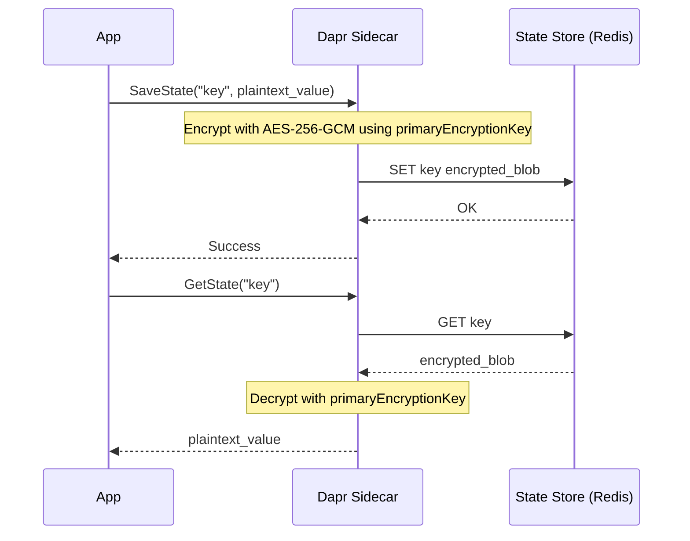

# How to Encrypt Dapr State at Rest with State Store Encryption

Author: [nawazdhandala](https://www.github.com/nawazdhandala)

Tags: Dapr, State Management, Encryption, Security, AES

Description: Enable automatic client-side encryption for Dapr state store data using AES-256-GCM so values are encrypted before leaving the sidecar.

---

## Overview

Dapr supports automatic encryption of state values before they are written to the state store. Encryption is performed by the Dapr sidecar using AES-256-GCM before data leaves the process. The state store backend (Redis, CosmosDB, etc.) stores only ciphertext. Decryption happens transparently on reads.

## How State Encryption Works



## Step 1: Generate an Encryption Key

The primary encryption key must be a 32-byte (256-bit) AES key encoded as hex or base64:

```bash
# Generate a 32-byte random key and hex-encode it
openssl rand -hex 32
# Example output: a9f7e2d1c3b4a5867890abcdef012345a9f7e2d1c3b4a5867890abcdef012345

# Or base64 encoded
openssl rand -base64 32
```

## Step 2: Store the Key in a Kubernetes Secret

```bash
kubectl create secret generic dapr-encryption-key \
  --from-literal=key=a9f7e2d1c3b4a5867890abcdef012345a9f7e2d1c3b4a5867890abcdef012345
```

## Step 3: Configure the State Store with Encryption

```yaml
# components/statestore-encrypted.yaml
apiVersion: dapr.io/v1alpha1
kind: Component
metadata:
  name: statestore
  namespace: default
spec:
  type: state.redis
  version: v1
  metadata:
  - name: redisHost
    value: redis-master.default.svc.cluster.local:6379
  - name: redisPassword
    secretKeyRef:
      name: redis-secret
      key: password
  - name: primaryEncryptionKey
    secretKeyRef:
      name: dapr-encryption-key
      key: key
  - name: keyPrefix
    value: "name"
```

### Key Fields

| Field | Required | Description |
|---|---|---|
| `primaryEncryptionKey` | Yes | AES-256 key used to encrypt all new writes |
| `secondaryEncryptionKey` | No | Used only for reading existing data during key rotation |
| `keyPrefix` | No | Controls how the key is prefixed in the store |

## Step 4: Key Rotation (Zero-Downtime)

Move the old primary key to secondary, then set the new key as primary:

```yaml
spec:
  type: state.redis
  version: v1
  metadata:
  - name: redisHost
    value: redis-master.default.svc.cluster.local:6379
  - name: primaryEncryptionKey
    secretKeyRef:
      name: dapr-encryption-key-new
      key: key
  - name: secondaryEncryptionKey
    secretKeyRef:
      name: dapr-encryption-key-old
      key: key
```

During rotation:
- Existing keys are read and decrypted with the secondary key
- New writes use the primary key
- Remove `secondaryEncryptionKey` after all data has been re-written

## Step 5: Self-Hosted Mode

For local development, use a local secret store or inline key:

```yaml
# components/statestore.yaml (self-hosted)
apiVersion: dapr.io/v1alpha1
kind: Component
metadata:
  name: statestore
spec:
  type: state.redis
  version: v1
  metadata:
  - name: redisHost
    value: localhost:6379
  - name: primaryEncryptionKey
    value: "a9f7e2d1c3b4a5867890abcdef012345a9f7e2d1c3b4a5867890abcdef012345"
```

Avoid inline keys in production. Use secret store references instead.

## Step 6: Verify Encryption at Rest

Write a value and inspect it directly in Redis:

```bash
# Write via Dapr
curl -X POST http://localhost:3500/v1.0/state/statestore \
  -H "Content-Type: application/json" \
  -d '[{"key":"secret-order","value":"confidential-payload"}]'

# Connect to Redis directly
redis-cli -h localhost

# Read the raw value
GET "order-service||secret-order"
# Output: binary/base64 blob - NOT plaintext
```

## Using the SDK with Encryption (Transparent)

Encryption is fully transparent to the SDK. No code changes are required:

```go
// Go - no changes needed; encryption is handled by the sidecar
err = client.SaveState(ctx, "statestore", "secret-order", []byte(`"confidential"`), nil)
result, err := client.GetState(ctx, "statestore", "secret-order", nil)
// result.Value contains the decrypted plaintext
```

```python
# Python - no changes needed
await client.save_state("statestore", "secret-order", b'"confidential"')
result = await client.get_state("statestore", "secret-order")
# result.data contains plaintext
```

## Supported State Stores

| State Store | Encryption Support |
|---|---|
| state.redis | Yes |
| state.azure.cosmosdb | Yes |
| state.azure.blobstorage | Yes |
| state.mongodb | Yes |
| state.postgresql | Yes |
| state.mysql | Yes |

## Summary

Dapr state store encryption provides automatic client-side AES-256-GCM encryption before data leaves the sidecar. Configure `primaryEncryptionKey` on the Component YAML pointing to a Kubernetes secret or Dapr secret store reference. Encryption and decryption are transparent to application code. For key rotation, set a `secondaryEncryptionKey` during the transition period so old data can still be read while new writes use the new key.
