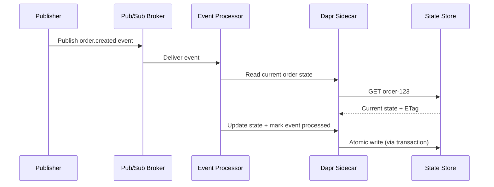

# How to Use Dapr State Management in Event-Driven Architectures

Author: [nawazdhandala](https://www.github.com/nawazdhandala)

Tags: Dapr, State Management, Event-Driven Architecture, Pub/Sub, Microservice

Description: Learn how to combine Dapr State Management with Pub/Sub messaging to build reliable event-driven architectures with event sourcing, sagas, and stateful event processors.

---

## Introduction

Event-driven architectures (EDA) and state management are complementary. Events describe what happened; state represents what is currently true. Dapr provides both primitives in a single sidecar, making it straightforward to build event processors that maintain state, implement event sourcing, and coordinate long-running sagas.

## Core Pattern: Stateful Event Processor



## Setup: State Store + Pub/Sub Components

```yaml
# State store
apiVersion: dapr.io/v1alpha1
kind: Component
metadata:
  name: statestore
spec:
  type: state.redis
  version: v1
  metadata:
    - name: redisHost
      value: redis-master:6379
---
# Pub/Sub broker
apiVersion: dapr.io/v1alpha1
kind: Component
metadata:
  name: pubsub
spec:
  type: pubsub.redis
  version: v1
  metadata:
    - name: redisHost
      value: redis-master:6379
```

## Pattern 1: Event-Sourced Order Aggregate

Store the full event history and derive current state by replaying events:

```python
# order_aggregate.py
import json
import time
from dapr.clients import DaprClient

STORE = "statestore"

def apply_event(state: dict, event: dict) -> dict:
    event_type = event["type"]
    if event_type == "order.created":
        state["status"] = "created"
        state["item"] = event["item"]
        state["qty"] = event["qty"]
    elif event_type == "order.paid":
        state["status"] = "paid"
    elif event_type == "order.shipped":
        state["status"] = "shipped"
        state["trackingId"] = event.get("trackingId")
    elif event_type == "order.cancelled":
        state["status"] = "cancelled"
    state["updatedAt"] = event["timestamp"]
    return state


def handle_order_event(event: dict):
    order_id = event["orderId"]
    events_key = f"events:{order_id}"
    state_key = f"order:{order_id}"

    with DaprClient() as client:
        # Read current state and events log
        state_result = client.get_state(STORE, state_key)
        events_result = client.get_state(STORE, events_key)

        current_state = json.loads(state_result.data) if state_result.data else {}
        events = json.loads(events_result.data) if events_result.data else []

        # Append new event
        events.append(event)

        # Derive new state
        new_state = apply_event(current_state.copy(), event)

        # Atomically update state and events log
        client.execute_state_transaction(
            store_name=STORE,
            operations=[
                {
                    "operation": "upsert",
                    "request": {
                        "key": state_key,
                        "value": json.dumps(new_state),
                        "etag": state_result.etag,
                        "options": {"concurrency": "first-write"}
                    }
                },
                {
                    "operation": "upsert",
                    "request": {
                        "key": events_key,
                        "value": json.dumps(events)
                    }
                }
            ]
        )
```

## Pattern 2: Event Subscription with State Update

Subscribe to events and update state as they arrive:

```python
# Flask subscription handler
from flask import Flask, request, jsonify
from dapr.clients import DaprClient
import json

app = Flask(__name__)

@app.route("/dapr/subscribe", methods=["GET"])
def subscribe():
    return jsonify([
        {"pubsubname": "pubsub", "topic": "orders", "route": "/orders"},
        {"pubsubname": "pubsub", "topic": "payments", "route": "/payments"},
    ])


@app.route("/orders", methods=["POST"])
def handle_order():
    event = request.get_json()
    order_id = event["data"]["orderId"]

    with DaprClient() as client:
        result = client.get_state("statestore", f"order:{order_id}")
        order = json.loads(result.data) if result.data else {}
        order.update(event["data"])
        order["lastEvent"] = event["type"]
        client.save_state("statestore", f"order:{order_id}", json.dumps(order))

    return jsonify({"status": "SUCCESS"}), 200


@app.route("/payments", methods=["POST"])
def handle_payment():
    event = request.get_json()
    order_id = event["data"]["orderId"]

    with DaprClient() as client:
        result = client.get_state("statestore", f"order:{order_id}")
        if result.data:
            order = json.loads(result.data)
            order["paymentStatus"] = event["data"]["status"]
            order["paidAt"] = event["data"]["timestamp"]
            client.save_state("statestore", f"order:{order_id}", json.dumps(order),
                              etag=result.etag)

    return jsonify({"status": "SUCCESS"}), 200
```

## Pattern 3: Saga Coordinator with State

Coordinate a multi-step saga (order -> payment -> inventory -> fulfillment) using state to track progress:

```python
# saga_coordinator.py
import json
from dapr.clients import DaprClient

STORE = "statestore"
PUBSUB = "pubsub"

SAGA_STEPS = ["reserve-inventory", "process-payment", "confirm-order", "fulfill-order"]

def start_saga(order_id: str, order_data: dict):
    saga = {
        "sagaId": f"saga:{order_id}",
        "orderId": order_id,
        "status": "started",
        "currentStep": 0,
        "completedSteps": [],
        "compensatedSteps": [],
        "data": order_data
    }
    with DaprClient() as client:
        client.save_state(STORE, saga["sagaId"], json.dumps(saga))
        # Trigger first step
        client.publish_event(
            pubsub_name=PUBSUB,
            topic_name="inventory.reserve",
            data=json.dumps({"sagaId": saga["sagaId"], "orderId": order_id, **order_data})
        )


def complete_step(saga_id: str, step: str):
    with DaprClient() as client:
        result = client.get_state(STORE, saga_id)
        saga = json.loads(result.data)
        saga["completedSteps"].append(step)
        saga["currentStep"] += 1

        if saga["currentStep"] >= len(SAGA_STEPS):
            saga["status"] = "completed"

        client.save_state(STORE, saga_id, json.dumps(saga), etag=result.etag)

        # Publish next step event
        if saga["status"] != "completed":
            next_topic = SAGA_STEPS[saga["currentStep"]].replace("-", ".")
            client.publish_event(PUBSUB, next_topic, json.dumps(saga))


def compensate_saga(saga_id: str, failed_step: str):
    """Roll back completed steps in reverse order."""
    with DaprClient() as client:
        result = client.get_state(STORE, saga_id)
        saga = json.loads(result.data)
        saga["status"] = "compensating"
        saga["failedStep"] = failed_step
        client.save_state(STORE, saga_id, json.dumps(saga))

        # Publish compensation events in reverse
        for step in reversed(saga["completedSteps"]):
            client.publish_event(PUBSUB, f"{step.replace('-','.')}.compensate",
                                json.dumps(saga))
```

## Publishing State Changes as Events (Outbox)

Use Dapr's transactional outbox to publish events alongside state updates atomically:

```bash
curl -X POST http://localhost:3500/v1.0/state/statestore/transaction \
  -H "Content-Type: application/json" \
  -d '{
    "operations": [
      {
        "operation": "upsert",
        "request": {
          "key": "order:abc-123",
          "value": {"status": "shipped"},
          "metadata": {
            "outbox.cloudevent.type": "order.shipped",
            "outbox.cloudevent.source": "orderservice"
          }
        }
      }
    ]
  }'
```

## Summary

Dapr makes event-driven architectures with state straightforward by combining Pub/Sub and State Management in the same sidecar. Use event sourcing to store an event log alongside derived state, subscription handlers to update state as events arrive, and the saga pattern to coordinate multi-service workflows with state tracking and compensation. The transactional outbox pattern ensures state updates and event publications are always atomic, eliminating the dual-write problem that affects naive EDA implementations.
