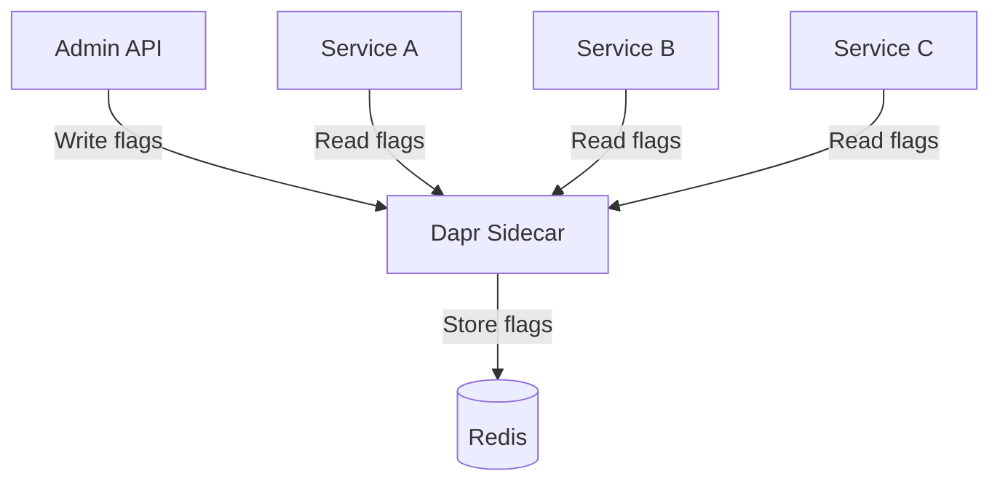

# How to Use Dapr State Management for Feature Flags

Author: [nawazdhandala](https://www.github.com/nawazdhandala)

Tags: Dapr, State Management, Feature Flag, Microservice, Configuration

Description: Learn how to implement a lightweight feature flag system using Dapr State Management with dynamic updates, per-user rollouts, and cross-service flag distribution.

---

## Introduction

Feature flags (also called feature toggles) let you enable or disable features at runtime without redeploying code. While dedicated tools like LaunchDarkly exist, many teams need a simpler solution. Dapr State Management combined with the Configuration API provides a fast, durable feature flag store that any service can read.

## Feature Flag Architecture



## Flag Data Model

```json
{
  "flagId": "new-checkout-flow",
  "enabled": true,
  "rolloutPercentage": 50,
  "allowedUsers": ["usr-1", "usr-2"],
  "allowedGroups": ["beta-testers"],
  "metadata": {
    "description": "New streamlined checkout experience",
    "owner": "checkout-team",
    "createdAt": "2026-03-01T00:00:00Z"
  }
}
```

## State Store Component

```yaml
apiVersion: dapr.io/v1alpha1
kind: Component
metadata:
  name: flags-store
  namespace: default
spec:
  type: state.redis
  version: v1
  metadata:
    - name: redisHost
      value: redis-master:6379
    - name: redisPassword
      secretKeyRef:
        name: redis-secret
        key: redis-password
    - name: keyPrefix
      value: none
```

## Feature Flag Service

```python
# feature_flags.py
import json
import hashlib
import time
from dapr.clients import DaprClient
from flask import Flask, request, jsonify

app = Flask(__name__)
STORE = "flags-store"

def flag_key(flag_id: str) -> str:
    return f"flag:{flag_id}"

def is_user_in_rollout(user_id: str, flag_id: str, percentage: int) -> bool:
    """Deterministic rollout: same user always gets same result."""
    if percentage >= 100:
        return True
    if percentage <= 0:
        return False
    hash_val = int(hashlib.md5(f"{user_id}:{flag_id}".encode()).hexdigest(), 16)
    return (hash_val % 100) < percentage


class FeatureFlagClient:
    def __init__(self, client: DaprClient):
        self.client = client
        self._cache = {}
        self._cache_ttl = 10  # seconds

    def get_flag(self, flag_id: str) -> dict | None:
        cache_key = flag_key(flag_id)
        cached = self._cache.get(cache_key)
        if cached and time.time() - cached["ts"] < self._cache_ttl:
            return cached["data"]

        result = self.client.get_state(STORE, cache_key)
        data = json.loads(result.data) if result.data else None
        self._cache[cache_key] = {"data": data, "ts": time.time()}
        return data

    def is_enabled(self, flag_id: str, user_id: str = None) -> bool:
        flag = self.get_flag(flag_id)
        if not flag:
            return False
        if not flag.get("enabled", False):
            return False

        # Check user allowlist
        if user_id and user_id in flag.get("allowedUsers", []):
            return True

        # Check percentage rollout
        rollout = flag.get("rolloutPercentage", 100)
        if user_id:
            return is_user_in_rollout(user_id, flag_id, rollout)

        return rollout >= 100


# Admin endpoints
@app.route("/flags", methods=["POST"])
def create_flag():
    flag = request.get_json()
    flag_id = flag["flagId"]
    with DaprClient() as client:
        client.save_state(
            store_name=STORE,
            key=flag_key(flag_id),
            value=json.dumps(flag)
        )
    return jsonify(flag), 201


@app.route("/flags/<flag_id>", methods=["GET"])
def get_flag(flag_id: str):
    with DaprClient() as client:
        result = client.get_state(STORE, flag_key(flag_id))
        if not result.data:
            return jsonify({"error": "flag not found"}), 404
        return result.data, 200


@app.route("/flags/<flag_id>", methods=["PATCH"])
def update_flag(flag_id: str):
    updates = request.get_json()
    with DaprClient() as client:
        result = client.get_state(STORE, flag_key(flag_id))
        if not result.data:
            return jsonify({"error": "not found"}), 404
        flag = json.loads(result.data)
        flag.update(updates)
        client.save_state(
            store_name=STORE,
            key=flag_key(flag_id),
            value=json.dumps(flag),
            etag=result.etag
        )
    return jsonify(flag), 200


@app.route("/flags/<flag_id>/check", methods=["GET"])
def check_flag(flag_id: str):
    user_id = request.args.get("userId")
    with DaprClient() as client:
        fc = FeatureFlagClient(client)
        enabled = fc.is_enabled(flag_id, user_id)
    return jsonify({"flagId": flag_id, "enabled": enabled, "userId": user_id})
```

## Using Feature Flags in Your Service

```python
# In orderservice
from dapr.clients import DaprClient
from feature_flags import FeatureFlagClient

def process_checkout(user_id: str, cart: dict):
    with DaprClient() as client:
        flags = FeatureFlagClient(client)

        if flags.is_enabled("new-checkout-flow", user_id):
            return new_checkout_flow(cart)
        else:
            return legacy_checkout_flow(cart)
```

## Creating Flags via the Dapr HTTP API

```bash
# Create a flag (50% rollout)
curl -X POST http://localhost:3500/v1.0/state/flags-store \
  -H "Content-Type: application/json" \
  -d '[{
    "key": "flag:dark-mode",
    "value": {
      "flagId": "dark-mode",
      "enabled": true,
      "rolloutPercentage": 50,
      "allowedUsers": [],
      "metadata": {"description": "Dark mode UI"}
    }
  }]'

# Enable for everyone
curl -X POST http://localhost:3500/v1.0/state/flags-store \
  -H "Content-Type: application/json" \
  -d '[{
    "key": "flag:dark-mode",
    "value": {
      "flagId": "dark-mode",
      "enabled": true,
      "rolloutPercentage": 100
    }
  }]'

# Disable immediately
curl -X POST http://localhost:3500/v1.0/state/flags-store \
  -H "Content-Type: application/json" \
  -d '[{"key": "flag:dark-mode", "value": {"flagId": "dark-mode", "enabled": false}}]'
```

## Bulk Flag Check

```bash
# Get all flags at once
curl -X POST http://localhost:3500/v1.0/state/flags-store/bulk \
  -H "Content-Type: application/json" \
  -d '{
    "keys": ["flag:dark-mode", "flag:new-checkout-flow", "flag:beta-dashboard"],
    "parallelism": 10
  }'
```

## Summary

Dapr State Management provides all the building blocks for a lightweight feature flag system: fast key-value reads, atomic updates with ETags, and access from any service via a shared component. Implement deterministic percentage-based rollouts using a hash of the user ID and flag ID so the same user always sees the same experience. Cache flags locally for a few seconds to avoid hitting the sidecar on every request, and use PATCH semantics for partial flag updates to avoid overwriting concurrent changes.
