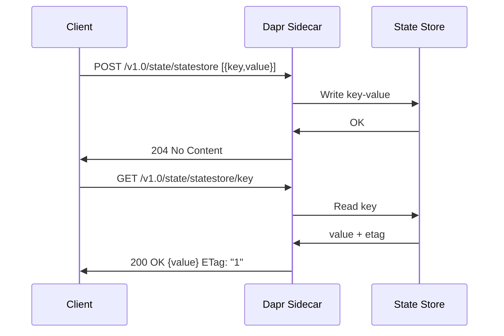

# How to Save and Get State in Dapr with HTTP API

Author: [nawazdhandala](https://www.github.com/nawazdhandala)

Tags: Dapr, State Management, HTTP API, Key-Value, REST

Description: A complete guide to using the Dapr HTTP API for saving, getting, updating, and deleting state, including bulk operations and concurrency options.

---

## Overview

The Dapr state management HTTP API provides a simple REST interface for key-value storage. All operations go through the sidecar at `http://localhost:3500/v1.0/state/{storeName}`. The API is identical regardless of the underlying state store backend.

## API Reference

| Method | Endpoint | Description |
|--------|----------|-------------|
| POST | `/v1.0/state/{storeName}` | Save one or more state items |
| GET | `/v1.0/state/{storeName}/{key}` | Get a single state item |
| DELETE | `/v1.0/state/{storeName}/{key}` | Delete a state item |
| POST | `/v1.0/state/{storeName}/bulk` | Get multiple state items |
| POST | `/v1.0/state/{storeName}/transaction` | Execute a transactional state operation |

## Saving State

Save one or more key-value pairs in a single request:

```bash
curl -X POST http://localhost:3500/v1.0/state/statestore \
  -H "Content-Type: application/json" \
  -d '[
    {
      "key": "order:001",
      "value": {
        "orderId": "001",
        "customerId": "cust-42",
        "items": [{"sku": "A1", "qty": 2}],
        "status": "pending"
      }
    }
  ]'
```

Success response: `204 No Content`

## Getting State

Retrieve a value by key:

```bash
curl http://localhost:3500/v1.0/state/statestore/order:001
```

Response:

```json
{"orderId": "001", "customerId": "cust-42", "items": [{"sku": "A1", "qty": 2}], "status": "pending"}
```

The response also includes:
- `ETag` header for optimistic concurrency control
- `Content-Type: application/json`

Get the ETag header:

```bash
curl -i http://localhost:3500/v1.0/state/statestore/order:001
```

```
HTTP/1.1 200 OK
Content-Type: application/json
ETag: "1"
```

## Getting State with Metadata

Include consistency and concurrency options via query parameters:

```bash
# Strong consistency read
curl "http://localhost:3500/v1.0/state/statestore/order:001?consistency=strong"
```

## Getting Bulk State

Retrieve multiple keys in a single request:

```bash
curl -X POST http://localhost:3500/v1.0/state/statestore/bulk \
  -H "Content-Type: application/json" \
  -d '{
    "keys": ["order:001", "order:002", "order:003"],
    "parallelism": 10
  }'
```

Response:

```json
[
  {"key": "order:001", "data": {"orderId": "001", "status": "pending"}, "etag": "1"},
  {"key": "order:002", "data": {"orderId": "002", "status": "shipped"}, "etag": "2"},
  {"key": "order:003", "data": null, "etag": ""}
]
```

Keys with no data return `null` without an error.

## Deleting State

```bash
curl -X DELETE http://localhost:3500/v1.0/state/statestore/order:001
```

Success response: `204 No Content`

Delete with concurrency check using ETag:

```bash
curl -X DELETE http://localhost:3500/v1.0/state/statestore/order:001 \
  -H "If-Match: \"1\""
```

## Optimistic Concurrency with ETags

ETags prevent lost updates when multiple clients update the same key concurrently.

Save with optimistic concurrency:

```bash
# Get current ETag
ETAG=$(curl -si http://localhost:3500/v1.0/state/statestore/order:001 | grep -i etag | awk '{print $2}' | tr -d '\r')

# Update only if ETag matches
curl -X POST http://localhost:3500/v1.0/state/statestore \
  -H "Content-Type: application/json" \
  -d "[{
    \"key\": \"order:001\",
    \"value\": {\"status\": \"shipped\"},
    \"etag\": $ETAG,
    \"options\": {\"concurrency\": \"first-write\"}
  }]"
```

If the ETag does not match (another client updated first), the response is `409 Conflict`.

## State Save Options

The `options` object in the save request controls concurrency and consistency:

```json
{
  "key": "mykey",
  "value": "myvalue",
  "options": {
    "concurrency": "first-write",
    "consistency": "strong"
  }
}
```

Concurrency modes:
- `first-write` - Only update if ETag matches (optimistic lock)
- `last-write` - Always overwrite (default)

Consistency modes:
- `eventual` - Eventual consistency (default, faster)
- `strong` - Strong consistency (slower but guaranteed current)

## Setting TTL on a State Item

```bash
curl -X POST http://localhost:3500/v1.0/state/statestore \
  -H "Content-Type: application/json" \
  -d '[{
    "key": "cache:session123",
    "value": {"userId": "u1", "token": "abc"},
    "metadata": {
      "ttlInSeconds": "3600"
    }
  }]'
```

The state item expires automatically after 3600 seconds.

## Transactional State Operations

Execute multiple operations atomically:

```bash
curl -X POST http://localhost:3500/v1.0/state/statestore/transaction \
  -H "Content-Type: application/json" \
  -d '{
    "operations": [
      {
        "operation": "upsert",
        "request": {
          "key": "order:001",
          "value": {"status": "shipped"}
        }
      },
      {
        "operation": "delete",
        "request": {
          "key": "cart:cust-42"
        }
      },
      {
        "operation": "upsert",
        "request": {
          "key": "shipment:001",
          "value": {"orderId": "001", "trackingCode": "TRK-XYZ"}
        }
      }
    ]
  }'
```

## State Operations Flow



## Error Responses

| Status Code | Meaning |
|-------------|---------|
| 204 | Success (save/delete) |
| 200 | Success (get/bulk) |
| 400 | Bad request (malformed body) |
| 404 | Key not found returns empty body with 200, not 404 |
| 409 | ETag conflict (first-write concurrency) |
| 500 | State store error |

Note: Getting a nonexistent key returns `200 OK` with an empty body, not a 404.

## Summary

The Dapr state management HTTP API provides a consistent, backend-agnostic interface for saving, retrieving, and managing application state. Key features include bulk operations for efficiency, ETag-based optimistic concurrency control, TTL for automatic expiration, and transactional operations for atomicity. The API is accessible at `http://localhost:3500/v1.0/state/{storeName}` from any application that can make HTTP calls.
