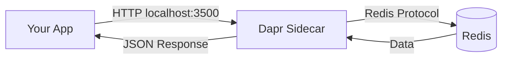

# How to Use Dapr State Management with Redis

Author: [nawazdhandala](https://www.github.com/nawazdhandala)

Tags: Dapr, State Management, Redis, Microservice, Key-Value Store

Description: Configure Dapr state management with Redis as the backing store and learn how to save, get, delete, and query state using the Dapr HTTP and SDK APIs.

---

## What Is Dapr State Management?

Dapr state management provides a consistent key-value API for storing and retrieving application state, regardless of the underlying database. Redis is the default state store in Dapr's local development setup and is widely used in production as a fast in-memory key-value store.

## How It Works



## Prerequisites

- Dapr CLI initialized (`dapr init` starts Redis automatically)
- Redis running on `localhost:6379` (or a remote instance)
- Dapr state store component configured

## Configuring the Redis State Store

The default configuration created by `dapr init`:

```yaml
# ~/.dapr/components/statestore.yaml
apiVersion: dapr.io/v1alpha1
kind: Component
metadata:
  name: statestore
spec:
  type: state.redis
  version: v1
  metadata:
  - name: redisHost
    value: "localhost:6379"
  - name: redisPassword
    value: ""
  - name: actorStateStore
    value: "true"
  - name: enableTLS
    value: "false"
```

### Kubernetes configuration with Redis auth:

```yaml
apiVersion: dapr.io/v1alpha1
kind: Component
metadata:
  name: statestore
  namespace: default
spec:
  type: state.redis
  version: v1
  metadata:
  - name: redisHost
    value: "redis-master.default.svc.cluster.local:6379"
  - name: redisPassword
    secretKeyRef:
      name: redis-secret
      key: redis-password
  - name: actorStateStore
    value: "true"
  - name: enableTLS
    value: "false"
  - name: db
    value: "0"
  - name: maxRetries
    value: "3"
```

Create the secret:

```bash
kubectl create secret generic redis-secret \
  --from-literal=redis-password=mysecretpassword
```

## Saving State

Use a POST request to save one or more key-value pairs:

```bash
curl -X POST http://localhost:3500/v1.0/state/statestore \
  -H "Content-Type: application/json" \
  -d '[
    {
      "key": "user:alice",
      "value": {"name": "Alice", "email": "alice@example.com", "score": 100}
    },
    {
      "key": "user:bob",
      "value": {"name": "Bob", "email": "bob@example.com", "score": 85}
    }
  ]'
```

## Getting State

```bash
curl http://localhost:3500/v1.0/state/statestore/user:alice
```

Response:

```json
{"name": "Alice", "email": "alice@example.com", "score": 100}
```

## Deleting State

```bash
curl -X DELETE http://localhost:3500/v1.0/state/statestore/user:alice
```

## Using Dapr SDK in Python

```python
from dapr.clients import DaprClient
import json

with DaprClient() as client:
    # Save state
    client.save_state(
        store_name="statestore",
        key="user:alice",
        value=json.dumps({"name": "Alice", "score": 100})
    )

    # Get state
    result = client.get_state(
        store_name="statestore",
        key="user:alice"
    )
    print(result.data)  # b'{"name": "Alice", "score": 100}'
    user = json.loads(result.data)
    print(user["name"])  # Alice

    # Delete state
    client.delete_state(
        store_name="statestore",
        key="user:alice"
    )
```

## Using Dapr SDK in Go

```go
package main

import (
    "context"
    "encoding/json"
    "fmt"
    "log"

    dapr "github.com/dapr/go-sdk/client"
)

type User struct {
    Name  string `json:"name"`
    Email string `json:"email"`
    Score int    `json:"score"`
}

func main() {
    client, err := dapr.NewClient()
    if err != nil {
        log.Fatal(err)
    }
    defer client.Close()

    ctx := context.Background()

    // Save state
    user := User{Name: "Alice", Email: "alice@example.com", Score: 100}
    data, _ := json.Marshal(user)
    err = client.SaveState(ctx, "statestore", "user:alice", data, nil)
    if err != nil {
        log.Fatal(err)
    }

    // Get state
    item, err := client.GetState(ctx, "statestore", "user:alice", nil)
    if err != nil {
        log.Fatal(err)
    }
    var retrieved User
    json.Unmarshal(item.Value, &retrieved)
    fmt.Printf("Retrieved: %+v\n", retrieved)

    // Delete state
    client.DeleteState(ctx, "statestore", "user:alice", nil)
}
```

## Node.js Example

```javascript
import { DaprClient } from "@dapr/dapr";

const client = new DaprClient();

// Save state
await client.state.save("statestore", [
  {
    key: "user:alice",
    value: { name: "Alice", email: "alice@example.com", score: 100 }
  }
]);

// Get state
const state = await client.state.get("statestore", "user:alice");
console.log(state); // { name: "Alice", ... }

// Delete state
await client.state.delete("statestore", "user:alice");
```

## State Stored in Redis

Dapr prefixes all state keys with the app ID to avoid collisions. The key format in Redis is:

```
{app-id}||{key}
```

For example, if your app ID is `myapp` and the key is `user:alice`, Redis stores it as:

```
myapp||user:alice
```

Inspect directly with the Redis CLI:

```bash
redis-cli keys "*"
# 1) "myapp||user:alice"

redis-cli get "myapp||user:alice"
```

## Configuring Persistence

By default, the Redis container started by `dapr init` does not persist data. For durability, configure Redis persistence:

```yaml
# Add to Redis deployment
command: ["redis-server", "--appendonly", "yes", "--appendfsync", "everysec"]
```

Or use a Redis instance with RDB snapshots enabled.

## Summary

Dapr state management with Redis provides a fast, consistent key-value API for storing application state. The Redis state store component connects through the Dapr sidecar, key-encoding with the app ID prefix for namespace isolation. The same API works with any other supported state store (CosmosDB, DynamoDB, PostgreSQL, etc.), making it easy to swap backends without changing application code.
