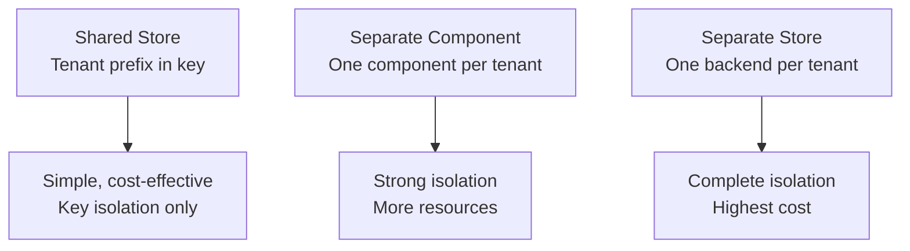

# How to Use Dapr State Management with Multi-Tenancy

Author: [OneUptime](https://oneuptime.com)

Tags: Dapr, State Management, Multi-Tenancy, Isolation, Microservice

Description: Learn how to implement multi-tenant state management with Dapr using tenant-scoped key prefixes, separate state stores per tenant, and access control patterns.

---

## Introduction

Multi-tenancy means multiple customers (tenants) share the same service infrastructure while keeping their data completely isolated. Dapr State Management supports multi-tenancy through key prefixing strategies, separate component instances, and component scoping. This guide covers the trade-offs and implementation of each approach.

## Multi-Tenancy Strategies



## Strategy 1: Tenant Key Prefix (Recommended for Most Cases)

All tenants share the same state store, but every key is prefixed with the tenant ID:

```python
# tenant_state.py
import json
from dapr.clients import DaprClient

STORE = "statestore"

def tenant_key(tenant_id: str, resource_type: str, resource_id: str) -> str:
    return f"{tenant_id}:{resource_type}:{resource_id}"


class TenantStateClient:
    def __init__(self, tenant_id: str):
        self.tenant_id = tenant_id

    def save(self, resource_type: str, resource_id: str, value: dict):
        key = tenant_key(self.tenant_id, resource_type, resource_id)
        with DaprClient() as client:
            client.save_state(STORE, key, json.dumps(value))

    def get(self, resource_type: str, resource_id: str) -> dict | None:
        key = tenant_key(self.tenant_id, resource_type, resource_id)
        with DaprClient() as client:
            result = client.get_state(STORE, key)
            return json.loads(result.data) if result.data else None

    def delete(self, resource_type: str, resource_id: str):
        key = tenant_key(self.tenant_id, resource_type, resource_id)
        with DaprClient() as client:
            client.delete_state(STORE, key)
```

Example usage in a request handler:

```python
from flask import Flask, request, jsonify, g
from tenant_state import TenantStateClient

app = Flask(__name__)

def get_tenant_id() -> str:
    # Extract tenant from JWT claims, header, or subdomain
    return request.headers.get("X-Tenant-Id", "default")


@app.route("/orders/<order_id>", methods=["GET"])
def get_order(order_id: str):
    client = TenantStateClient(get_tenant_id())
    order = client.get("order", order_id)
    if not order:
        return jsonify({"error": "not found"}), 404
    return jsonify(order)


@app.route("/orders", methods=["POST"])
def create_order():
    tenant_id = get_tenant_id()
    client = TenantStateClient(tenant_id)
    order_data = request.get_json()
    order_id = f"ord-{tenant_id}-{int(__import__('time').time())}"
    order_data["orderId"] = order_id
    order_data["tenantId"] = tenant_id
    client.save("order", order_id, order_data)
    return jsonify(order_data), 201
```

## State Store Component (Shared)

```yaml
apiVersion: dapr.io/v1alpha1
kind: Component
metadata:
  name: statestore
  namespace: default
spec:
  type: state.redis
  version: v1
  metadata:
    - name: redisHost
      value: redis-master:6379
    - name: redisPassword
      secretKeyRef:
        name: redis-secret
        key: redis-password
    - name: keyPrefix
      value: none    # We manage our own prefixes
```

## Strategy 2: Separate Component Per Tenant

Create one Dapr component per tenant, pointing to tenant-specific Redis databases:

```yaml
# tenant-acme-statestore.yaml
apiVersion: dapr.io/v1alpha1
kind: Component
metadata:
  name: acme-statestore
  namespace: default
spec:
  type: state.redis
  version: v1
  metadata:
    - name: redisHost
      value: redis-master:6379
    - name: redisDB
      value: "1"    # Redis DB 1 for ACME
  scopes:
    - orderservice
---
# tenant-globex-statestore.yaml
apiVersion: dapr.io/v1alpha1
kind: Component
metadata:
  name: globex-statestore
spec:
  type: state.redis
  version: v1
  metadata:
    - name: redisHost
      value: redis-master:6379
    - name: redisDB
      value: "2"    # Redis DB 2 for Globex
  scopes:
    - orderservice
```

```python
def get_store_name(tenant_id: str) -> str:
    return f"{tenant_id}-statestore"

# Routes requests to tenant-specific component
with DaprClient() as client:
    client.save_state(
        store_name=get_store_name("acme"),
        key="order-001",
        value=json.dumps({"item": "laptop"})
    )
```

## Strategy 3: Separate Backend Per Tenant

For complete data isolation (compliance, PCI, HIPAA), provision a separate state store backend per tenant:

```yaml
# Each tenant has their own Redis or PostgreSQL instance
apiVersion: dapr.io/v1alpha1
kind: Component
metadata:
  name: acme-statestore
spec:
  type: state.postgresql
  version: v2
  metadata:
    - name: connectionString
      secretKeyRef:
        name: acme-pg-secret
        key: connectionString
    - name: tableName
      value: state
```

## Tenant Isolation Enforcement

Add middleware to enforce that requests can only access their own tenant's data:

```python
from functools import wraps
from flask import request, jsonify, g

def require_tenant(f):
    @wraps(f)
    def decorated(*args, **kwargs):
        tenant_id = request.headers.get("X-Tenant-Id")
        if not tenant_id:
            return jsonify({"error": "X-Tenant-Id header required"}), 400

        # Validate JWT contains this tenant ID
        # token_claims = verify_jwt(request.headers.get("Authorization"))
        # if token_claims["tenant"] != tenant_id:
        #     return jsonify({"error": "forbidden"}), 403

        g.tenant_id = tenant_id
        return f(*args, **kwargs)
    return decorated
```

## Tenant Data Deletion (GDPR Right to Erasure)

With the key prefix strategy, deleting all tenant data requires scanning keys:

```python
import redis

def delete_tenant_data(tenant_id: str):
    """Delete all state entries for a tenant. Use with caution!"""
    r = redis.Redis(host="redis-master", port=6379, password="secret")

    # Pattern matches: {appId}||{tenantId}:*
    # With keyPrefix=none, just: {tenantId}:*
    pattern = f"{tenant_id}:*"

    deleted = 0
    for key in r.scan_iter(pattern):
        r.delete(key)
        deleted += 1

    print(f"Deleted {deleted} keys for tenant {tenant_id}")
    return deleted
```

## Comparison of Strategies

| Strategy | Data Isolation | Cost | Complexity | Compliance |
|----------|--------------|------|------------|------------|
| Key prefix | Logical only | Low | Low | Limited |
| Separate component | Component-level | Medium | Medium | Moderate |
| Separate backend | Physical | High | High | Strong |

## Summary

Multi-tenant state management with Dapr is best implemented using tenant-scoped key prefixes for most applications: prefix every key with the tenant ID (`{tenantId}:{type}:{id}`), set `keyPrefix: none` on the component, and extract the tenant ID from the request context in a middleware. For stronger isolation requirements, use separate Dapr components pointing to different Redis databases or separate backend instances per tenant. Implement a centralized `TenantStateClient` class to enforce the naming convention and prevent accidental cross-tenant access in application code.
