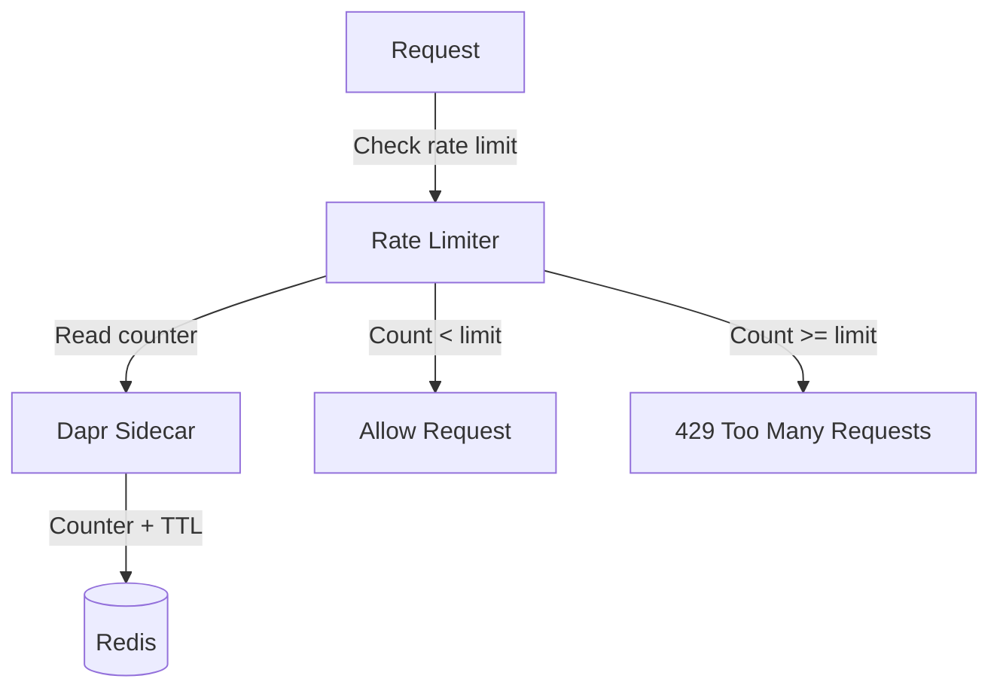

# How to Use Dapr State Management for Rate Limiting

Author: [OneUptime](https://oneuptime.com)

Tags: Dapr, State Management, Rate Limiting, API, Microservice

Description: Learn how to implement a sliding window and fixed window rate limiter using Dapr State Management with TTL, protecting your microservices from overuse.

---

## Introduction

Rate limiting protects services from overuse, prevents denial-of-service scenarios, and enforces fair use across clients. While Dapr has a built-in middleware rate limiter, sometimes you need application-level rate limiting with per-user or per-tenant granularity. Dapr State Management with TTL provides the building blocks for flexible rate limiters.

## Rate Limiting Patterns



## Fixed Window Rate Limiter

The simplest approach: count requests in a fixed time window. The window resets at a fixed boundary.

```python
# rate_limiter.py
import json
import time
from dapr.clients import DaprClient

STORE = "statestore"

class FixedWindowRateLimiter:
    def __init__(self, limit: int, window_seconds: int):
        self.limit = limit
        self.window_seconds = window_seconds

    def _window_key(self, identifier: str) -> str:
        # Fixed window: round down to window boundary
        window = int(time.time() // self.window_seconds)
        return f"rl:fw:{identifier}:{window}"

    def is_allowed(self, identifier: str) -> tuple[bool, dict]:
        key = self._window_key(identifier)

        with DaprClient() as client:
            result = client.get_state(STORE, key)
            current = json.loads(result.data) if result.data else {"count": 0}
            count = current["count"]

            if count >= self.limit:
                return False, {
                    "allowed": False,
                    "limit": self.limit,
                    "remaining": 0,
                    "retryAfter": self.window_seconds - (int(time.time()) % self.window_seconds)
                }

            # Increment counter
            new_count = count + 1
            client.save_state(
                store_name=STORE,
                key=key,
                value=json.dumps({"count": new_count}),
                state_metadata={"ttlInSeconds": str(self.window_seconds * 2)}
            )

            return True, {
                "allowed": True,
                "limit": self.limit,
                "remaining": self.limit - new_count,
                "resetAt": int(time.time() // self.window_seconds + 1) * self.window_seconds
            }
```

## Sliding Window Rate Limiter

More accurate but requires storing individual request timestamps:

```python
class SlidingWindowRateLimiter:
    def __init__(self, limit: int, window_seconds: int):
        self.limit = limit
        self.window_seconds = window_seconds

    def _key(self, identifier: str) -> str:
        return f"rl:sw:{identifier}"

    def is_allowed(self, identifier: str) -> tuple[bool, dict]:
        key = self._key(identifier)
        now = time.time()
        window_start = now - self.window_seconds

        with DaprClient() as client:
            result = client.get_state(STORE, key)
            data = json.loads(result.data) if result.data else {"timestamps": []}

            # Remove timestamps outside the window
            timestamps = [ts for ts in data["timestamps"] if ts > window_start]
            count = len(timestamps)

            if count >= self.limit:
                oldest_in_window = min(timestamps) if timestamps else now
                retry_after = int(oldest_in_window + self.window_seconds - now) + 1
                return False, {
                    "allowed": False,
                    "limit": self.limit,
                    "remaining": 0,
                    "retryAfter": retry_after
                }

            timestamps.append(now)
            client.save_state(
                store_name=STORE,
                key=key,
                value=json.dumps({"timestamps": timestamps}),
                state_metadata={"ttlInSeconds": str(self.window_seconds + 60)},
                etag=result.etag
            )

            return True, {
                "allowed": True,
                "limit": self.limit,
                "remaining": self.limit - len(timestamps)
            }
```

## Flask Middleware Using the Rate Limiter

```python
from flask import Flask, request, jsonify, g
from functools import wraps
from rate_limiter import FixedWindowRateLimiter

app = Flask(__name__)

# 100 requests per minute per user
user_limiter = FixedWindowRateLimiter(limit=100, window_seconds=60)
# 1000 requests per minute per IP
ip_limiter = FixedWindowRateLimiter(limit=1000, window_seconds=60)


def rate_limit(f):
    @wraps(f)
    def decorated(*args, **kwargs):
        # Use user ID if authenticated, fall back to IP
        identifier = getattr(g, "user_id", None) or request.remote_addr
        allowed, info = user_limiter.is_allowed(identifier)

        if not allowed:
            response = jsonify({
                "error": "rate limit exceeded",
                "retryAfter": info["retryAfter"]
            })
            response.headers["X-RateLimit-Limit"] = str(info["limit"])
            response.headers["X-RateLimit-Remaining"] = "0"
            response.headers["Retry-After"] = str(info["retryAfter"])
            return response, 429

        response = f(*args, **kwargs)
        # Add rate limit headers to successful responses
        if hasattr(response, "headers"):
            response.headers["X-RateLimit-Limit"] = str(info["limit"])
            response.headers["X-RateLimit-Remaining"] = str(info["remaining"])
        return response
    return decorated


@app.route("/api/data")
@rate_limit
def get_data():
    return jsonify({"data": "..."})
```

## Per-Tenant Rate Limiting

```python
# Different limits for different subscription tiers
TIER_LIMITS = {
    "free":       FixedWindowRateLimiter(limit=100,   window_seconds=3600),
    "pro":        FixedWindowRateLimiter(limit=1000,  window_seconds=3600),
    "enterprise": FixedWindowRateLimiter(limit=10000, window_seconds=3600),
}

def check_tenant_rate_limit(tenant_id: str, tier: str) -> tuple[bool, dict]:
    limiter = TIER_LIMITS.get(tier, TIER_LIMITS["free"])
    return limiter.is_allowed(f"tenant:{tenant_id}")
```

## State Store Component for Rate Limiting

```yaml
apiVersion: dapr.io/v1alpha1
kind: Component
metadata:
  name: statestore
spec:
  type: state.redis
  version: v1
  metadata:
    - name: redisHost
      value: redis-master:6379
    - name: redisPassword
      secretKeyRef:
        name: redis-secret
        key: redis-password
    - name: keyPrefix
      value: none
    - name: poolSize
      value: "50"     # High pool size for rate limit workloads
    - name: readTimeout
      value: "100ms"  # Fast timeout - rate limits should not add latency
    - name: writeTimeout
      value: "100ms"
```

## Testing the Rate Limiter

```bash
# Send requests until rate limited
for i in $(seq 1 110); do
  STATUS=$(curl -s -o /dev/null -w "%{http_code}" \
    -H "X-User-Id: usr-42" \
    http://localhost:5000/api/data)
  echo "Request $i: $STATUS"
done

# Expected: first 100 return 200, requests 101+ return 429
```

## Summary

Dapr State Management provides a solid foundation for application-level rate limiting. Implement fixed window rate limiters for simplicity or sliding window limiters for accuracy, using TTL to automatically expire counter keys. Store rate limit state under keys like `rl:{type}:{identifier}:{window}` with short TTLs matching the rate window. Use a connection pool optimized for low-latency reads on the Redis component, and expose standard `X-RateLimit-*` response headers so clients can adapt their request rate intelligently.
