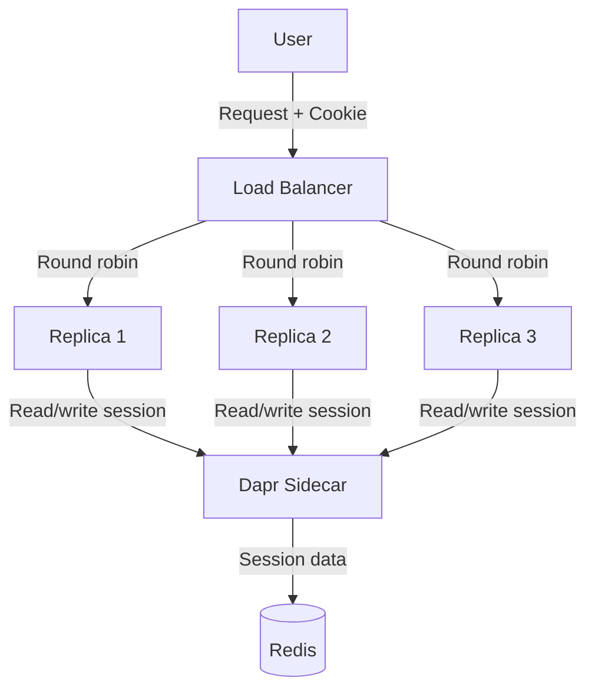

# How to Use Dapr State Management for Session Storage

Author: [OneUptime](https://oneuptime.com)

Tags: Dapr, State Management, Session Storage, Microservice, Redis

Description: Learn how to implement distributed session storage using Dapr State Management with TTL support, enabling stateless services to maintain user sessions across multiple replicas.

---

## Introduction

Session storage is a classic stateful problem in web applications. When your service scales to multiple replicas, user sessions stored in memory on one instance are invisible to others. Dapr State Management with TTL support provides a simple, backend-agnostic solution for distributed session storage.

## Session Storage Architecture



Any replica can serve any user request because session data lives in the shared state store.

## Setting Up the State Store with TTL

```yaml
apiVersion: dapr.io/v1alpha1
kind: Component
metadata:
  name: session-store
  namespace: default
spec:
  type: state.redis
  version: v1
  metadata:
    - name: redisHost
      value: redis-master:6379
    - name: redisPassword
      secretKeyRef:
        name: redis-secret
        key: redis-password
    - name: keyPrefix
      value: none       # Sessions are app-specific, no prefix collision risk
    - name: ttlInSeconds
      value: "3600"     # Default 1 hour TTL for all session keys
```

## Implementing Session Management in Python (Flask)

```python
# session_store.py
import json
import secrets
import time
from dapr.clients import DaprClient

STORE = "session-store"
SESSION_TTL_SECONDS = 3600

class DaprSessionStore:
    def create_session(self, user_id: str, user_data: dict) -> str:
        session_id = secrets.token_urlsafe(32)
        session = {
            "userId": user_id,
            "createdAt": int(time.time()),
            "lastAccessedAt": int(time.time()),
            **user_data
        }
        with DaprClient() as client:
            client.save_state(
                store_name=STORE,
                key=f"session:{session_id}",
                value=json.dumps(session),
                state_metadata={"ttlInSeconds": str(SESSION_TTL_SECONDS)}
            )
        return session_id

    def get_session(self, session_id: str) -> dict | None:
        with DaprClient() as client:
            result = client.get_state(STORE, f"session:{session_id}")
            if not result.data:
                return None
            session = json.loads(result.data)
            # Refresh TTL on access
            session["lastAccessedAt"] = int(time.time())
            client.save_state(
                store_name=STORE,
                key=f"session:{session_id}",
                value=json.dumps(session),
                state_metadata={"ttlInSeconds": str(SESSION_TTL_SECONDS)}
            )
            return session

    def delete_session(self, session_id: str):
        with DaprClient() as client:
            client.delete_state(STORE, f"session:{session_id}")

    def update_session(self, session_id: str, updates: dict) -> bool:
        with DaprClient() as client:
            result = client.get_state(STORE, f"session:{session_id}")
            if not result.data:
                return False
            session = json.loads(result.data)
            session.update(updates)
            session["lastAccessedAt"] = int(time.time())
            client.save_state(
                store_name=STORE,
                key=f"session:{session_id}",
                value=json.dumps(session),
                state_metadata={"ttlInSeconds": str(SESSION_TTL_SECONDS)}
            )
            return True
```

## Flask Integration

```python
# app.py
from flask import Flask, request, jsonify, make_response
from session_store import DaprSessionStore

app = Flask(__name__)
store = DaprSessionStore()
SESSION_COOKIE = "session_id"

@app.route("/login", methods=["POST"])
def login():
    data = request.get_json()
    # ... validate credentials
    user_id = data["userId"]
    session_id = store.create_session(user_id, {
        "email": data["email"],
        "roles": ["user"]
    })
    response = make_response(jsonify({"message": "logged in"}))
    response.set_cookie(
        SESSION_COOKIE, session_id,
        httponly=True, secure=True, samesite="Strict",
        max_age=3600
    )
    return response

@app.route("/profile")
def profile():
    session_id = request.cookies.get(SESSION_COOKIE)
    if not session_id:
        return jsonify({"error": "not authenticated"}), 401
    session = store.get_session(session_id)
    if not session:
        return jsonify({"error": "session expired"}), 401
    return jsonify({"userId": session["userId"], "email": session["email"]})

@app.route("/logout", methods=["POST"])
def logout():
    session_id = request.cookies.get(SESSION_COOKIE)
    if session_id:
        store.delete_session(session_id)
    response = make_response(jsonify({"message": "logged out"}))
    response.delete_cookie(SESSION_COOKIE)
    return response
```

## Using Per-Session TTL via Metadata

Override the default TTL for specific sessions:

```bash
# Create a "remember me" session with 30-day TTL
curl -X POST http://localhost:3500/v1.0/state/session-store \
  -H "Content-Type: application/json" \
  -d '[{
    "key": "session:abc123",
    "value": {"userId": "usr-42", "rememberMe": true},
    "metadata": {
      "ttlInSeconds": "2592000"
    }
  }]'
```

## Kubernetes Deployment for Multi-Replica Session Handling

```yaml
apiVersion: apps/v1
kind: Deployment
metadata:
  name: webapp
spec:
  replicas: 3       # Multiple replicas all share the same session store
  template:
    metadata:
      annotations:
        dapr.io/enabled: "true"
        dapr.io/app-id: "webapp"
        dapr.io/app-port: "5000"
    spec:
      containers:
        - name: webapp
          image: myregistry/webapp:1.0
          ports:
            - containerPort: 5000
```

## Testing Session Persistence Across Replicas

```bash
# Log in (creates session)
SESSION_COOKIE=$(curl -s -c /tmp/cookies.txt -X POST \
  http://webapp/login \
  -H "Content-Type: application/json" \
  -d '{"userId":"usr-1","email":"alice@example.com"}' \
  -D - | grep "session_id" | awk '{print $2}')

# Kill replica 1 (simulates restart)
kubectl delete pod -l app=webapp --field-selector=status.podIP=10.0.0.1

# Session still works via replica 2 or 3
curl -b /tmp/cookies.txt http://webapp/profile
# Returns: {"userId": "usr-1", "email": "alice@example.com"}
```

## Summary

Dapr State Management with TTL support is an excellent distributed session store. Configure a state store component (Redis recommended for session workloads), use per-key `ttlInSeconds` metadata to control session expiry, and refresh the TTL on every access to implement sliding session windows. Since all replicas share the same Dapr sidecar and state store, sessions work seamlessly across horizontal scale-out without sticky sessions or shared in-memory state.
