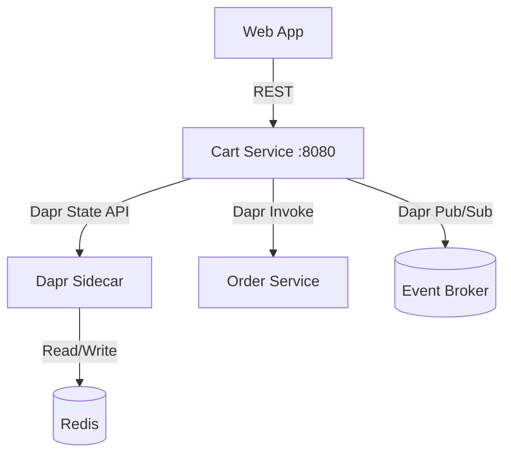

# How to Use Dapr State Management for Shopping Cart Implementations

Author: [nawazdhandala](https://www.github.com/nawazdhandala)

Tags: Dapr, State Management, Shopping Cart, E-Commerce, Microservice

Description: Learn how to build a shopping cart service using Dapr State Management with optimistic concurrency, TTL for abandoned carts, and transactional checkout operations.

---

## Introduction

A shopping cart is a canonical use case for distributed state management. It requires fast reads and writes, handles concurrent modifications from multiple browser tabs, expires abandoned carts, and must transfer to an order atomically at checkout. Dapr State Management handles all of these requirements cleanly.

## Shopping Cart Service Architecture



## State Store Component

```yaml
apiVersion: dapr.io/v1alpha1
kind: Component
metadata:
  name: cart-store
  namespace: default
spec:
  type: state.redis
  version: v1
  metadata:
    - name: redisHost
      value: redis-master:6379
    - name: redisPassword
      secretKeyRef:
        name: redis-secret
        key: redis-password
    - name: keyPrefix
      value: none
    - name: ttlInSeconds
      value: "86400"    # Carts expire after 24 hours of inactivity
```

## Cart Data Model

```json
{
  "cartId": "cart-usr-42",
  "userId": "usr-42",
  "items": [
    {
      "productId": "prod-101",
      "name": "Mechanical Keyboard",
      "price": 149.99,
      "qty": 1
    },
    {
      "productId": "prod-202",
      "name": "USB-C Hub",
      "price": 39.99,
      "qty": 2
    }
  ],
  "updatedAt": "2026-03-31T10:00:00Z"
}
```

## Cart Service Implementation (Python/Flask)

```python
# cart_service.py
import json
import time
from flask import Flask, request, jsonify
from dapr.clients import DaprClient
from dapr.clients.grpc._state import StateOptions, Concurrency, Consistency

app = Flask(__name__)
STORE = "cart-store"
CART_TTL = "86400"

def cart_key(user_id: str) -> str:
    return f"cart:{user_id}"


@app.route("/cart/<user_id>", methods=["GET"])
def get_cart(user_id: str):
    with DaprClient() as client:
        result = client.get_state(STORE, cart_key(user_id))
        if not result.data:
            return jsonify({"userId": user_id, "items": [], "total": 0}), 200
        return result.data, 200


@app.route("/cart/<user_id>/items", methods=["POST"])
def add_item(user_id: str):
    new_item = request.get_json()
    max_retries = 5

    for attempt in range(max_retries):
        with DaprClient() as client:
            result = client.get_state(STORE, cart_key(user_id))
            cart = json.loads(result.data) if result.data else {
                "userId": user_id,
                "items": [],
                "updatedAt": None
            }

            # Merge item (increase qty if exists)
            for item in cart["items"]:
                if item["productId"] == new_item["productId"]:
                    item["qty"] += new_item.get("qty", 1)
                    break
            else:
                cart["items"].append({
                    "productId": new_item["productId"],
                    "name": new_item["name"],
                    "price": new_item["price"],
                    "qty": new_item.get("qty", 1)
                })

            cart["updatedAt"] = time.strftime("%Y-%m-%dT%H:%M:%SZ", time.gmtime())

            try:
                client.save_state(
                    store_name=STORE,
                    key=cart_key(user_id),
                    value=json.dumps(cart),
                    etag=result.etag,
                    options=StateOptions(
                        concurrency=Concurrency.first_write,
                        consistency=Consistency.strong
                    ),
                    state_metadata={"ttlInSeconds": CART_TTL}
                )
                return jsonify(cart), 200
            except Exception as e:
                if "etag" in str(e).lower() and attempt < max_retries - 1:
                    continue   # Retry on ETag conflict
                raise

    return jsonify({"error": "conflict after retries"}), 409


@app.route("/cart/<user_id>/items/<product_id>", methods=["DELETE"])
def remove_item(user_id: str, product_id: str):
    with DaprClient() as client:
        result = client.get_state(STORE, cart_key(user_id))
        if not result.data:
            return jsonify({"error": "cart not found"}), 404

        cart = json.loads(result.data)
        cart["items"] = [i for i in cart["items"] if i["productId"] != product_id]
        cart["updatedAt"] = time.strftime("%Y-%m-%dT%H:%M:%SZ", time.gmtime())

        client.save_state(
            store_name=STORE,
            key=cart_key(user_id),
            value=json.dumps(cart),
            state_metadata={"ttlInSeconds": CART_TTL}
        )
        return jsonify(cart), 200


@app.route("/cart/<user_id>/checkout", methods=["POST"])
def checkout(user_id: str):
    with DaprClient() as client:
        result = client.get_state(STORE, cart_key(user_id))
        if not result.data:
            return jsonify({"error": "cart is empty"}), 400

        cart = json.loads(result.data)
        if not cart["items"]:
            return jsonify({"error": "cart is empty"}), 400

        # Atomically create order and delete cart
        client.execute_state_transaction(
            store_name=STORE,
            operations=[
                {
                    "operation": "delete",
                    "request": {"key": cart_key(user_id)}
                }
            ]
        )

        # Invoke order service via Dapr
        order_response = client.invoke_method(
            app_id="orderservice",
            method_name="orders",
            data=json.dumps({
                "userId": user_id,
                "items": cart["items"]
            }).encode(),
            content_type="application/json"
        )

        return order_response.data, 201
```

## TTL for Abandoned Cart Recovery

When a cart TTL expires, Dapr automatically removes the key. To implement abandoned cart recovery before expiry, use a scheduled job:

```bash
# Dapr Jobs API to schedule daily abandoned cart check
curl -X POST http://localhost:3500/v1.0/jobs/abandoned-cart-check \
  -H "Content-Type: application/json" \
  -d '{
    "schedule": "@every 1h",
    "data": {"task": "send_recovery_email"}
  }'
```

## Testing the Cart Service

```bash
# Add item to cart
curl -X POST http://localhost:8080/cart/usr-42/items \
  -H "Content-Type: application/json" \
  -d '{"productId": "prod-101", "name": "Keyboard", "price": 149.99, "qty": 1}'

# View cart
curl http://localhost:8080/cart/usr-42

# Add another item
curl -X POST http://localhost:8080/cart/usr-42/items \
  -H "Content-Type: application/json" \
  -d '{"productId": "prod-202", "name": "USB Hub", "price": 39.99, "qty": 2}'

# Checkout
curl -X POST http://localhost:8080/cart/usr-42/checkout
```

## Summary

Dapr State Management is well-suited for shopping cart implementations. Use per-key TTL to automatically expire abandoned carts, optimistic concurrency (ETag + first-write-wins) with retry loops to handle concurrent tab modifications, transactional state operations to atomically clear the cart at checkout, and Dapr service invocation to call the order service in the same operation. The cart key scheme `cart:{userId}` with `keyPrefix: none` keeps the implementation simple and easy to debug.
