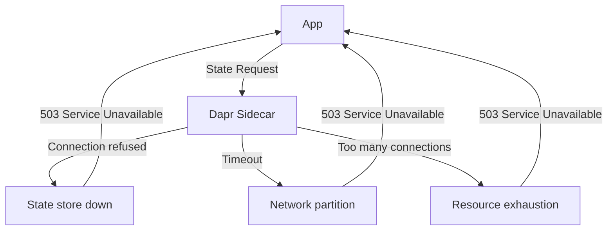
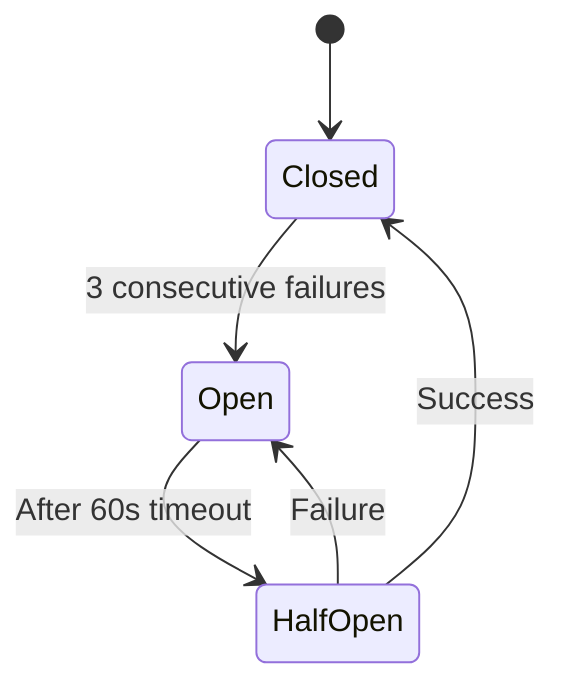

# How to Handle State Store Connection Failures in Dapr

Author: [nawazdhandala](https://www.github.com/nawazdhandala)

Tags: Dapr, State Management, Resiliency, Error Handling, Microservice

Description: Learn how to handle Dapr state store connection failures gracefully using resiliency policies, circuit breakers, fallback strategies, and health checks.

---

## Introduction

State store connection failures are a fact of life in distributed systems. Network partitions, backend restarts, and resource exhaustion can make your state store temporarily unavailable. Dapr provides resiliency policies and your application needs fallback logic to survive these outages gracefully.

## Failure Modes



## Configuring Resiliency for State Stores

Define a Dapr Resiliency policy targeting the state store:

```yaml
apiVersion: dapr.io/v1alpha1
kind: Resiliency
metadata:
  name: statestore-resiliency
  namespace: default
spec:
  policies:
    retries:
      stateRetry:
        policy: exponential
        maxInterval: 15s
        maxRetries: 5
        matching:
          httpStatusCodes: "503,502,429"

    timeouts:
      stateTimeout: 5s

    circuitBreakers:
      stateCB:
        maxRequests: 1
        interval: 30s
        timeout: 60s
        trip: consecutiveFailures >= 3

  targets:
    components:
      statestore:
        outbound:
          retry: stateRetry
          timeout: stateTimeout
          circuitBreaker: stateCB
```

Apply this to any namespace where your application runs:

```bash
kubectl apply -f statestore-resiliency.yaml
```

## Application-Level Fallback Pattern

Do not let state store failures crash your service. Implement a fallback:

```python
from dapr.clients import DaprClient
from dapr.clients.exceptions import DaprInternalError
import logging

logger = logging.getLogger(__name__)
_in_memory_cache = {}

def get_user_preferences(user_id: str) -> dict:
    key = f"prefs:{user_id}"
    try:
        with DaprClient() as client:
            result = client.get_state("statestore", key)
            if result.data:
                prefs = json.loads(result.data)
                _in_memory_cache[key] = prefs  # Update local cache
                return prefs
    except DaprInternalError as e:
        logger.warning(f"State store unavailable: {e}. Using cache.")
        if key in _in_memory_cache:
            return _in_memory_cache[key]
    return {"theme": "light", "language": "en"}  # Safe defaults
```

## Circuit Breaker State Transitions



When the circuit is open, Dapr immediately returns an error without attempting the state store call, protecting both the store and the app from cascading failures.

## Detecting State Store Health

Use Dapr's health endpoint to check sidecar and component health:

```bash
# Check overall sidecar health
curl http://localhost:3500/v1.0/healthz

# Check component health (Dapr 1.13+)
curl http://localhost:3500/v1.0/healthz/outbound
```

In Kubernetes, Dapr sidecars expose liveness and readiness probes automatically:

```yaml
# Your app's readiness can depend on Dapr component health
livenessProbe:
  httpGet:
    path: /healthz
    port: 3500
  initialDelaySeconds: 5
  periodSeconds: 10
```

## Handling Specific Error Codes in Application Code

```go
package main

import (
    "context"
    "errors"
    dapr "github.com/dapr/go-sdk/client"
    "google.golang.org/grpc/codes"
    "google.golang.org/grpc/status"
)

func getOrderWithFallback(ctx context.Context, client dapr.Client, orderID string) ([]byte, error) {
    result, err := client.GetState(ctx, "statestore", orderID, nil)
    if err != nil {
        st, ok := status.FromError(err)
        if ok {
            switch st.Code() {
            case codes.Unavailable:
                // State store down - return cached or default
                return []byte(`{"status":"unknown"}`), nil
            case codes.DeadlineExceeded:
                // Timeout - return cached value
                return getCachedOrder(orderID)
            }
        }
        return nil, err
    }
    cacheOrder(orderID, result.Value)
    return result.Value, nil
}
```

## Configuring Connection Pool and Retry at State Store Level

For Redis:

```yaml
apiVersion: dapr.io/v1alpha1
kind: Component
metadata:
  name: statestore
spec:
  type: state.redis
  version: v1
  metadata:
    - name: redisHost
      value: redis-master:6379
    - name: redisMaxRetries
      value: "3"
    - name: redisMaxRetryInterval
      value: "8s"
    - name: redisMinRetryInterval
      value: "1s"
    - name: dialTimeout
      value: "5s"
    - name: readTimeout
      value: "3s"
    - name: writeTimeout
      value: "3s"
    - name: poolSize
      value: "20"
    - name: minIdleConns
      value: "5"
```

## Monitoring for Connection Failures

```bash
# Watch for state store errors in Dapr sidecar logs
kubectl logs deployment/myapp -c daprd --follow | grep -i "state\|error\|fail"

# Prometheus metric for state store errors
dapr_component_state_operations_total{component="statestore",status="error"}
```

Set up an alert when error rate exceeds threshold:

```yaml
# Prometheus alert rule
- alert: DaprStateStoreHighErrorRate
  expr: |
    rate(dapr_component_state_operations_total{status="error"}[5m])
    / rate(dapr_component_state_operations_total[5m]) > 0.05
  for: 2m
  labels:
    severity: warning
  annotations:
    summary: "Dapr state store error rate above 5%"
```

## Summary

Handle Dapr state store connection failures with a defence-in-depth strategy: configure Dapr Resiliency policies with retries, timeouts, and circuit breakers targeting the state store component; implement application-level fallback logic with in-memory caches or safe defaults; configure connection pool and timeout settings on the state store component itself; and monitor Dapr metrics and sidecar logs for early detection. This combination ensures your service degrades gracefully rather than failing completely when the state store is temporarily unavailable.
