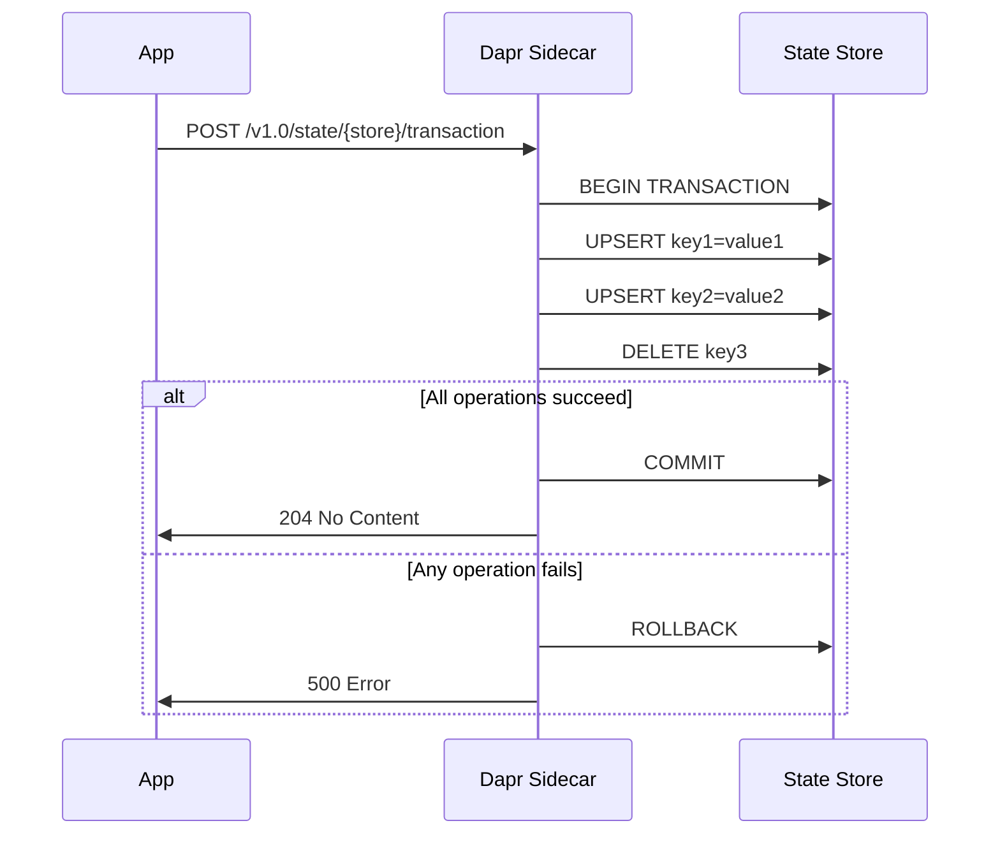
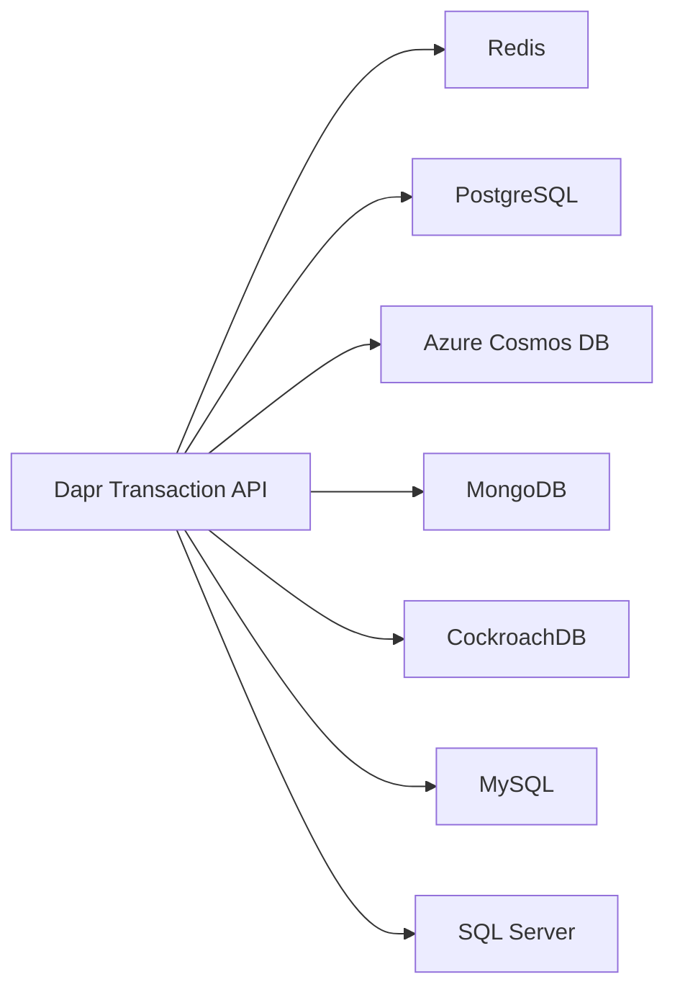

# How to Use Dapr State Transactions for Atomic Operations

Author: [nawazdhandala](https://www.github.com/nawazdhandala)

Tags: Dapr, State Management, Transaction, Atomic, Consistency

Description: Learn how to use Dapr state transactions to execute multiple upsert and delete operations atomically, ensuring consistency across related state items.

---

## What Are Dapr State Transactions?

Dapr state transactions allow you to execute multiple upsert (insert or update) and delete operations in a single atomic request. Either all operations succeed or none do. This is critical for maintaining consistency across related state items, such as updating an order status while deleting a shopping cart.

Not all state stores support transactions. Supported stores include Redis (single-key transactions), PostgreSQL, MongoDB, Azure Cosmos DB, CockroachDB, and MySQL.

## How Transactions Work



## Prerequisites

- Dapr initialized with a transactional state store
- Redis (supports single-shard multi-key transactions) or PostgreSQL/CosmosDB for full transactions

## Transaction via HTTP API

```bash
curl -X POST http://localhost:3500/v1.0/state/statestore/transaction \
  -H "Content-Type: application/json" \
  -d '{
    "operations": [
      {
        "operation": "upsert",
        "request": {
          "key": "order:001",
          "value": {
            "orderId": "001",
            "status": "processing",
            "updatedAt": "2026-03-31T10:00:00Z"
          }
        }
      },
      {
        "operation": "upsert",
        "request": {
          "key": "payment:001",
          "value": {
            "orderId": "001",
            "amount": 99.99,
            "status": "captured"
          }
        }
      },
      {
        "operation": "delete",
        "request": {
          "key": "cart:user-42"
        }
      }
    ]
  }'
```

Success returns: `204 No Content`

## Python Example

### Using the HTTP API

```python
import requests
import json
import os

DAPR_HTTP_PORT = os.environ.get("DAPR_HTTP_PORT", "3500")
STORE_NAME = "statestore"

def execute_order_transaction(order_id, customer_id, cart_key):
    """
    Atomically:
    1. Create the order record
    2. Update customer's order count
    3. Delete the shopping cart
    """
    url = f"http://localhost:{DAPR_HTTP_PORT}/v1.0/state/{STORE_NAME}/transaction"

    payload = {
        "operations": [
            {
                "operation": "upsert",
                "request": {
                    "key": f"order:{order_id}",
                    "value": {
                        "orderId": order_id,
                        "customerId": customer_id,
                        "status": "confirmed"
                    }
                }
            },
            {
                "operation": "upsert",
                "request": {
                    "key": f"customer:{customer_id}:last_order",
                    "value": order_id
                }
            },
            {
                "operation": "delete",
                "request": {
                    "key": cart_key
                }
            }
        ]
    }

    response = requests.post(url, json=payload)
    if response.status_code == 204:
        print(f"Transaction succeeded for order {order_id}")
    else:
        raise Exception(f"Transaction failed: {response.status_code} {response.text}")

execute_order_transaction("ORD-001", "CUST-42", "cart:CUST-42")
```

### Using the Dapr Python SDK

```python
from dapr.clients import DaprClient
from dapr.clients.grpc._request import TransactionalStateOperation, OperationType
import json

with DaprClient() as client:
    operations = [
        TransactionalStateOperation(
            key="order:ORD-002",
            data=json.dumps({
                "orderId": "ORD-002",
                "status": "confirmed",
                "total": 249.99
            }).encode(),
            operation_type=OperationType.upsert
        ),
        TransactionalStateOperation(
            key="inventory:ITEM-A",
            data=json.dumps({"stock": 48}).encode(),
            operation_type=OperationType.upsert
        ),
        TransactionalStateOperation(
            key="cart:CUST-43",
            operation_type=OperationType.delete
        )
    ]

    client.execute_state_transaction(
        store_name="statestore",
        operations=operations
    )
    print("Transaction completed successfully")
```

## Go Example

```go
package main

import (
    "context"
    "encoding/json"
    "log"

    dapr "github.com/dapr/go-sdk/client"
)

func main() {
    client, err := dapr.NewClient()
    if err != nil {
        log.Fatal(err)
    }
    defer client.Close()

    ctx := context.Background()

    order := map[string]interface{}{
        "orderId":  "ORD-003",
        "status":   "confirmed",
        "total":    199.99,
    }
    orderData, _ := json.Marshal(order)

    inventory := map[string]interface{}{"stock": 22}
    inventoryData, _ := json.Marshal(inventory)

    ops := []*dapr.StateOperation{
        {
            Type: dapr.StateOperationTypeUpsert,
            Item: &dapr.SetStateItem{
                Key:   "order:ORD-003",
                Value: orderData,
            },
        },
        {
            Type: dapr.StateOperationTypeUpsert,
            Item: &dapr.SetStateItem{
                Key:   "inventory:ITEM-B",
                Value: inventoryData,
            },
        },
        {
            Type: dapr.StateOperationTypeDelete,
            Item: &dapr.SetStateItem{
                Key: "cart:CUST-44",
            },
        },
    }

    if err := client.ExecuteStateTransaction(ctx, "statestore", nil, ops); err != nil {
        log.Fatalf("Transaction failed: %v", err)
    }
    log.Println("Transaction completed")
}
```

## Using ETags in Transactions

You can include ETags for optimistic concurrency within a transaction:

```json
{
  "operations": [
    {
      "operation": "upsert",
      "request": {
        "key": "account:alice",
        "value": {"balance": 950},
        "etag": "\"5\"",
        "options": {
          "concurrency": "first-write"
        }
      }
    }
  ]
}
```

If the ETag does not match, the entire transaction is rolled back with a `409 Conflict` response.

## Transactional Metadata

Pass additional metadata for transactional hints:

```json
{
  "operations": [...],
  "metadata": {
    "partitionKey": "customer-42"
  }
}
```

## Supported State Stores for Transactions



State stores that do not support transactions return an error if the transaction endpoint is called.

## Summary

Dapr state transactions provide atomic multi-key operations that ensure consistency across related state items. The transaction endpoint accepts a list of upsert and delete operations and executes them as a single atomic unit. Combined with ETag-based optimistic concurrency, transactions enable safe, consistent state management for complex business operations like order processing, inventory updates, and cart management.
