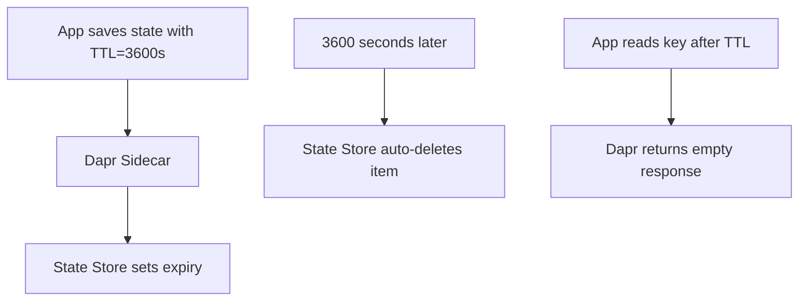

# How to Set State Store TTL in Dapr

Author: [nawazdhandala](https://www.github.com/nawazdhandala)

Tags: Dapr, State Management, TTL, Expiration, Cache

Description: Configure time-to-live (TTL) for Dapr state items to automatically expire cached sessions, tokens, and temporary data without manual cleanup.

---

## What Is State TTL in Dapr?

Time-to-live (TTL) allows you to set an expiration time on individual state items. After the TTL expires, the state store automatically deletes the item. This is useful for sessions, tokens, cache entries, and any temporary data that should not persist indefinitely.

TTL support depends on the backing state store. Supported stores include Redis, Azure Cosmos DB, DynamoDB, PostgreSQL, MySQL, and others.

## How TTL Works



## Setting TTL on a State Item

TTL is specified via the `ttlInSeconds` metadata field when saving state.

### HTTP API

```bash
curl -X POST http://localhost:3500/v1.0/state/statestore \
  -H "Content-Type: application/json" \
  -d '[{
    "key": "session:user123",
    "value": {
      "userId": "user123",
      "token": "eyJhbGciOiJIUzI1NiJ9...",
      "permissions": ["read", "write"]
    },
    "metadata": {
      "ttlInSeconds": "3600"
    }
  }]'
```

The item automatically expires after 1 hour.

## Python Example

```python
import requests
import os
import json

DAPR_HTTP_PORT = os.environ.get("DAPR_HTTP_PORT", "3500")

def save_with_ttl(store_name, key, value, ttl_seconds):
    url = f"http://localhost:{DAPR_HTTP_PORT}/v1.0/state/{store_name}"
    payload = [{
        "key": key,
        "value": value,
        "metadata": {
            "ttlInSeconds": str(ttl_seconds)
        }
    }]
    resp = requests.post(url, json=payload)
    resp.raise_for_status()
    print(f"Saved {key} with TTL={ttl_seconds}s")

# Save a session token expiring in 1 hour
save_with_ttl(
    store_name="statestore",
    key="session:alice",
    value={"userId": "alice", "token": "tok-abc123", "role": "admin"},
    ttl_seconds=3600
)

# Save a verification code expiring in 10 minutes
save_with_ttl(
    store_name="statestore",
    key="verify:alice",
    value={"code": "123456", "createdAt": "2026-03-31T10:00:00Z"},
    ttl_seconds=600
)
```

### Using the Dapr Python SDK

```python
from dapr.clients import DaprClient
import json

with DaprClient() as client:
    # Save with TTL using metadata
    client.save_state(
        store_name="statestore",
        key="session:bob",
        value=json.dumps({"userId": "bob", "token": "tok-xyz789"}),
        state_metadata={"ttlInSeconds": "1800"}
    )
    print("Session saved with 30-minute TTL")

    # Verify the state is available
    result = client.get_state(store_name="statestore", key="session:bob")
    print(f"Session data: {result.data}")
```

## Go Example

```go
package main

import (
    "context"
    "encoding/json"
    "fmt"
    "log"

    dapr "github.com/dapr/go-sdk/client"
)

func main() {
    client, err := dapr.NewClient()
    if err != nil {
        log.Fatal(err)
    }
    defer client.Close()

    ctx := context.Background()

    session := map[string]interface{}{
        "userId": "carol",
        "token":  "tok-def456",
        "role":   "viewer",
    }
    data, _ := json.Marshal(session)

    // Save state with TTL metadata
    meta := map[string]string{"ttlInSeconds": "7200"}
    err = client.SaveStateWithETag(ctx, "statestore", "session:carol", data, "", meta)
    if err != nil {
        log.Fatal(err)
    }
    fmt.Println("Session saved with 2-hour TTL")

    // Read it back
    item, err := client.GetState(ctx, "statestore", "session:carol", nil)
    if err != nil {
        log.Fatal(err)
    }
    fmt.Printf("Session: %s\n", item.Value)
}
```

## Node.js Example

```javascript
import { DaprClient } from "@dapr/dapr";

const client = new DaprClient();

// Save with TTL
await client.state.save("statestore", [
  {
    key: "ratelimit:ip:192.168.1.1",
    value: { count: 1, windowStart: Date.now() },
    metadata: { ttlInSeconds: "60" }
  }
]);

// Read back
const state = await client.state.get("statestore", "ratelimit:ip:192.168.1.1");
console.log(state); // null if expired
```

## Reading TTL Remaining

To check when an item expires, use the state metadata endpoint:

```bash
curl -H "metadata.rawPayload: true" \
  http://localhost:3500/v1.0/state/statestore/session:alice
```

Some state stores return TTL metadata in the response headers or in the value payload.

## Configuring Default TTL at the Component Level

Some state stores support a default TTL for all items in the component configuration:

### Redis

```yaml
apiVersion: dapr.io/v1alpha1
kind: Component
metadata:
  name: statestore
spec:
  type: state.redis
  version: v1
  metadata:
  - name: redisHost
    value: localhost:6379
  - name: defaultTTLInSeconds
    value: "3600"
```

All items saved to this store default to a 1-hour TTL unless overridden per item.

### PostgreSQL

```yaml
apiVersion: dapr.io/v1alpha1
kind: Component
metadata:
  name: statestore
spec:
  type: state.postgresql
  version: v1
  metadata:
  - name: connectionString
    value: "host=localhost user=postgres password=secret dbname=daprstate"
  - name: cleanupInterval
    value: "10m"
```

The `cleanupInterval` controls how often expired items are purged from the database.

## Common TTL Use Cases

| Use Case | Recommended TTL |
|----------|----------------|
| User session | 1-24 hours |
| OAuth access token | Token expiry (e.g., 1 hour) |
| Email verification code | 10-30 minutes |
| Rate limit counter | 1-60 seconds |
| API response cache | 1-60 minutes |
| Temporary file reference | 1-7 days |

## Summary

Dapr state TTL enables automatic expiration of state items without any background jobs or manual cleanup. Set TTL per item using the `ttlInSeconds` metadata field, or configure a default TTL at the component level. This is ideal for sessions, tokens, verification codes, and cache entries. TTL behavior is delegated to the native expiration mechanism of the underlying state store (Redis EXPIRE, DynamoDB TTL, PostgreSQL cleanup worker).
