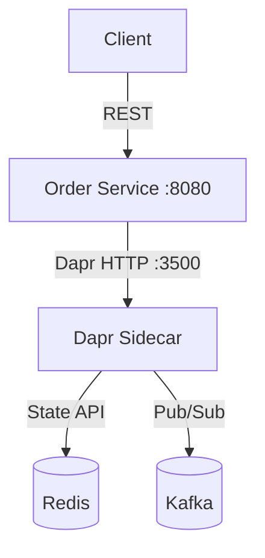

# How to Build a Stateful Service with Dapr State Management

Author: [OneUptime](https://oneuptime.com)

Tags: Dapr, State Management, Microservice, Redis, Stateful Service

Description: Step-by-step guide to building a production-ready stateful microservice using Dapr State Management, covering save, get, update, delete, and transactional patterns.

---

## Introduction

Microservices are often designed to be stateless, but real applications need to persist data. Dapr State Management lets any service become stateful without coupling it to a specific database. Your service talks to the Dapr sidecar, and the sidecar handles the connection, serialization, and consistency guarantees against the configured backend (Redis, Cosmos DB, PostgreSQL, and more).

## Application Architecture



## Setting Up the State Store Component

```yaml
apiVersion: dapr.io/v1alpha1
kind: Component
metadata:
  name: statestore
  namespace: default
spec:
  type: state.redis
  version: v1
  metadata:
    - name: redisHost
      value: redis-master:6379
    - name: redisPassword
      secretKeyRef:
        name: redis-secret
        key: redis-password
    - name: actorStateStore
      value: "false"
```

## Project Structure

```
orderservice/
  main.py
  orders.py
  requirements.txt
  components/
    statestore.yaml
```

## Building the Order Service in Python

```python
# orders.py
from flask import Flask, request, jsonify
from dapr.clients import DaprClient
from dapr.clients.grpc._state import StateOptions, Consistency, Concurrency
import uuid

app = Flask(__name__)
STORE = "statestore"

@app.route("/orders", methods=["POST"])
def create_order():
    data = request.get_json()
    order_id = str(uuid.uuid4())
    order = {
        "orderId": order_id,
        "item": data["item"],
        "qty": data.get("qty", 1),
        "status": "pending"
    }
    with DaprClient() as client:
        client.save_state(
            store_name=STORE,
            key=order_id,
            value=str(order),
            options=StateOptions(
                consistency=Consistency.strong,
                concurrency=Concurrency.last_write
            )
        )
    return jsonify({"orderId": order_id}), 201


@app.route("/orders/<order_id>", methods=["GET"])
def get_order(order_id):
    with DaprClient() as client:
        result = client.get_state(store_name=STORE, key=order_id)
        if not result.data:
            return jsonify({"error": "not found"}), 404
        return result.data, 200


@app.route("/orders/<order_id>", methods=["PUT"])
def update_order(order_id):
    data = request.get_json()
    with DaprClient() as client:
        # Read current state and ETag
        current = client.get_state(store_name=STORE, key=order_id)
        if not current.data:
            return jsonify({"error": "not found"}), 404

        import json
        order = json.loads(current.data)
        order["status"] = data.get("status", order["status"])

        client.save_state(
            store_name=STORE,
            key=order_id,
            value=json.dumps(order),
            etag=current.etag,
            options=StateOptions(concurrency=Concurrency.first_write)
        )
    return jsonify(order), 200


@app.route("/orders/<order_id>", methods=["DELETE"])
def delete_order(order_id):
    with DaprClient() as client:
        client.delete_state(store_name=STORE, key=order_id)
    return "", 204
```

## Running Locally with Dapr

```bash
# Install dependencies
pip install flask dapr

# Start with Dapr sidecar
dapr run \
  --app-id orderservice \
  --app-port 8080 \
  --components-path ./components \
  -- python main.py
```

## Kubernetes Deployment

```yaml
apiVersion: apps/v1
kind: Deployment
metadata:
  name: orderservice
spec:
  replicas: 2
  selector:
    matchLabels:
      app: orderservice
  template:
    metadata:
      labels:
        app: orderservice
      annotations:
        dapr.io/enabled: "true"
        dapr.io/app-id: "orderservice"
        dapr.io/app-port: "8080"
    spec:
      containers:
        - name: orderservice
          image: myregistry/orderservice:1.0
          ports:
            - containerPort: 8080
          env:
            - name: DAPR_HTTP_PORT
              value: "3500"
---
apiVersion: v1
kind: Service
metadata:
  name: orderservice
spec:
  selector:
    app: orderservice
  ports:
    - port: 80
      targetPort: 8080
```

## Testing the Stateful Service

```bash
# Create an order
curl -X POST http://localhost:8080/orders \
  -H "Content-Type: application/json" \
  -d '{"item": "laptop", "qty": 1}'
# Response: {"orderId": "abc-123"}

# Retrieve the order
curl http://localhost:8080/orders/abc-123
# Response: {"orderId": "abc-123", "item": "laptop", "status": "pending"}

# Update order status
curl -X PUT http://localhost:8080/orders/abc-123 \
  -H "Content-Type: application/json" \
  -d '{"status": "shipped"}'

# Delete the order
curl -X DELETE http://localhost:8080/orders/abc-123
```

## Adding Transactional Updates

When an order ships, update state and publish an event atomically:

```python
@app.route("/orders/<order_id>/ship", methods=["POST"])
def ship_order(order_id):
    with DaprClient() as client:
        # Transactional state update
        client.execute_state_transaction(
            store_name=STORE,
            operations=[
                {
                    "operation": "upsert",
                    "request": {
                        "key": order_id,
                        "value": '{"status": "shipped"}'
                    }
                },
                {
                    "operation": "upsert",
                    "request": {
                        "key": f"shipped-log-{order_id}",
                        "value": '{"event": "shipped"}'
                    }
                }
            ]
        )
    return jsonify({"status": "shipped"}), 200
```

## Summary

Building a stateful service with Dapr is straightforward: configure a state store component, use the Dapr HTTP API or SDK to save, get, update, and delete state in your application handlers, and deploy with `dapr.io/enabled: "true"` annotations. Dapr handles connection management, serialization, and consistency against any supported backend. Pair state management with Dapr transactions and pub/sub for fully event-driven stateful services without coupling your code to any specific database.
