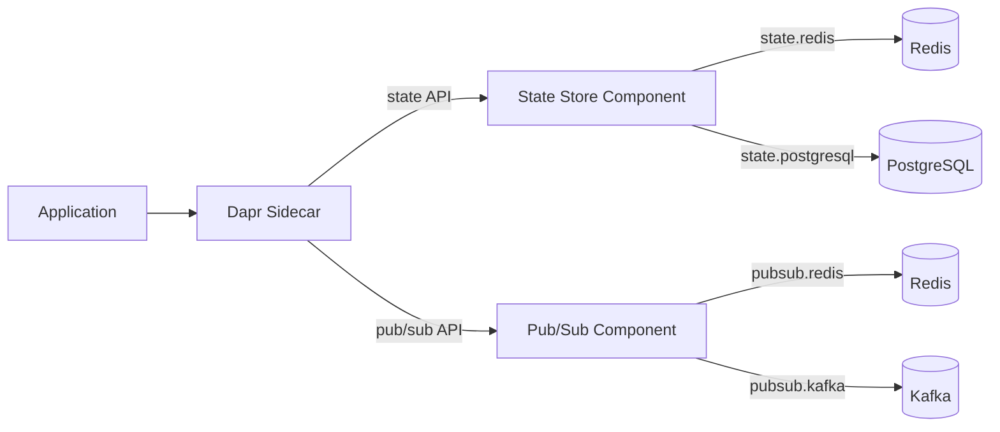

# How to Configure a State Store and Pub/Sub Message Broker in Dapr

Author: [nawazdhandala](https://www.github.com/nawazdhandala)

Tags: Dapr, State Management, Pub/Sub, Redis, Configuration

Description: Step-by-step guide to configuring Redis as both a state store and pub/sub broker in Dapr, then swapping each backend to PostgreSQL and Kafka without code changes.

---

## Overview

Dapr separates API from infrastructure. Your code calls the state or pub/sub API; the component YAML determines which backend is used. This guide walks through configuring both, verifying they work, and shows how to swap backends.



## Part 1 - Redis State Store

### Component File

```yaml
# components/statestore.yaml
apiVersion: dapr.io/v1alpha1
kind: Component
metadata:
  name: statestore
spec:
  type: state.redis
  version: v1
  metadata:
  - name: redisHost
    value: localhost:6379
  - name: redisPassword
    value: ""
  - name: enableTLS
    value: "false"
  - name: maxRetries
    value: "3"
  - name: failover
    value: "false"
  - name: actorStateStore
    value: "true"
```

### Test the State Store

```bash
dapr run \
  --app-id test-state \
  --dapr-http-port 3500 \
  --resources-path ./components \
  -- echo "sidecar started"

# In another terminal
curl -X POST http://localhost:3500/v1.0/state/statestore \
  -H "Content-Type: application/json" \
  -d '[{"key": "test-key", "value": {"hello": "world"}}]'

curl http://localhost:3500/v1.0/state/statestore/test-key
```

### Switch to PostgreSQL

```bash
# Start PostgreSQL
docker run -d \
  --name dapr-postgres \
  -e POSTGRES_PASSWORD=mysecret \
  -p 5432:5432 \
  postgres:15

# Create state table
docker exec -it dapr-postgres psql -U postgres -c "
  CREATE TABLE IF NOT EXISTS state (
    key TEXT NOT NULL PRIMARY KEY,
    value JSONB NOT NULL,
    isbinary BOOLEAN NOT NULL,
    etag UUID,
    expiredate TIMESTAMPTZ
  );
"
```

Replace the component file:

```yaml
# components/statestore.yaml (replace existing)
apiVersion: dapr.io/v1alpha1
kind: Component
metadata:
  name: statestore
spec:
  type: state.postgresql
  version: v2
  metadata:
  - name: connectionString
    value: "host=localhost user=postgres password=mysecret port=5432 connect_timeout=10 database=postgres"
  - name: tableName
    value: state
```

No application code changes needed. Restart your sidecar and the same API calls work with PostgreSQL.

## Part 2 - Redis Pub/Sub

### Component File

```yaml
# components/pubsub.yaml
apiVersion: dapr.io/v1alpha1
kind: Component
metadata:
  name: pubsub
spec:
  type: pubsub.redis
  version: v1
  metadata:
  - name: redisHost
    value: localhost:6379
  - name: redisPassword
    value: ""
  - name: enableTLS
    value: "false"
  - name: consumerID
    value: myapp
```

### Publisher

```python
# publisher.py
import requests, os

DAPR_PORT = os.getenv('DAPR_HTTP_PORT', '3500')

for i in range(1, 6):
    requests.post(
        f"http://localhost:{DAPR_PORT}/v1.0/publish/pubsub/orders",
        json={"orderId": i, "item": f"widget-{i}"},
        headers={"Content-Type": "application/json"}
    )
    print(f"Published order {i}")
```

### Subscriber

```python
# subscriber.py
from flask import Flask, request, jsonify

app = Flask(__name__)

@app.route('/dapr/subscribe', methods=['GET'])
def subscribe():
    return jsonify([{
        "pubsubname": "pubsub",
        "topic": "orders",
        "route": "/orders"
    }])

@app.route('/orders', methods=['POST'])
def handle_order():
    order = request.get_json().get('data', request.get_json())
    print(f"Received: {order}")
    return '', 200

app.run(port=5001)
```

### Test Pub/Sub

```bash
# Run subscriber
dapr run \
  --app-id subscriber \
  --app-port 5001 \
  --dapr-http-port 3501 \
  --resources-path ./components \
  -- python3 subscriber.py

# Run publisher
dapr run \
  --app-id publisher \
  --dapr-http-port 3500 \
  --resources-path ./components \
  -- python3 publisher.py
```

### Switch to Kafka

```bash
# Start Kafka (single-node for development)
docker run -d \
  --name dapr-kafka \
  -p 9092:9092 \
  -e KAFKA_ENABLE_KRAFT=yes \
  -e KAFKA_CFG_PROCESS_ROLES=broker,controller \
  -e KAFKA_CFG_CONTROLLER_LISTENER_NAMES=CONTROLLER \
  -e KAFKA_CFG_LISTENERS=PLAINTEXT://:9092,CONTROLLER://:9093 \
  -e KAFKA_CFG_ADVERTISED_LISTENERS=PLAINTEXT://localhost:9092 \
  -e KAFKA_BROKER_ID=1 \
  -e KAFKA_CFG_CONTROLLER_QUORUM_VOTERS=1@localhost:9093 \
  -e ALLOW_PLAINTEXT_LISTENER=yes \
  bitnami/kafka:latest
```

Replace the component:

```yaml
# components/pubsub.yaml (replace existing)
apiVersion: dapr.io/v1alpha1
kind: Component
metadata:
  name: pubsub
spec:
  type: pubsub.kafka
  version: v1
  metadata:
  - name: brokers
    value: localhost:9092
  - name: consumerGroup
    value: dapr-group
  - name: authType
    value: none
  - name: autoOffsetReset
    value: earliest
```

Same publisher and subscriber code works with Kafka.

## Part 3 - Production Kubernetes Configuration

```yaml
# Kubernetes statestore with secret reference
apiVersion: dapr.io/v1alpha1
kind: Component
metadata:
  name: statestore
  namespace: production
spec:
  type: state.redis
  version: v1
  metadata:
  - name: redisHost
    value: redis-master.production.svc.cluster.local:6379
  - name: redisPassword
    secretKeyRef:
      name: redis-credentials
      key: password
  - name: enableTLS
    value: "true"
  - name: maxRetries
    value: "5"
  - name: failover
    value: "false"
auth:
  secretStore: kubernetes
scopes:
- order-service
- inventory-service
```

```bash
# Create the Kubernetes secret
kubectl create secret generic redis-credentials \
  --from-literal=password=mysupersecretpassword \
  -n production

# Apply the component
kubectl apply -f statestore.yaml -n production
```

## Verifying Components Are Loaded

```bash
# Check loaded components
curl http://localhost:3500/v1.0/metadata | jq '.registeredComponents'
```

```json
[
  {"name": "statestore", "type": "state.redis", "version": "v1"},
  {"name": "pubsub", "type": "pubsub.redis", "version": "v1"}
]
```

## Summary

Configuring a Dapr state store and pub/sub broker requires two YAML component files that reference the backend connection details and credentials. Redis works for both in development with zero additional setup after `dapr init`. Switching to PostgreSQL for state or Kafka for messaging requires only replacing the component YAML - application code calling `/v1.0/state/statestore` or `/v1.0/publish/pubsub/topic` stays identical. In Kubernetes, use `secretKeyRef` to avoid plain-text credentials.
