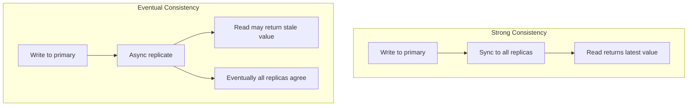

# How to Use Strong Consistency for Dapr State Operations

Author: [nawazdhandala](https://www.github.com/nawazdhandala)

Tags: Dapr, State Management, Consistency, Microservice, Distributed System

Description: Learn when and how to use strong consistency mode in Dapr State Management to ensure reads always reflect the latest committed writes across all replicas.

---

## Introduction

In a distributed state store, data is often replicated across multiple nodes. Strong consistency guarantees that a read always returns the most recent committed write, regardless of which replica serves the request. Dapr exposes this as a first-class option on every state operation. This guide explains when strong consistency matters and how to configure it.

## Strong vs. Eventual Consistency



| Property | Strong | Eventual |
|----------|--------|---------|
| Read freshness | Always latest | May be stale |
| Latency | Higher (quorum required) | Lower |
| Availability | Lower during partition | Higher |
| Use case | Financial, inventory | Sessions, caches, counters |

## Setting Strong Consistency on a Save Operation

### HTTP API

```bash
curl -X POST http://localhost:3500/v1.0/state/statestore \
  -H "Content-Type: application/json" \
  -d '[{
    "key": "account-balance-42",
    "value": {"balance": 5000, "currency": "USD"},
    "options": {
      "consistency": "strong",
      "concurrency": "last-write"
    }
  }]'
```

### Python SDK

```python
from dapr.clients import DaprClient
from dapr.clients.grpc._state import StateOptions, Consistency, Concurrency
import json

with DaprClient() as client:
    client.save_state(
        store_name="statestore",
        key="account-balance-42",
        value=json.dumps({"balance": 5000, "currency": "USD"}),
        options=StateOptions(
            consistency=Consistency.strong,
            concurrency=Concurrency.last_write
        )
    )
```

### Go SDK

```go
err := client.SaveState(ctx, "statestore", "account-balance-42",
    []byte(`{"balance":5000,"currency":"USD"}`),
    map[string]string{},
)
// Note: consistency options are passed via StateOptions
opts := dapr.StateOptions{
    Consistency: dapr.StateConsistencyStrong,
    Concurrency: dapr.StateConcurrencyLastWrite,
}
err = client.SaveStateWithETag(ctx, "statestore", "account-balance-42",
    []byte(`{"balance":5000}`), "", &opts, nil)
```

## Setting Strong Consistency on a Get Operation

```bash
curl "http://localhost:3500/v1.0/state/statestore/account-balance-42?consistency=strong"
```

With strong consistency on reads, the sidecar queries the primary/quorum of the state store rather than any replica. This is important for read-after-write scenarios.

```python
result = client.get_state(
    store_name="statestore",
    key="account-balance-42",
    state_options=StateOptions(consistency=Consistency.strong)
)
```

## Configuring the State Store for Strong Consistency

Some state stores require specific configuration to support strong consistency:

### Redis (Sentinel/Cluster mode required for strong consistency)

```yaml
apiVersion: dapr.io/v1alpha1
kind: Component
metadata:
  name: statestore
spec:
  type: state.redis
  version: v1
  metadata:
    - name: redisHost
      value: redis-sentinel:26379
    - name: sentinelMasterName
      value: mymaster
    - name: replicaCount
      value: "2"
```

### PostgreSQL

```yaml
apiVersion: dapr.io/v1alpha1
kind: Component
metadata:
  name: statestore
spec:
  type: state.postgresql
  version: v2
  metadata:
    - name: connectionString
      value: "host=pg-primary user=dapr password=secret dbname=dapr sslmode=require"
```

PostgreSQL with synchronous_commit=on (the default) provides strong consistency natively.

## Read-Your-Writes Consistency

A common pattern is to write with strong consistency and immediately verify the write:

```python
def transfer_funds(from_account: str, to_account: str, amount: float):
    with DaprClient() as client:
        strong = StateOptions(consistency=Consistency.strong, concurrency=Concurrency.first_write)

        # Read both accounts with strong consistency
        from_result = client.get_state("statestore", from_account, state_options=strong)
        to_result = client.get_state("statestore", to_account, state_options=strong)

        from_data = json.loads(from_result.data)
        to_data = json.loads(to_result.data)

        from_data["balance"] -= amount
        to_data["balance"] += amount

        # Write both atomically with ETags
        client.execute_state_transaction(
            store_name="statestore",
            operations=[
                {"operation": "upsert", "request": {
                    "key": from_account,
                    "value": json.dumps(from_data),
                    "etag": from_result.etag,
                    "options": {"concurrency": "first-write", "consistency": "strong"}
                }},
                {"operation": "upsert", "request": {
                    "key": to_account,
                    "value": json.dumps(to_data),
                    "etag": to_result.etag,
                    "options": {"concurrency": "first-write", "consistency": "strong"}
                }}
            ]
        )
```

## Performance Considerations

Strong consistency introduces latency because the state store must reach a quorum of replicas before acknowledging the write. Measure this impact:

```bash
# Compare latency: eventual vs strong
time curl -X POST http://localhost:3500/v1.0/state/statestore \
  -H "Content-Type: application/json" \
  -d '[{"key": "test", "value": "v1", "options": {"consistency": "eventual"}}]'

time curl -X POST http://localhost:3500/v1.0/state/statestore \
  -H "Content-Type: application/json" \
  -d '[{"key": "test", "value": "v1", "options": {"consistency": "strong"}}]'
```

Use strong consistency selectively for operations where correctness outweighs latency: financial transactions, inventory deductions, and any read-after-write patterns.

## Summary

Strong consistency in Dapr State Management ensures that every read returns the most recently committed value across all replicas. Configure it per-operation using the `consistency: strong` option in HTTP requests or `Consistency.strong` in SDK calls. Reserve strong consistency for operations that cannot tolerate stale reads (financial balances, inventory counts), and use eventual consistency for high-throughput, latency-sensitive workloads where occasional staleness is acceptable.
