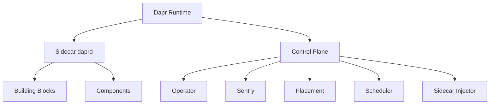
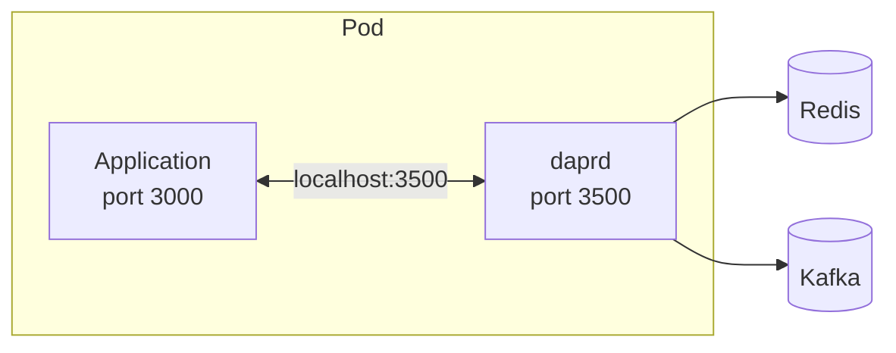

# How to Learn Dapr Terminology and Key Concepts

Author: [nawazdhandala](https://www.github.com/nawazdhandala)

Tags: Dapr, Terminology, Concept, Getting Started, Glossary

Description: A clear reference of Dapr terminology covering sidecars, building blocks, components, app IDs, control plane services, and runtime concepts to help you get productive quickly.

---

## Overview

Dapr uses specific terminology that can be confusing when you first encounter it. This guide defines every key term and shows how the concepts relate to each other.



## Core Terms

### Dapr

Distributed Application Runtime. An open-source, CNCF-graduated project that provides APIs for common distributed systems patterns. Dapr runs alongside your application as a sidecar and exposes HTTP and gRPC APIs.

### daprd

The Dapr runtime binary. This is the actual executable that runs as the sidecar process (self-hosted) or container (Kubernetes). It is the engine behind all Dapr APIs.

### Sidecar Pattern

An architectural pattern where a helper process runs alongside the main application process (or container). The sidecar shares the same lifecycle as the app but handles cross-cutting concerns like communication, security, and observability.



### App ID

A unique identifier for your application within a Dapr environment. Used for service discovery, actor placement, and access control. Set with `--app-id` flag or `dapr.io/app-id` annotation.

```bash
dapr run --app-id order-service -- node app.js
```

### Building Block

A named API category exposed by the Dapr sidecar. Each building block solves one distributed systems problem. The 11 building blocks are: Service Invocation, State Management, Publish/Subscribe, Bindings, Secrets Management, Configuration, Virtual Actors, Workflow, Distributed Lock, Cryptography, and Jobs.

### Component

A YAML-declared implementation of a building block. Components are the infrastructure backends. Example: `state.redis` is a component that implements the State Management building block using Redis.

```yaml
apiVersion: dapr.io/v1alpha1
kind: Component
metadata:
  name: statestore
spec:
  type: state.redis
  version: v1
```

### Component Scoping

Restricting a component to specific app IDs using the `scopes` field. Only listed app IDs can use that component.

### Configuration

A Dapr `Configuration` CRD that controls sidecar runtime behavior: tracing settings, middleware, access control policies, resiliency features, and mTLS. Not to be confused with the Configuration API building block.

### Control Plane

The set of Dapr system services: Operator, Sentry, Placement, Scheduler, and Sidecar Injector. In Kubernetes, these run in the `dapr-system` namespace.

### Namespace

In Kubernetes, Dapr components, configurations, and subscriptions are namespace-scoped. A component in namespace `team-a` is invisible to apps in `team-b`.

### Trust Domain

A SPIFFE trust domain that identifies the organizational unit for certificates. Default is `cluster.local`. Used in SPIFFE identities: `spiffe://<trust-domain>/ns/<namespace>/<app-id>`.

## Building Block Terms

### Service Invocation

Calling another Dapr-enabled service by its app ID. The sidecar handles name resolution, mTLS, retries, and tracing.

```bash
GET http://localhost:3500/v1.0/invoke/<app-id>/method/<method>
```

### State Store

A key-value store component used by the State Management building block. Multiple state stores can be registered; each is referenced by name in API calls.

### Pub/Sub Component

A message broker component (Kafka, Redis, Azure Service Bus, etc.) used by the Publish/Subscribe building block.

### Topic

A named message channel in pub/sub. Publishers send to a topic; subscribers receive from a topic.

### Subscription

Declarative configuration for a subscriber. Defines which app ID, component, and topic to subscribe to.

```yaml
apiVersion: dapr.io/v2alpha1
kind: Subscription
metadata:
  name: orders-subscription
spec:
  topic: orders
  routes:
    default: /orders
  pubsubname: pubsub
  scopes:
  - order-processor
```

### Input Binding

A binding that triggers your application when an external event occurs (e.g., a message arrives in an S3 bucket, a cron fires).

### Output Binding

A binding that lets your application write to an external system (e.g., send an email, upload a file to S3).

## Actor Terms

### Virtual Actor

An actor instance managed by the Dapr runtime. "Virtual" means the runtime automatically activates actors on demand and deactivates idle ones. Only one instance of a given actor ID can be active at a time across the entire cluster.

### Actor Type

The class or type name for a group of actors. All instances of the same actor type share the same logic.

### Actor ID

The unique identifier for a specific actor instance. `OrderActor/order-123` means actor type `OrderActor` with ID `order-123`.

### Placement Table

A distributed hash ring maintained by the Placement service that maps actor IDs to their hosting sidecar.

### Reminder

A persistent, timer-based callback for a virtual actor. Reminders survive actor deactivation and service restarts.

### Timer

A non-persistent, timer-based callback for a virtual actor. Timers are lost when the actor is deactivated.

## Workflow Terms

### Activity

A single unit of work within a workflow. Activities are the building blocks of workflow logic.

### Orchestrator

The workflow function that coordinates the execution of activities and child workflows.

### Workflow Instance

A running or completed execution of a workflow. Each instance has a unique instance ID.

### Durable Execution

Execution that survives process restarts. Dapr workflows use event sourcing to replay workflow state on startup.

## Security Terms

### mTLS (Mutual TLS)

A form of TLS where both parties authenticate each other using certificates. Dapr enables mTLS between all sidecars by default.

### SPIFFE SVID

A cryptographic identity document issued by the Sentry CA. The SVID contains the app's SPIFFE URI and is used for mTLS authentication.

### Sentry

The Dapr internal Certificate Authority that issues SVIDs to sidecars and rotates them automatically.

## Operational Terms

### Self-Hosted Mode

Running Dapr locally without Kubernetes. Services run as processes and sidecars run as companion processes started by `dapr run`.

### Multi-App Run

A feature for running multiple Dapr applications locally using a single `dapr run -f dapr.yaml` command with a multi-app YAML file.

### dapr init

The CLI command that bootstraps a local Dapr environment (self-hosted) or installs Dapr on Kubernetes (`dapr init --kubernetes`).

### Hot-Reload

The ability to update Dapr components without restarting application pods. Requires the `HotReload` feature flag in the Configuration CRD.

### Resiliency Policy

A declarative policy defining retry, timeout, and circuit breaker behavior for service invocation, component operations, and actor calls.

## Summary

Dapr's terminology centers on a few core concepts: the `daprd` sidecar that runs next to your app, building blocks that define APIs, components that implement those APIs with real infrastructure, and a control plane (Operator, Sentry, Placement, Scheduler, Injector) that manages the Kubernetes lifecycle. Actors, workflows, and pub/sub subscriptions each have their own vocabulary layered on top of these foundations.
