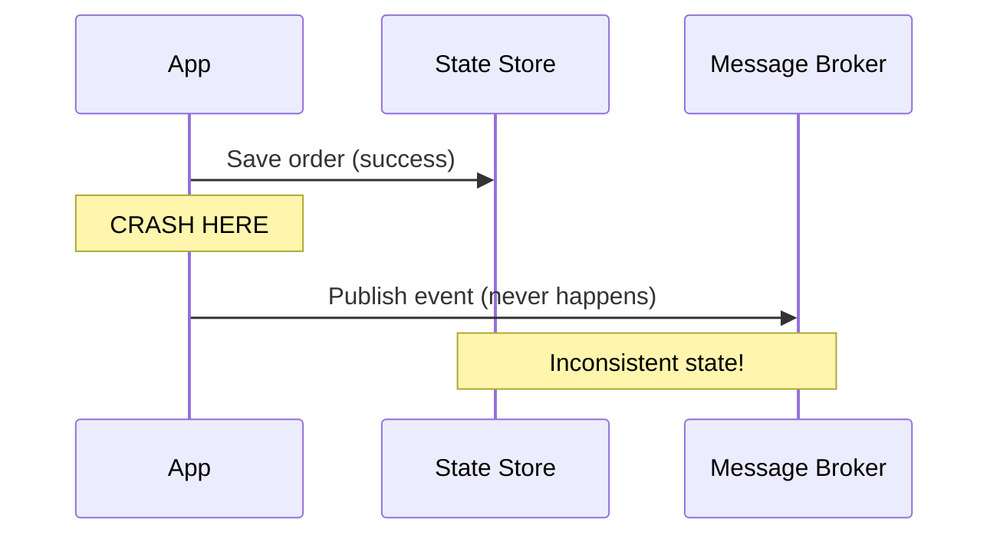
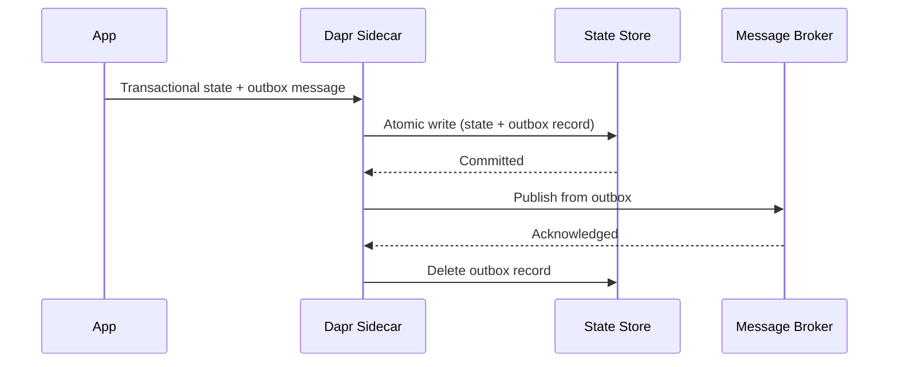

# How to Enable the Transactional Outbox Pattern in Dapr

Author: [OneUptime](https://oneuptime.com)

Tags: Dapr, Outbox Pattern, State Management, Pub/Sub, Microservice

Description: Learn how to implement the transactional outbox pattern in Dapr to guarantee exactly-once message delivery alongside state updates without distributed transactions.

---

## Introduction

The transactional outbox pattern solves a fundamental problem in microservices: how do you update state and publish an event atomically? Without it, a crash between the database write and the message publish leaves your system in an inconsistent state. Dapr's built-in outbox support (introduced in Dapr 1.12) lets you atomically commit state changes and enqueue events in a single operation.

## The Problem Without Outbox



## The Outbox Solution



With Dapr's outbox, the message is stored in the same state store transaction and only published after the commit succeeds.

## Prerequisites

1. A state store that supports transactions (Redis, PostgreSQL, CosmosDB).
2. A pub/sub broker configured in Dapr.
3. Dapr 1.12 or later.

## Configuring the Outbox

Enable the outbox feature on your state store component:

```yaml
apiVersion: dapr.io/v1alpha1
kind: Component
metadata:
  name: statestore
  namespace: default
spec:
  type: state.redis
  version: v1
  metadata:
    - name: redisHost
      value: redis-master:6379
    - name: outboxPublishPubsub
      value: "pubsub"
    - name: outboxPublishTopic
      value: "orders"
    - name: outboxDiscardWhenMissingState
      value: "false"
```

Configure the pub/sub component:

```yaml
apiVersion: dapr.io/v1alpha1
kind: Component
metadata:
  name: pubsub
  namespace: default
spec:
  type: pubsub.redis
  version: v1
  metadata:
    - name: redisHost
      value: redis-master:6379
```

## Using the Outbox in a State Transaction

When you write state using the transactional API, Dapr automatically publishes the outbox event:

```bash
curl -X POST http://localhost:3500/v1.0/state/statestore/transaction \
  -H "Content-Type: application/json" \
  -d '{
    "operations": [
      {
        "operation": "upsert",
        "request": {
          "key": "order-456",
          "value": {
            "orderId": "order-456",
            "item": "keyboard",
            "status": "created"
          },
          "metadata": {
            "outbox.cloudevent.type": "order.created",
            "outbox.cloudevent.source": "orderservice"
          }
        }
      }
    ]
  }'
```

Dapr will:
1. Write `order-456` to Redis.
2. Publish a CloudEvent to the `orders` topic on `pubsub`.

## Using the Outbox with the Go SDK

```go
package main

import (
    "context"
    "encoding/json"
    dapr "github.com/dapr/go-sdk/client"
)

type Order struct {
    OrderID string `json:"orderId"`
    Item    string `json:"item"`
    Status  string `json:"status"`
}

func createOrder(ctx context.Context, client dapr.Client, order Order) error {
    data, _ := json.Marshal(order)

    ops := []*dapr.StateOperation{
        {
            Type: dapr.StateOperationTypeUpsert,
            Item: &dapr.SetStateItem{
                Key:   order.OrderID,
                Value: data,
                Metadata: map[string]string{
                    "outbox.cloudevent.type":   "order.created",
                    "outbox.cloudevent.source": "orderservice",
                },
            },
        },
    }

    return client.ExecuteStateTransaction(ctx, "statestore", nil, ops)
}
```

## Subscribing to Outbox Events

Any service can subscribe to the outbox topic to react to state changes:

```yaml
# subscriptions.yaml
apiVersion: dapr.io/v2alpha1
kind: Subscription
metadata:
  name: order-created-sub
spec:
  topic: orders
  routes:
    default: /order-created
  pubsubname: pubsub
```

```python
# notification service
@app.route("/order-created", methods=["POST"])
def handle_order_created():
    event = request.get_json()
    order_id = event["data"]["orderId"]
    print(f"Order created: {order_id}")
    # Send confirmation email, update analytics, etc.
    return "", 200
```

## Outbox CloudEvent Structure

Dapr wraps the outbox message in a CloudEvent envelope:

```json
{
  "specversion": "1.0",
  "id": "uuid-here",
  "source": "orderservice",
  "type": "order.created",
  "datacontenttype": "application/json",
  "data": {
    "orderId": "order-456",
    "item": "keyboard",
    "status": "created"
  }
}
```

## Handling At-Least-Once Delivery

The outbox guarantees at-least-once delivery, meaning subscribers may receive duplicates after a crash-recovery cycle. Make subscriber handlers idempotent:

```python
processed_orders = set()

@app.route("/order-created", methods=["POST"])
def handle_order_created():
    event = request.get_json()
    order_id = event["data"]["orderId"]

    if order_id in processed_orders:
        return "", 200  # Already processed, skip

    # Process the event
    send_confirmation_email(order_id)
    processed_orders.add(order_id)
    return "", 200
```

## Summary

Dapr's transactional outbox pattern guarantees that state updates and event publications either both succeed or both fail, eliminating the dual-write problem. Configure it by setting `outboxPublishPubsub` and `outboxPublishTopic` metadata on your state store component, then use the transactional state API with `outbox.cloudevent.*` metadata keys. The pattern delivers at-least-once semantics, so design your subscribers to be idempotent for complete reliability.
