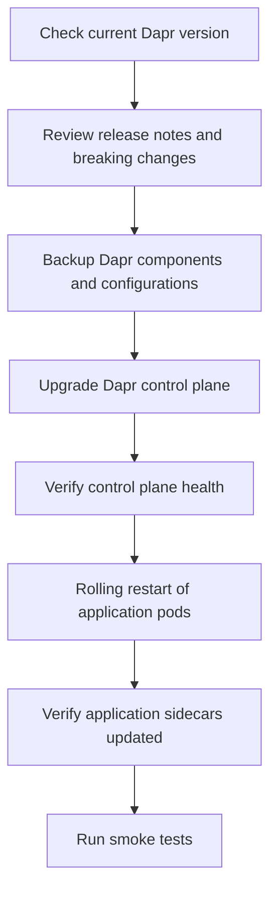

# How to Upgrade Dapr on Kubernetes

Author: [nawazdhandala](https://www.github.com/nawazdhandala)

Tags: Dapr, Kubernetes, Upgrade, Helm, Operation

Description: Learn how to safely upgrade Dapr on Kubernetes using the Dapr CLI or Helm, including pre-upgrade checks, rolling upgrade procedures, and rollback steps.

---

## Introduction

Upgrading Dapr on Kubernetes requires careful attention to sequencing. The Dapr control plane (operator, sentry, placement, sidecar injector) must be upgraded before application sidecars are upgraded. Dapr supports rolling upgrades, meaning your application workloads continue running during the upgrade process.

This guide covers both CLI-based and Helm-based upgrade procedures for production environments.

## Upgrade Architecture



## Prerequisites

- Dapr installed on Kubernetes
- `kubectl` access to the cluster
- Helm 3.x (for Helm-based upgrades)
- Backup of Dapr CRDs and custom resources

## Step 1: Pre-Upgrade Checks

Check the current Dapr version:

```bash
dapr version

# On Kubernetes
dapr status -k
```

Check for running workflows, actors, and jobs that should complete before upgrade:

```bash
# Check actor distribution
kubectl logs -n dapr-system deployment/dapr-placement-server | grep -i "host count"

# Check for active workflow instances
# (application-specific - query your workflow monitoring endpoint)
```

Review the Dapr release notes for breaking changes:

```bash
# Open the GitHub releases page
open https://github.com/dapr/dapr/releases
```

## Step 2: Backup Current Configuration

Export all Dapr custom resources:

```bash
mkdir dapr-backup-$(date +%Y%m%d)
cd dapr-backup-$(date +%Y%m%d)

# Backup components
kubectl get components -A -o yaml > components-backup.yaml

# Backup configurations
kubectl get configurations -A -o yaml > configurations-backup.yaml

# Backup subscriptions
kubectl get subscriptions -A -o yaml > subscriptions-backup.yaml

# Backup resiliency policies
kubectl get resiliency -A -o yaml > resiliency-backup.yaml

# Save current Dapr control plane image tags
kubectl get deployment -n dapr-system -o jsonpath='{range .items[*]}{.metadata.name}{"\t"}{.spec.template.spec.containers[0].image}{"\n"}{end}'
```

## Step 3: Upgrade via Dapr CLI

For a straightforward upgrade using the Dapr CLI:

```bash
# Update the Dapr CLI itself
curl -fsSL https://raw.githubusercontent.com/dapr/cli/master/install/install.sh | /bin/bash

# Check available runtime version
dapr upgrade --help

# Upgrade Dapr runtime on Kubernetes
dapr upgrade -k --runtime-version 1.14.0 --wait
```

Monitor the upgrade:

```bash
kubectl rollout status deployment/dapr-operator -n dapr-system
kubectl rollout status deployment/dapr-sentry -n dapr-system
kubectl rollout status deployment/dapr-sidecar-injector -n dapr-system
kubectl rollout status statefulset/dapr-placement-server -n dapr-system
```

## Step 4: Upgrade via Helm

For Helm-based deployments:

```bash
# Update the Dapr Helm repo
helm repo update

# Check available versions
helm search repo dapr/dapr --versions | head -10

# Preview changes before applying
helm diff upgrade dapr dapr/dapr \
  --namespace dapr-system \
  --version 1.14.0 \
  --values dapr-values.yaml

# Upgrade
helm upgrade dapr dapr/dapr \
  --namespace dapr-system \
  --version 1.14.0 \
  --values dapr-values.yaml \
  --atomic \
  --wait \
  --timeout 10m
```

The `--atomic` flag automatically rolls back on failure.

## Step 5: Verify Control Plane Health

```bash
dapr status -k
```

All components should show `HEALTHY: True`:

```text
  NAME                   NAMESPACE    HEALTHY  STATUS   REPLICAS  VERSION
  dapr-operator          dapr-system  True     Running  2         1.14.0
  dapr-placement-server  dapr-system  True     Running  3         1.14.0
  dapr-sentry            dapr-system  True     Running  2         1.14.0
  dapr-sidecar-injector  dapr-system  True     Running  2         1.14.0
  dapr-scheduler-server  dapr-system  True     Running  3         1.14.0
```

## Step 6: Upgrade Application Sidecars

After the control plane is updated, application pods still run the old sidecar version until they are restarted. Trigger a rolling restart:

```bash
# Restart all deployments in a namespace
kubectl rollout restart deployment -n default

# Restart a specific deployment
kubectl rollout restart deployment/order-service -n default

# Wait for rollout to complete
kubectl rollout status deployment/order-service -n default
```

Check that the new sidecar version is injected:

```bash
kubectl get pod -l app=order-service -o jsonpath='{.items[0].spec.containers[?(@.name=="daprd")].image}'
# Should return daprio/daprd:1.14.0
```

## Step 7: Upgrade CRDs (if applicable)

Some Dapr versions include CRD changes. Upgrade CRDs separately when required:

```bash
# Check if CRD updates are needed (per release notes)
kubectl get crd | grep dapr

# Apply updated CRDs (Helm does this automatically with --wait)
helm upgrade dapr dapr/dapr --namespace dapr-system --version 1.14.0
```

## Step 8: Post-Upgrade Validation

Run smoke tests after the upgrade:

```bash
# Test service invocation
kubectl exec deployment/test-client -- \
  curl http://localhost:3500/v1.0/invoke/order-service/method/health

# Check Dapr sidecar logs for errors
kubectl logs -l app=order-service -c daprd --since=10m | grep -i error

# Verify Placement Service actor distribution
kubectl logs -n dapr-system deployment/dapr-placement-server | tail -20
```

## Rollback Procedure

If the upgrade causes issues, roll back:

### Helm Rollback

```bash
# Check release history
helm history dapr -n dapr-system

# Roll back to previous revision
helm rollback dapr 1 --namespace dapr-system --wait
```

### Manual Rollback

```bash
# Redeploy previous version
helm upgrade dapr dapr/dapr \
  --namespace dapr-system \
  --version 1.13.0 \
  --values dapr-values.yaml \
  --wait

# Restart app pods to get old sidecar
kubectl rollout restart deployment -n default
```

## Upgrade Checklist

- [ ] Read release notes for breaking changes
- [ ] Backup all Dapr CRs (components, configurations, subscriptions)
- [ ] Upgrade Dapr CLI to match target runtime version
- [ ] Upgrade control plane using Helm or CLI
- [ ] Verify all control plane pods are healthy
- [ ] Rolling restart all application pods
- [ ] Verify new sidecar version is running
- [ ] Run smoke tests
- [ ] Monitor logs and metrics for 15-30 minutes post-upgrade

## Summary

Upgrading Dapr on Kubernetes follows a two-phase approach: first upgrade the control plane (operator, sentry, placement, sidecar injector), then trigger a rolling restart of application pods to pick up the new sidecar. Use `helm upgrade` with `--atomic` for safe, auto-rollback-on-failure upgrades. Always backup Dapr custom resources before upgrading, review release notes for breaking changes, and validate health at each stage. The Dapr CLI provides a simpler upgrade path via `dapr upgrade -k` for less complex deployments.
