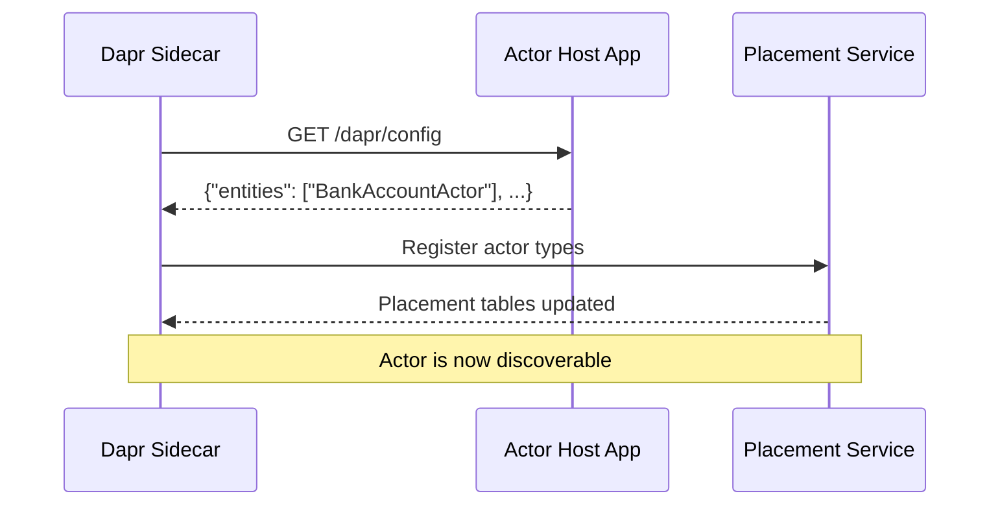

# How to Create a Dapr Virtual Actor with HTTP API

Author: [nawazdhandala](https://www.github.com/nawazdhandala)

Tags: Dapr, Actor, HTTP, API, Microservice

Description: Step-by-step guide to creating and invoking Dapr virtual actors using the HTTP API, including actor registration, method invocation, and state management.

---

## Introduction

Dapr's virtual actor model can be used entirely through HTTP without any SDK. This is useful for polyglot applications, debugging, or when you want to understand exactly what happens at the protocol level. Every actor operation - method invocation, state access, timer and reminder management - is available via Dapr's HTTP API on port 3500.

This guide walks through building an actor application that exposes the required endpoints and interacting with it through the Dapr HTTP API.

## How the Actor HTTP API Works

Dapr's actor HTTP API has two sides:

1. **Client side** - your code calls Dapr's sidecar to invoke actors
2. **Actor host side** - Dapr's sidecar calls your application to execute actor methods

```mermaid
flowchart LR
    A[Client App] -->|POST /v1.0/actors/{type}/{id}/method/{method}| B[Dapr Sidecar :3500]
    B -->|GET /dapr/config| C[Actor Host App :3000]
    B -->|PUT /actors/{type}/{id}/method/{method}| C
    C -->|Read/Write| D[(State Store)]
    B -->|Actor placement| E[Placement Service :50005]
```

## Prerequisites

- Dapr CLI installed and initialized (`dapr init`)
- Redis running locally (default state store)
- Any HTTP server framework (Node.js Express, Python Flask, Go net/http, etc.)

## Step 1: Build the Actor Host Application

Your application must implement several endpoints that Dapr will call. Here is a minimal Node.js example:

```javascript
const express = require('express');
const app = express();
app.use(express.json());

// In-memory state for demo (use Dapr state store in production)
const actorState = {};

// Required: advertise supported actor types and configuration
app.get('/dapr/config', (req, res) => {
  res.json({
    entities: ['BankAccountActor'],
    actorIdleTimeout: '1h',
    actorScanInterval: '30s',
    drainOngoingCallTimeout: '30s',
    drainRebalancedActors: true
  });
});

// Required: Dapr health check
app.get('/healthz', (req, res) => res.sendStatus(200));

// Actor method: deposit
app.put('/actors/BankAccountActor/:actorId/method/deposit', (req, res) => {
  const { actorId } = req.params;
  const { amount } = req.body;
  if (!actorState[actorId]) actorState[actorId] = { balance: 0 };
  actorState[actorId].balance += amount;
  res.json({ balance: actorState[actorId].balance });
});

// Actor method: getBalance
app.put('/actors/BankAccountActor/:actorId/method/getBalance', (req, res) => {
  const { actorId } = req.params;
  const balance = actorState[actorId]?.balance ?? 0;
  res.json({ balance });
});

// Actor activation callback
app.post('/actors/BankAccountActor/:actorId', (req, res) => {
  console.log(`Actor activated: ${req.params.actorId}`);
  res.sendStatus(200);
});

// Actor deactivation callback
app.delete('/actors/BankAccountActor/:actorId', (req, res) => {
  console.log(`Actor deactivated: ${req.params.actorId}`);
  res.sendStatus(200);
});

app.listen(3000, () => console.log('Actor service running on :3000'));
```

## Step 2: Configure the State Store Component

Create the Dapr state store component file:

```yaml
apiVersion: dapr.io/v1alpha1
kind: Component
metadata:
  name: statestore
spec:
  type: state.redis
  version: v1
  metadata:
  - name: redisHost
    value: "localhost:6379"
  - name: actorStateStore
    value: "true"
```

Save this as `./components/statestore.yaml`.

## Step 3: Run with the Dapr CLI

```bash
dapr run \
  --app-id bank-actor-service \
  --app-port 3000 \
  --dapr-http-port 3500 \
  --components-path ./components \
  -- node app.js
```

## Step 4: Invoke Actors via HTTP API

### Invoke a Method

Call the `deposit` method on actor `account-123`:

```bash
curl -X POST \
  http://localhost:3500/v1.0/actors/BankAccountActor/account-123/method/deposit \
  -H "Content-Type: application/json" \
  -d '{"amount": 500}'
```

Call the `getBalance` method:

```bash
curl -X POST \
  http://localhost:3500/v1.0/actors/BankAccountActor/account-123/method/getBalance \
  -H "Content-Type: application/json" \
  -d '{}'
```

### Read Actor State Directly

```bash
curl http://localhost:3500/v1.0/actors/BankAccountActor/account-123/state/balance
```

### Write Actor State Directly

```bash
curl -X PUT \
  http://localhost:3500/v1.0/actors/BankAccountActor/account-123/state \
  -H "Content-Type: application/json" \
  -d '[{"operation":"upsert","request":{"key":"balance","value":1000}}]'
```

## Step 5: List Actor Endpoints (Reference)

| Operation | Method | Path |
|---|---|---|
| Invoke actor method | POST | `/v1.0/actors/{type}/{id}/method/{method}` |
| Get actor state | GET | `/v1.0/actors/{type}/{id}/state/{key}` |
| Set actor state | PUT | `/v1.0/actors/{type}/{id}/state` |
| Create/update timer | POST | `/v1.0/actors/{type}/{id}/timers/{name}` |
| Delete timer | DELETE | `/v1.0/actors/{type}/{id}/timers/{name}` |
| Create/update reminder | POST | `/v1.0/actors/{type}/{id}/reminders/{name}` |
| Delete reminder | DELETE | `/v1.0/actors/{type}/{id}/reminders/{name}` |

## Actor Registration Flow

When your application starts, Dapr queries `/dapr/config` to discover which actor types your app supports. The Dapr sidecar then registers these with the Placement Service.



## Summary

Dapr's HTTP API makes it possible to work with virtual actors from any language or framework without an SDK. Your application exposes method endpoints and a `/dapr/config` route, while Dapr handles state persistence, placement, and routing. This protocol-level understanding is valuable for debugging and building lightweight actor implementations in any language.
