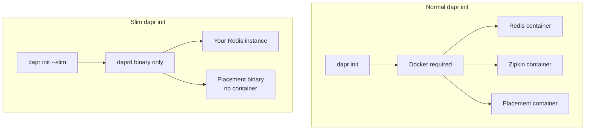

# How to Run Dapr Without Docker

Author: [nawazdhandala](https://www.github.com/nawazdhandala)

Tags: Dapr, Self-Hosted, Slim Init, No Docker, Local Development

Description: Initialize and run Dapr without Docker using slim init mode, configure your own state store and pub/sub backends, and start services with the daprd binary directly.

---

## Why Run Without Docker?

Some environments do not have Docker installed: CI pipelines, restricted corporate environments, or machines where Docker is unavailable. Dapr's slim init mode installs only the `daprd` binary without pulling container images. You bring your own infrastructure (Redis, Kafka, etc.) running natively or elsewhere.



## Slim Init

```bash
dapr init --slim
```

Output:

```text
Making the jump to hyperspace...
Installing runtime version 1.14.x
Downloading binaries and setting up components...
Downloaded & verified dapr binary.
Downloaded & verified placement binary.

No default components or configuration files were installed because --slim flag was used.
```

This installs:
- `~/.dapr/bin/daprd` - the Dapr runtime binary
- `~/.dapr/bin/placement` - the placement service binary (for actors)

No containers are started. No Redis, no Zipkin.

## Starting the Placement Service

If you plan to use actors, start the placement service manually:

```bash
~/.dapr/bin/placement --port 50005 --log-level warn &
```

## Configuring a State Store

You need to provide your own Redis or another state store. Options:

### Option 1 - Redis Installed Natively

```bash
# macOS
brew install redis
brew services start redis

# Ubuntu
sudo apt-get install redis-server
sudo systemctl start redis
```

Create the component file:

```yaml
# ~/.dapr/components/statestore.yaml
apiVersion: dapr.io/v1alpha1
kind: Component
metadata:
  name: statestore
spec:
  type: state.redis
  version: v1
  metadata:
  - name: redisHost
    value: localhost:6379
  - name: redisPassword
    value: ""
  - name: actorStateStore
    value: "true"
```

### Option 2 - Use a Remote Redis

If Redis is running on another machine:

```yaml
metadata:
- name: redisHost
  value: 192.168.1.100:6379
- name: redisPassword
  secretKeyRef:
    name: redis-password
    key: password
```

### Option 3 - Use a File-Based State Store (No Infrastructure)

For simple testing, use a local file state store:

```yaml
# ~/.dapr/components/statestore.yaml
apiVersion: dapr.io/v1alpha1
kind: Component
metadata:
  name: statestore
spec:
  type: state.in-memory
  version: v1
```

The in-memory store persists state only within the sidecar process lifetime. Useful for quick testing without any external dependencies.

## Configuring a Pub/Sub Component

### Option 1 - In-Memory Pub/Sub (No Infrastructure)

```yaml
# ~/.dapr/components/pubsub.yaml
apiVersion: dapr.io/v1alpha1
kind: Component
metadata:
  name: pubsub
spec:
  type: pubsub.in-memory
  version: v1
```

Messages are delivered in-process. Only works when publisher and subscriber share the same sidecar or run in the same process - useful for local unit testing.

### Option 2 - Kafka Running Natively

```bash
# Start Kafka with KRaft (no ZooKeeper)
wget https://downloads.apache.org/kafka/3.7.0/kafka_2.13-3.7.0.tgz
tar -xzf kafka_2.13-3.7.0.tgz
cd kafka_2.13-3.7.0

KAFKA_CLUSTER_ID="$(bin/kafka-storage.sh random-uuid)"
bin/kafka-storage.sh format -t "${KAFKA_CLUSTER_ID}" -c config/kraft/server.properties
bin/kafka-server-start.sh config/kraft/server.properties &
```

```yaml
# ~/.dapr/components/pubsub.yaml
apiVersion: dapr.io/v1alpha1
kind: Component
metadata:
  name: pubsub
spec:
  type: pubsub.kafka
  version: v1
  metadata:
  - name: brokers
    value: localhost:9092
  - name: authType
    value: none
```

## Running Applications Without Docker

```bash
dapr run \
  --app-id myapp \
  --app-port 3000 \
  --dapr-http-port 3500 \
  --placement-host-address localhost:50005 \
  -- python3 app.py
```

The `--placement-host-address` flag points to the manually started placement binary.

## Running daprd Directly

For more control, run the `daprd` binary directly without the CLI wrapper:

```bash
~/.dapr/bin/daprd \
  --app-id myapp \
  --app-port 3000 \
  --dapr-http-port 3500 \
  --dapr-grpc-port 50001 \
  --resources-path ~/.dapr/components \
  --config ~/.dapr/config.yaml \
  --placement-host-address localhost:50005 \
  --log-level info &
```

Then start your application:

```bash
python3 app.py
```

## Verifying the Setup

```bash
# Check the sidecar is running
curl http://localhost:3500/v1.0/healthz

# Test state management
curl -X POST http://localhost:3500/v1.0/state/statestore \
  -H "Content-Type: application/json" \
  -d '[{"key": "test", "value": "no-docker"}]'

curl http://localhost:3500/v1.0/state/statestore/test
# Response: "no-docker"
```

## CI Pipeline Example (No Docker)

```yaml
# GitHub Actions - no Docker socket required
jobs:
  test:
    runs-on: ubuntu-latest
    services:
      redis:
        image: redis:7
        ports:
        - 6379:6379
    steps:
    - uses: actions/checkout@v4

    - name: Install Dapr CLI
      run: wget -q https://raw.githubusercontent.com/dapr/cli/master/install/install.sh -O - | /bin/bash

    - name: Initialize Dapr slim
      run: dapr init --slim

    - name: Start placement
      run: ~/.dapr/bin/placement --port 50005 &

    - name: Run tests
      run: |
        dapr run \
          --app-id myapp \
          --dapr-http-port 3500 \
          --placement-host-address localhost:50005 \
          -- python3 -m pytest tests/
```

## Summary

Running Dapr without Docker uses `dapr init --slim` to install only the `daprd` binary. You provide your own infrastructure backends: Redis installed natively, a remote Redis instance, or Dapr's built-in in-memory components for unit testing. The placement binary is started manually for actor support. The `dapr run` command works identically to normal mode once the placement service is running and component files are configured.
