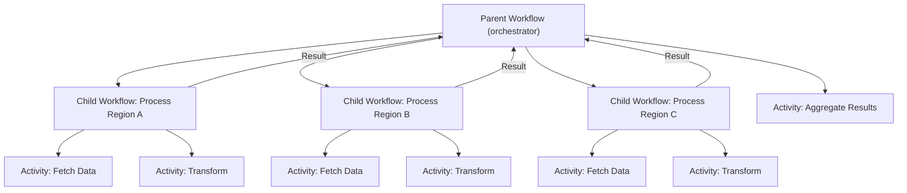

# How to Use Dapr Workflow Child Workflows

Author: [nawazdhandala](https://www.github.com/nawazdhandala)

Tags: Dapr, Workflow, Child Workflow, Orchestration, Composition

Description: Learn how to compose Dapr workflows using child workflows, including how to pass inputs, receive outputs, and build modular hierarchical workflow patterns.

---

## Introduction

Dapr Workflow supports child workflows, allowing you to decompose complex processes into smaller, reusable workflow components. A parent workflow can start one or more child workflows, optionally wait for their completion, and use their results to drive further logic. Child workflows execute as independent workflow instances with their own state and history.

Child workflows are useful for:

- Breaking large workflows into reusable modules
- Running multiple sub-workflows in parallel (fan-out)
- Isolating failure handling to specific sub-processes
- Building hierarchical business process models

## Architecture



## Prerequisites

- Dapr v1.10 or later
- Dapr initialized locally or on Kubernetes
- Workflow SDK (.NET, Go, Python, or Java)

## Implementing Child Workflows

### Python

Define the child workflow and parent workflow:

```python
import dapr.ext.workflow as wf
from dapr.ext.workflow import DaprWorkflowContext, WorkflowActivityContext
import logging

wfr = wf.WorkflowRuntime()

# Child workflow: Process a single order
@wfr.workflow(name='process_order_workflow')
def process_order_workflow(ctx: DaprWorkflowContext, order: dict):
    order_id = order['orderId']

    validated = yield ctx.call_activity(validate_order, input=order)
    if not validated:
        raise ValueError(f"Order {order_id} invalid")

    payment = yield ctx.call_activity(charge_payment, input=order)
    tracking = yield ctx.call_activity(ship_order, input={
        'orderId': order_id,
        'transactionId': payment['transactionId']
    })

    return {'orderId': order_id, 'tracking': tracking, 'status': 'complete'}

# Parent workflow: Process a batch of orders using child workflows
@wfr.workflow(name='batch_orders_workflow')
def batch_orders_workflow(ctx: DaprWorkflowContext, batch: dict):
    orders = batch['orders']

    # Fan-out: start all child workflows in parallel
    child_tasks = []
    for order in orders:
        task = ctx.call_child_workflow(
            process_order_workflow,
            input=order,
            instance_id=f"order-{order['orderId']}"
        )
        child_tasks.append(task)

    # Fan-in: wait for all to complete
    results = yield wf.when_all(child_tasks)

    # Aggregate results
    summary = yield ctx.call_activity(aggregate_results, input={'results': results})
    return summary

# Activities
@wfr.activity(name='validate_order')
def validate_order(ctx: WorkflowActivityContext, order: dict) -> bool:
    logging.info(f"Validating order {order['orderId']}")
    return order.get('amount', 0) > 0

@wfr.activity(name='charge_payment')
def charge_payment(ctx: WorkflowActivityContext, order: dict) -> dict:
    logging.info(f"Charging payment for order {order['orderId']}")
    return {'transactionId': f"txn-{order['orderId']}"}

@wfr.activity(name='ship_order')
def ship_order(ctx: WorkflowActivityContext, input: dict) -> str:
    logging.info(f"Shipping order {input['orderId']}")
    return f"track-{input['orderId']}-XYZ"

@wfr.activity(name='aggregate_results')
def aggregate_results(ctx: WorkflowActivityContext, input: dict) -> dict:
    results = input['results']
    completed = sum(1 for r in results if r.get('status') == 'complete')
    return {'total': len(results), 'completed': completed}

wfr.start()
```

### Go

```go
package main

import (
    "context"
    "fmt"
    "log"

    daprwf "github.com/dapr/go-sdk/workflow"
)

// Child workflow
func ProcessOrderWorkflow(ctx *daprwf.WorkflowContext) (any, error) {
    var order OrderInput
    ctx.GetInput(&order)

    var valid bool
    ctx.CallActivity(ValidateOrderActivity, daprwf.ActivityInput(order)).Await(&valid)
    if !valid {
        return nil, fmt.Errorf("order %s is invalid", order.OrderID)
    }

    var payment PaymentResult
    ctx.CallActivity(ChargePaymentActivity, daprwf.ActivityInput(order)).Await(&payment)

    var tracking string
    ctx.CallActivity(ShipOrderActivity, daprwf.ActivityInput(map[string]string{
        "orderId":       order.OrderID,
        "transactionId": payment.TransactionID,
    })).Await(&tracking)

    return map[string]string{
        "orderId":  order.OrderID,
        "tracking": tracking,
        "status":   "complete",
    }, nil
}

// Parent workflow using child workflows
func BatchOrdersWorkflow(ctx *daprwf.WorkflowContext) (any, error) {
    var batch BatchInput
    ctx.GetInput(&batch)

    // Fan-out child workflows
    tasks := make([]*daprwf.Task, len(batch.Orders))
    for i, order := range batch.Orders {
        tasks[i] = ctx.CallChildWorkflow(ProcessOrderWorkflow,
            daprwf.ChildWorkflowInput(order),
            daprwf.ChildWorkflowInstanceID(fmt.Sprintf("order-%s", order.OrderID)),
        )
    }

    // Fan-in: collect all results
    results := make([]map[string]string, len(tasks))
    for i, task := range tasks {
        task.Await(&results[i])
    }

    completed := 0
    for _, r := range results {
        if r["status"] == "complete" {
            completed++
        }
    }

    return map[string]int{
        "total":     len(results),
        "completed": completed,
    }, nil
}

type OrderInput struct {
    OrderID    string  `json:"orderId"`
    CustomerID string  `json:"customerId"`
    Amount     float64 `json:"amount"`
}

type BatchInput struct {
    Orders []OrderInput `json:"orders"`
}

type PaymentResult struct {
    TransactionID string `json:"transactionId"`
}

func ValidateOrderActivity(ctx context.Context, order OrderInput) (bool, error) {
    return order.Amount > 0, nil
}

func ChargePaymentActivity(ctx context.Context, order OrderInput) (PaymentResult, error) {
    return PaymentResult{TransactionID: fmt.Sprintf("txn-%s", order.OrderID)}, nil
}

func ShipOrderActivity(ctx context.Context, input map[string]string) (string, error) {
    return fmt.Sprintf("track-%s-XYZ", input["orderId"]), nil
}

func main() {
    w, err := daprwf.NewWorker()
    if err != nil {
        log.Fatal(err)
    }
    w.RegisterWorkflow(BatchOrdersWorkflow)
    w.RegisterWorkflow(ProcessOrderWorkflow)
    w.RegisterActivity(ValidateOrderActivity)
    w.RegisterActivity(ChargePaymentActivity)
    w.RegisterActivity(ShipOrderActivity)
    if err := w.Start(); err != nil {
        log.Fatal(err)
    }
}
```

## Starting the Parent Workflow via HTTP API

```bash
curl -X POST \
  "http://localhost:3500/v1.0-beta1/workflows/dapr/batch_orders_workflow/start?instanceID=batch-001" \
  -H "Content-Type: application/json" \
  -d '{
    "orders": [
      {"orderId": "ord-01", "customerId": "cust-A", "amount": 50.00},
      {"orderId": "ord-02", "customerId": "cust-B", "amount": 120.00},
      {"orderId": "ord-03", "customerId": "cust-C", "amount": 75.00}
    ]
  }'
```

## Checking Child Workflow Status

Each child workflow gets its own instance ID. Check them individually:

```bash
curl http://localhost:3500/v1.0-beta1/workflows/dapr/order-ord-01
curl http://localhost:3500/v1.0-beta1/workflows/dapr/order-ord-02
```

## Child Workflow Instance IDs

When you provide an explicit instance ID for a child workflow, you can check its status independently. If you omit the ID, Dapr generates one automatically. Explicit IDs are recommended for traceability.

## Summary

Dapr Workflow child workflows enable modular, composable workflow design. Parent workflows orchestrate child workflows the same way they orchestrate activities - calling them and waiting for results. Use child workflows to encapsulate reusable sub-processes, isolate failure handling, and implement fan-out patterns where multiple independent sub-workflows run in parallel. Each child workflow has its own durable state and can be monitored independently.
