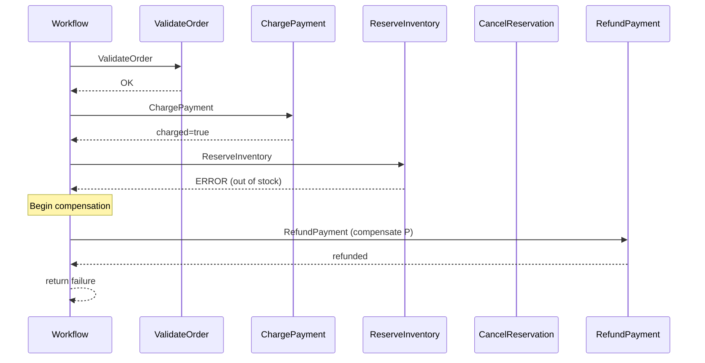

# How to Handle Dapr Workflow Compensation and Rollback

Author: [nawazdhandala](https://www.github.com/nawazdhandala)

Tags: Dapr, Workflow, Compensation, Saga, Rollback

Description: Implement saga compensation and rollback patterns in Dapr Workflow to undo completed steps when a later activity fails in a distributed transaction.

---

## Overview

Distributed transactions across microservices cannot use traditional ACID rollback. The saga pattern compensates for failures by executing compensating activities that undo the effects of completed steps. Dapr Workflow makes saga compensation explicit and durable.

## Saga Compensation Flow



## Step 1: Define Activities and Compensations

```go
// activities.go
package main

import (
    "fmt"
    "github.com/dapr/durabletask-go/task"
)

type OrderInput struct {
    OrderID string  `json:"orderId"`
    Amount  float64 `json:"amount"`
    Items   []string `json:"items"`
}

// Forward activities
func ValidateOrderActivity(ctx task.ActivityContext) (any, error) {
    var input OrderInput
    ctx.GetInput(&input)
    fmt.Printf("Validating order %s\n", input.OrderID)
    return true, nil
}

func ChargePaymentActivity(ctx task.ActivityContext) (any, error) {
    var input OrderInput
    ctx.GetInput(&input)
    fmt.Printf("Charging $%.2f for order %s\n", input.Amount, input.OrderID)
    // Returns a charge receipt ID
    return fmt.Sprintf("charge-%s", input.OrderID), nil
}

func ReserveInventoryActivity(ctx task.ActivityContext) (any, error) {
    var input OrderInput
    ctx.GetInput(&input)
    fmt.Printf("Reserving inventory for order %s\n", input.OrderID)
    // Simulate stock out
    if input.OrderID == "order-no-stock" {
        return nil, fmt.Errorf("out of stock")
    }
    return fmt.Sprintf("reservation-%s", input.OrderID), nil
}

func CreateShipmentActivity(ctx task.ActivityContext) (any, error) {
    var input OrderInput
    ctx.GetInput(&input)
    return fmt.Sprintf("shipment-%s", input.OrderID), nil
}

// Compensating activities
func RefundPaymentActivity(ctx task.ActivityContext) (any, error) {
    var chargeID string
    ctx.GetInput(&chargeID)
    fmt.Printf("Refunding charge %s\n", chargeID)
    return nil, nil
}

func CancelInventoryReservationActivity(ctx task.ActivityContext) (any, error) {
    var reservationID string
    ctx.GetInput(&reservationID)
    fmt.Printf("Cancelling reservation %s\n", reservationID)
    return nil, nil
}

func CancelShipmentActivity(ctx task.ActivityContext) (any, error) {
    var shipmentID string
    ctx.GetInput(&shipmentID)
    fmt.Printf("Cancelling shipment %s\n", shipmentID)
    return nil, nil
}

func NotifyFailureActivity(ctx task.ActivityContext) (any, error) {
    var input OrderInput
    ctx.GetInput(&input)
    fmt.Printf("Notifying failure for order %s\n", input.OrderID)
    return nil, nil
}
```

## Step 2: Implement the Saga Workflow with Compensation Stack

```go
// saga_workflow.go
package main

import (
    "fmt"
    "github.com/dapr/durabletask-go/task"
)

type CompensationFn func() error

// OrderSagaWorkflow implements a compensatable saga
func OrderSagaWorkflow(ctx *task.OrchestrationContext) (any, error) {
    var input OrderInput
    if err := ctx.GetInput(&input); err != nil {
        return nil, err
    }

    // Compensation stack - executed in reverse on failure
    var compensations []CompensationFn

    // --- Step 1: Validate order ---
    var validated bool
    if err := ctx.CallActivity(ValidateOrderActivity,
        task.WithActivityInput(input)).Await(&validated); err != nil {
        return nil, err
    }
    if !validated {
        return map[string]string{"status": "invalid_order"}, nil
    }

    // --- Step 2: Charge payment ---
    var chargeID string
    if err := ctx.CallActivity(ChargePaymentActivity,
        task.WithActivityInput(input)).Await(&chargeID); err != nil {
        return nil, err
    }
    // Register compensation for this step
    capturedChargeID := chargeID
    compensations = append(compensations, func() error {
        return ctx.CallActivity(RefundPaymentActivity,
            task.WithActivityInput(capturedChargeID)).Await(nil)
    })

    // --- Step 3: Reserve inventory ---
    var reservationID string
    if err := ctx.CallActivity(ReserveInventoryActivity,
        task.WithActivityInput(input)).Await(&reservationID); err != nil {
        // Compensate: refund payment
        runCompensations(compensations)
        ctx.CallActivity(NotifyFailureActivity, task.WithActivityInput(input))
        return map[string]string{"status": "out_of_stock"}, nil
    }
    // Register compensation
    capturedReservationID := reservationID
    compensations = append(compensations, func() error {
        return ctx.CallActivity(CancelInventoryReservationActivity,
            task.WithActivityInput(capturedReservationID)).Await(nil)
    })

    // --- Step 4: Create shipment ---
    var shipmentID string
    if err := ctx.CallActivity(CreateShipmentActivity,
        task.WithActivityInput(input)).Await(&shipmentID); err != nil {
        // Compensate: cancel reservation, refund payment
        runCompensations(compensations)
        ctx.CallActivity(NotifyFailureActivity, task.WithActivityInput(input))
        return map[string]string{"status": "shipping_failed"}, nil
    }

    return map[string]string{
        "status":        "completed",
        "chargeId":      chargeID,
        "reservationId": reservationID,
        "shipmentId":    shipmentID,
    }, nil
}

// runCompensations executes compensations in reverse order (LIFO)
func runCompensations(compensations []CompensationFn) {
    for i := len(compensations) - 1; i >= 0; i-- {
        if err := compensations[i](); err != nil {
            fmt.Printf("Compensation failed: %v\n", err)
        }
    }
}
```

## Step 3: Register Workflow and Activities

```go
// main.go
package main

import (
    "context"
    "log"

    "github.com/dapr/durabletask-go/backend"
    "github.com/dapr/durabletask-go/backend/sqlite"
    "github.com/dapr/durabletask-go/task"
)

func main() {
    be, _ := sqlite.NewSqliteBackend(sqlite.NewSqliteOptions("./workflow.db"), backend.DefaultLogger())
    executor := task.NewTaskExecutor(be)

    executor.AddOrchestratorN("OrderSagaWorkflow", OrderSagaWorkflow)
    executor.AddActivityN("ValidateOrderActivity", ValidateOrderActivity)
    executor.AddActivityN("ChargePaymentActivity", ChargePaymentActivity)
    executor.AddActivityN("ReserveInventoryActivity", ReserveInventoryActivity)
    executor.AddActivityN("CreateShipmentActivity", CreateShipmentActivity)
    executor.AddActivityN("RefundPaymentActivity", RefundPaymentActivity)
    executor.AddActivityN("CancelInventoryReservationActivity", CancelInventoryReservationActivity)
    executor.AddActivityN("CancelShipmentActivity", CancelShipmentActivity)
    executor.AddActivityN("NotifyFailureActivity", NotifyFailureActivity)

    if err := executor.Start(context.Background()); err != nil {
        log.Fatal(err)
    }
}
```

## Step 4: Retry Before Compensating

Use retry options on activities before triggering compensation:

```go
// Retry up to 3 times before treating as failure
if err := ctx.CallActivity(ReserveInventoryActivity,
    task.WithActivityInput(input),
    task.WithActivityRetryPolicy(&task.ActivityRetryPolicy{
        MaxNumberOfAttempts: 3,
        FirstRetryInterval:  time.Second,
        BackoffCoefficient:  2.0,
    }),
).Await(&reservationID); err != nil {
    // Only compensate after all retries are exhausted
    runCompensations(compensations)
    return nil, err
}
```

## Step 5: Idempotency in Compensating Activities

Compensating activities must be idempotent since they may be called more than once if the workflow restarts:

```go
func RefundPaymentActivity(ctx task.ActivityContext) (any, error) {
    var chargeID string
    ctx.GetInput(&chargeID)

    // Check if already refunded (idempotency check)
    existing, _ := getRefundStatus(chargeID)
    if existing == "refunded" {
        fmt.Printf("Charge %s already refunded, skipping\n", chargeID)
        return nil, nil
    }

    // Process refund
    processRefund(chargeID)
    return nil, nil
}
```

## Summary

Dapr Workflow saga compensation is implemented by maintaining a compensation stack of closures. Each completed forward activity registers its compensating counterpart. On failure, compensations execute in reverse (LIFO) order to undo completed work. Activities used as compensations must be idempotent because they can run more than once if the workflow is interrupted. Use retry policies on forward activities to avoid triggering compensation for transient failures.
