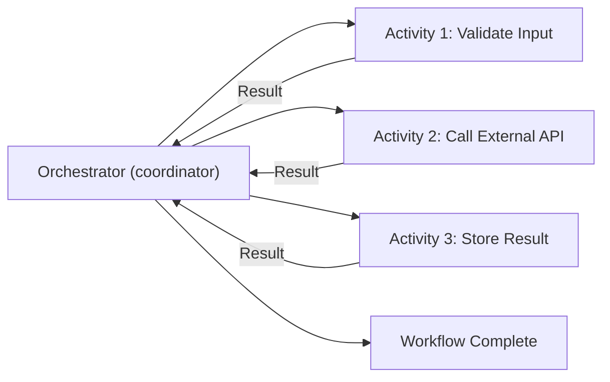

# How to Define a Dapr Workflow with Activities

Author: [nawazdhandala](https://www.github.com/nawazdhandala)

Tags: Dapr, Workflow, Activity, Orchestration, Microservice

Description: Learn how to define Dapr workflow orchestrators and activities, including input/output handling, sequencing, and parallel fan-out patterns with code examples.

---

## Introduction

A Dapr Workflow consists of two core building blocks: **orchestrators** and **activities**. An orchestrator is the workflow function that defines the logic flow - calling activities, handling decisions, and managing state. An activity is a discrete unit of work that performs a single task such as calling an API, writing to a database, or sending a notification.

Activities are the "steps" of your workflow. They run in isolation, can be retried independently, and their results are stored durably by the workflow engine.

## Orchestrator vs. Activity



**Orchestrators** must be deterministic (no random numbers, no current time, no I/O). All side effects go in activities.

**Activities** can do anything: HTTP calls, database writes, file I/O, and other side effects.

## Prerequisites

- Dapr v1.10 or later
- Dapr initialized locally or on Kubernetes
- Workflow SDK (Go, Python, .NET, or Java)

## Defining Activities

### Go

```go
package main

import (
    "context"
    "fmt"
    "log"
    "time"

    daprwf "github.com/dapr/go-sdk/workflow"
)

// Input and output types
type EmailInput struct {
    To      string `json:"to"`
    Subject string `json:"subject"`
    Body    string `json:"body"`
}

type EmailResult struct {
    MessageID string `json:"messageId"`
    SentAt    string `json:"sentAt"`
}

type OrderInput struct {
    OrderID    string  `json:"orderId"`
    CustomerID string  `json:"customerId"`
    Total      float64 `json:"total"`
}

// Activity: Send confirmation email
func SendEmailActivity(ctx context.Context, input EmailInput) (EmailResult, error) {
    log.Printf("Sending email to %s: %s", input.To, input.Subject)
    // Simulate sending email
    return EmailResult{
        MessageID: fmt.Sprintf("msg-%d", time.Now().Unix()),
        SentAt:    time.Now().UTC().Format(time.RFC3339),
    }, nil
}

// Activity: Update database record
func UpdateOrderStatusActivity(ctx context.Context, input map[string]string) error {
    orderID := input["orderId"]
    status := input["status"]
    log.Printf("Updating order %s to status %s", orderID, status)
    // Simulate DB update
    return nil
}

// Activity: Call external API
func ValidateInventoryActivity(ctx context.Context, input OrderInput) (bool, error) {
    log.Printf("Validating inventory for order %s", input.OrderID)
    // Call external inventory service
    return true, nil
}
```

### Go Orchestrator

```go
// Orchestrator: Coordinates the activities in sequence
func FulfillmentWorkflow(ctx *daprwf.WorkflowContext) (any, error) {
    var order OrderInput
    if err := ctx.GetInput(&order); err != nil {
        return nil, err
    }

    // Step 1: Validate inventory
    var inStock bool
    err := ctx.CallActivity(ValidateInventoryActivity,
        daprwf.ActivityInput(order)).Await(&inStock)
    if err != nil || !inStock {
        return nil, fmt.Errorf("item out of stock for order %s", order.OrderID)
    }

    // Step 2: Update order status
    err = ctx.CallActivity(UpdateOrderStatusActivity,
        daprwf.ActivityInput(map[string]string{
            "orderId": order.OrderID,
            "status":  "processing",
        })).Await(nil)
    if err != nil {
        return nil, err
    }

    // Step 3: Send confirmation email
    var emailResult EmailResult
    err = ctx.CallActivity(SendEmailActivity,
        daprwf.ActivityInput(EmailInput{
            To:      fmt.Sprintf("%s@example.com", order.CustomerID),
            Subject: fmt.Sprintf("Order %s confirmed", order.OrderID),
            Body:    "Your order has been confirmed.",
        })).Await(&emailResult)
    if err != nil {
        return nil, err
    }

    return map[string]string{
        "orderId":   order.OrderID,
        "messageId": emailResult.MessageID,
        "status":    "fulfilled",
    }, nil
}
```

### Python Orchestrator and Activities

```python
import dapr.ext.workflow as wf
from dapr.ext.workflow import DaprWorkflowContext, WorkflowActivityContext
import logging
import time

wfr = wf.WorkflowRuntime()

@wfr.workflow(name='fulfillment_workflow')
def fulfillment_workflow(ctx: DaprWorkflowContext, order: dict):
    # Step 1: Validate inventory
    in_stock = yield ctx.call_activity(validate_inventory, input=order)
    if not in_stock:
        raise ValueError(f"Item out of stock for order {order['orderId']}")

    # Step 2: Update status
    yield ctx.call_activity(update_order_status, input={
        'orderId': order['orderId'],
        'status': 'processing'
    })

    # Step 3: Send email
    email_result = yield ctx.call_activity(send_email, input={
        'to': f"{order['customerId']}@example.com",
        'subject': f"Order {order['orderId']} confirmed",
        'body': 'Your order has been confirmed.'
    })

    return {
        'orderId': order['orderId'],
        'messageId': email_result['messageId'],
        'status': 'fulfilled'
    }

@wfr.activity(name='validate_inventory')
def validate_inventory(ctx: WorkflowActivityContext, order: dict) -> bool:
    logging.info(f"Validating inventory for order {order['orderId']}")
    return True  # In real code, call inventory service

@wfr.activity(name='update_order_status')
def update_order_status(ctx: WorkflowActivityContext, input: dict) -> None:
    logging.info(f"Updating order {input['orderId']} to {input['status']}")
    # In real code, write to database

@wfr.activity(name='send_email')
def send_email(ctx: WorkflowActivityContext, input: dict) -> dict:
    logging.info(f"Sending email to {input['to']}")
    return {'messageId': f"msg-{int(time.time())}"}

wfr.start()
```

## Parallel Activity Fan-Out

Call multiple activities in parallel using `when_all`:

```python
@wfr.workflow(name='parallel_workflow')
def parallel_workflow(ctx: DaprWorkflowContext, order: dict):
    # Fan-out: run all validations in parallel
    inventory_task = ctx.call_activity(validate_inventory, input=order)
    fraud_task = ctx.call_activity(check_fraud, input=order)
    credit_task = ctx.call_activity(check_credit, input=order)

    # Wait for all to complete
    results = yield wf.when_all([inventory_task, fraud_task, credit_task])
    in_stock, is_fraud, has_credit = results

    if is_fraud or not has_credit or not in_stock:
        raise ValueError("Order validation failed")

    return {'status': 'approved'}
```

In Go:

```go
func ParallelWorkflow(ctx *daprwf.WorkflowContext) (any, error) {
    var order OrderInput
    ctx.GetInput(&order)

    // Fan-out
    inventoryTask := ctx.CallActivity(ValidateInventoryActivity, daprwf.ActivityInput(order))
    fraudTask := ctx.CallActivity(CheckFraudActivity, daprwf.ActivityInput(order))

    // Fan-in
    var inStock bool
    inventoryTask.Await(&inStock)

    var isFraud bool
    fraudTask.Await(&isFraud)

    if isFraud || !inStock {
        return nil, fmt.Errorf("order %s rejected", order.OrderID)
    }

    return "approved", nil
}
```

## Registering Workflows and Activities

### Go

```go
func main() {
    w, err := daprwf.NewWorker()
    if err != nil {
        log.Fatal(err)
    }
    w.RegisterWorkflow(FulfillmentWorkflow)
    w.RegisterWorkflow(ParallelWorkflow)
    w.RegisterActivity(ValidateInventoryActivity)
    w.RegisterActivity(UpdateOrderStatusActivity)
    w.RegisterActivity(SendEmailActivity)
    if err := w.Start(); err != nil {
        log.Fatal(err)
    }
}
```

## Summary

Dapr workflows consist of orchestrators that coordinate activities. Orchestrators must be deterministic; all I/O and side effects belong in activities. Activities receive typed inputs, produce typed outputs, and are automatically retried on failure. Use sequential activity calls for ordered steps and parallel fan-out patterns for independent validation or processing tasks. Register your orchestrators and activities with the workflow runtime at application startup.
