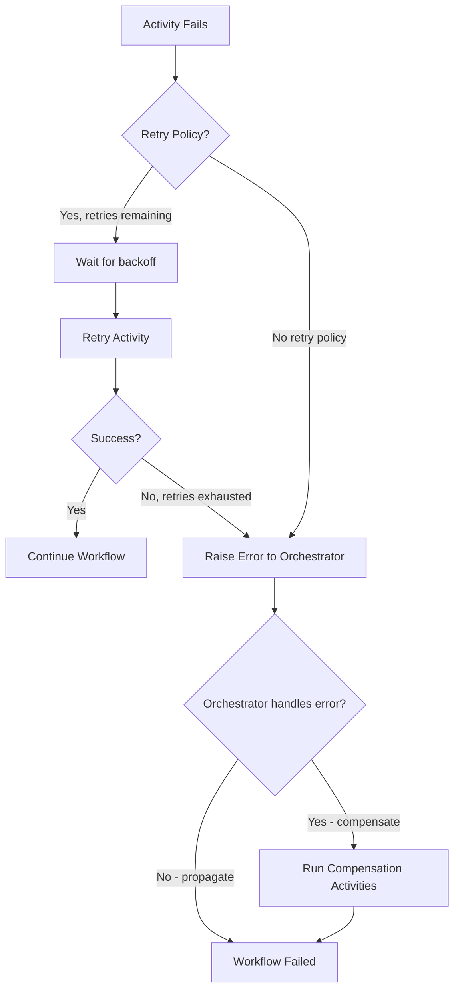
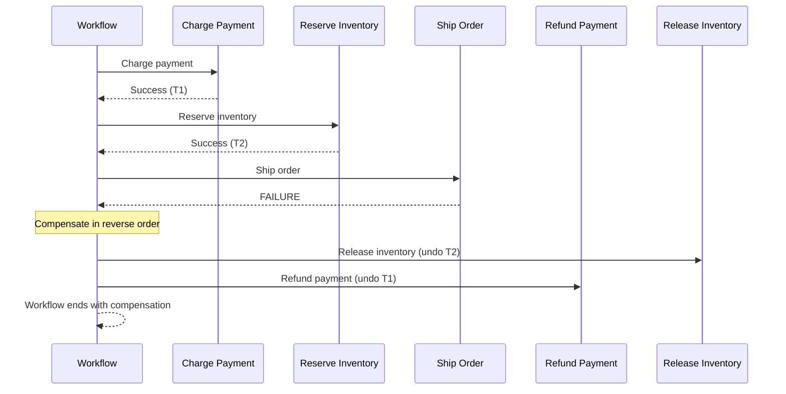

# How to Handle Dapr Workflow Errors and Retries

Author: [nawazdhandala](https://www.github.com/nawazdhandala)

Tags: Dapr, Workflow, Error, Retry, Resilience

Description: Learn how to implement error handling and automatic retry policies in Dapr Workflows, including activity retries, compensation logic, and graceful failure handling.

---

## Introduction

Dapr Workflow provides built-in mechanisms for handling activity failures, configuring retry policies, and implementing compensation logic (sagas). When an activity fails, the workflow engine can automatically retry it with configurable backoff, or surface the error to the orchestrator for custom handling.

Proper error handling in workflows ensures:

- Transient failures are automatically retried without losing progress
- Permanent failures are handled gracefully with compensation
- Workflows do not get stuck in failed states indefinitely

## Error Handling Strategies



## Prerequisites

- Dapr v1.10 or later
- Dapr workflow SDK (.NET, Go, or Python)

## Configuring Retry Policies

### Python - Retry Policy on Activities

```python
import dapr.ext.workflow as wf
from dapr.ext.workflow import DaprWorkflowContext, WorkflowActivityContext
from dapr.ext.workflow.workflow_activity_config import WorkflowActivityConfig
from datetime import timedelta
import logging

wfr = wf.WorkflowRuntime()

# Retry policy: 3 retries, exponential backoff from 5s to 60s
retry_policy = wf.WorkflowActivityConfig(
    retry_policy=wf.RetryPolicy(
        max_number_of_attempts=3,
        first_retry_interval=timedelta(seconds=5),
        backoff_coefficient=2.0,
        max_retry_interval=timedelta(seconds=60),
        retry_timeout=timedelta(minutes=5)
    )
)

@wfr.workflow(name='resilient_workflow')
def resilient_workflow(ctx: DaprWorkflowContext, order: dict):
    order_id = order['orderId']

    try:
        # Activity with retry policy
        payment = yield ctx.call_activity(
            charge_payment,
            input=order,
            retry_policy=wf.RetryPolicy(
                max_number_of_attempts=3,
                first_retry_interval=timedelta(seconds=5),
                backoff_coefficient=2.0
            )
        )
    except Exception as e:
        logging.error(f"Payment failed for order {order_id} after retries: {e}")
        # Compensate: send failure notification
        yield ctx.call_activity(notify_failure, input={'orderId': order_id, 'reason': str(e)})
        raise

    try:
        tracking = yield ctx.call_activity(
            ship_order,
            input={'orderId': order_id, 'transactionId': payment['transactionId']},
            retry_policy=wf.RetryPolicy(max_number_of_attempts=5)
        )
    except Exception as e:
        # Compensation: refund payment if shipping fails
        logging.error(f"Shipping failed for order {order_id}: {e}")
        yield ctx.call_activity(refund_payment, input=payment)
        raise

    return {'orderId': order_id, 'tracking': tracking}

@wfr.activity(name='charge_payment')
def charge_payment(ctx: WorkflowActivityContext, order: dict) -> dict:
    logging.info(f"Charging payment for order {order['orderId']}")
    # Simulate transient failure
    return {'transactionId': f"txn-{order['orderId']}"}

@wfr.activity(name='ship_order')
def ship_order(ctx: WorkflowActivityContext, input: dict) -> str:
    return f"track-{input['orderId']}"

@wfr.activity(name='notify_failure')
def notify_failure(ctx: WorkflowActivityContext, input: dict) -> None:
    logging.warning(f"Order {input['orderId']} failed: {input['reason']}")

@wfr.activity(name='refund_payment')
def refund_payment(ctx: WorkflowActivityContext, payment: dict) -> None:
    logging.info(f"Refunding transaction {payment['transactionId']}")

wfr.start()
```

### Go - Retry Policy on Activities

```go
package main

import (
    "context"
    "fmt"
    "log"
    "time"

    daprwf "github.com/dapr/go-sdk/workflow"
)

type OrderInput struct {
    OrderID    string  `json:"orderId"`
    Amount     float64 `json:"amount"`
}

type PaymentResult struct {
    TransactionID string `json:"transactionId"`
}

func ResilientWorkflow(ctx *daprwf.WorkflowContext) (any, error) {
    var order OrderInput
    ctx.GetInput(&order)

    retryPolicy := &daprwf.RetryPolicy{
        MaxAttempts:          3,
        InitialRetryInterval: 5 * time.Second,
        BackoffCoefficient:   2.0,
        MaxRetryInterval:     60 * time.Second,
    }

    var payment PaymentResult
    err := ctx.CallActivity(ChargePaymentActivity,
        daprwf.ActivityInput(order),
        daprwf.WithRetryPolicy(retryPolicy),
    ).Await(&payment)
    if err != nil {
        log.Printf("Payment failed after retries for order %s: %v", order.OrderID, err)
        // Compensation: notify failure
        ctx.CallActivity(NotifyFailureActivity,
            daprwf.ActivityInput(map[string]string{
                "orderId": order.OrderID,
                "reason":  err.Error(),
            }),
        ).Await(nil)
        return nil, err
    }

    var tracking string
    err = ctx.CallActivity(ShipOrderActivity,
        daprwf.ActivityInput(map[string]string{
            "orderId":       order.OrderID,
            "transactionId": payment.TransactionID,
        }),
        daprwf.WithRetryPolicy(&daprwf.RetryPolicy{MaxAttempts: 5}),
    ).Await(&tracking)
    if err != nil {
        log.Printf("Shipping failed for order %s: %v", order.OrderID, err)
        // Compensation: refund
        ctx.CallActivity(RefundPaymentActivity,
            daprwf.ActivityInput(payment),
        ).Await(nil)
        return nil, err
    }

    return map[string]string{
        "orderId":  order.OrderID,
        "tracking": tracking,
    }, nil
}

func ChargePaymentActivity(ctx context.Context, order OrderInput) (PaymentResult, error) {
    return PaymentResult{TransactionID: fmt.Sprintf("txn-%s", order.OrderID)}, nil
}

func ShipOrderActivity(ctx context.Context, input map[string]string) (string, error) {
    return fmt.Sprintf("track-%s", input["orderId"]), nil
}

func NotifyFailureActivity(ctx context.Context, input map[string]string) error {
    log.Printf("Order %s failed: %s", input["orderId"], input["reason"])
    return nil
}

func RefundPaymentActivity(ctx context.Context, payment PaymentResult) error {
    log.Printf("Refunding transaction %s", payment.TransactionID)
    return nil
}
```

## Retry Policy Parameters

| Parameter | Description |
|---|---|
| `maxAttempts` / `max_number_of_attempts` | Maximum total number of attempts (including first) |
| `firstRetryInterval` / `first_retry_interval` | Delay before first retry |
| `backoffCoefficient` / `backoff_coefficient` | Multiplier for subsequent retry delays |
| `maxRetryInterval` / `max_retry_interval` | Cap on retry delay (prevents exponential overflow) |
| `retryTimeout` / `retry_timeout` | Total time budget for all retries |

## Saga / Compensation Pattern



## Terminating a Stuck Workflow

If a workflow is stuck in a retrying state, terminate it via the HTTP API:

```bash
curl -X POST \
  "http://localhost:3500/v1.0-beta1/workflows/dapr/order-001/terminate" \
  -H "Content-Type: application/json" \
  -d '{"output": "Manually terminated by operator"}'
```

## Summary

Dapr Workflow error handling and retries are powerful tools for building resilient distributed processes. Attach retry policies directly to activity calls to handle transient failures automatically. Catch errors in the orchestrator to implement compensation logic (saga pattern) that undoes completed steps when a later step fails. Use the `terminate` API to clean up workflows that are permanently stuck after retries are exhausted.
