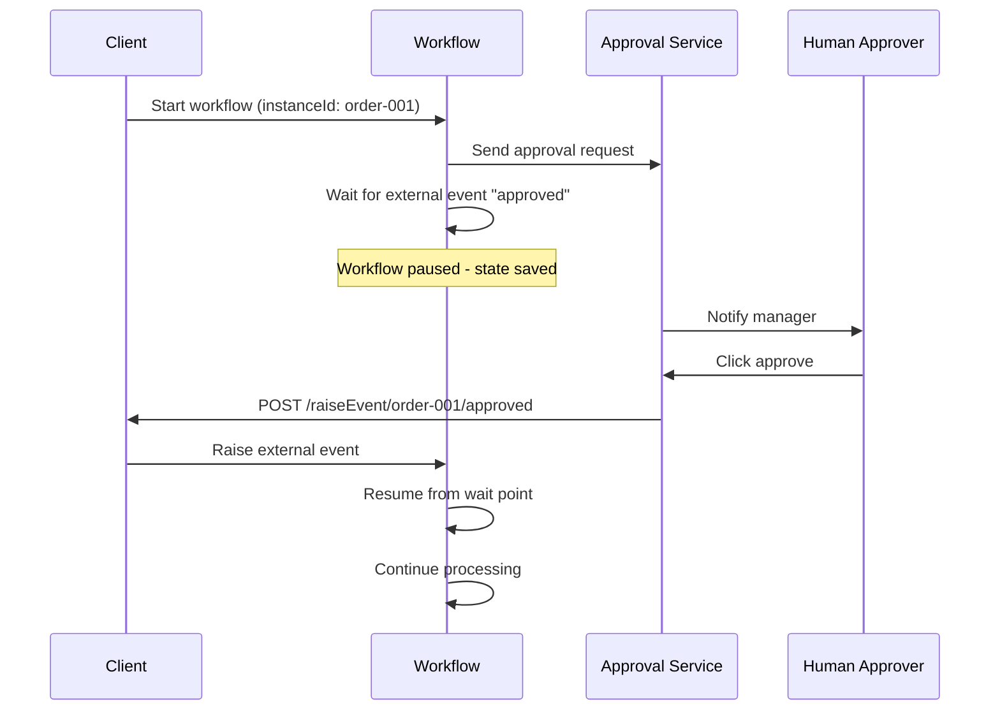
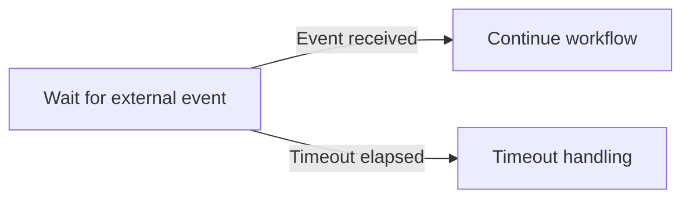

# How to Use Dapr Workflow External Events

Author: [nawazdhandala](https://www.github.com/nawazdhandala)

Tags: Dapr, Workflow, External Event, Approval, Orchestration

Description: Learn how to pause a Dapr Workflow and wait for external events such as human approvals or webhook callbacks, enabling interactive long-running business processes.

---

## Introduction

Dapr Workflow external events allow a running workflow to pause and wait for input from outside the workflow - such as a human approval, a webhook callback, or a message from another service. The workflow suspends execution at the `wait_for_external_event` call, and resumes when the event is raised against the workflow instance.

External events are ideal for:

- Human-in-the-loop approval workflows
- Waiting for payment confirmations from a payment provider webhook
- Orchestrating third-party async callbacks
- Multi-step approvals with timeouts

## How External Events Work



## Prerequisites

- Dapr v1.10 or later
- Workflow SDK (.NET, Go, or Python)

## Implementing External Event Waiting

### Python

```python
import dapr.ext.workflow as wf
from dapr.ext.workflow import DaprWorkflowContext, WorkflowActivityContext
from datetime import timedelta
import logging

wfr = wf.WorkflowRuntime()

@wfr.workflow(name='approval_workflow')
def approval_workflow(ctx: DaprWorkflowContext, request: dict):
    order_id = request['orderId']
    amount = request['amount']

    # Step 1: Submit approval request
    yield ctx.call_activity(send_approval_request, input={
        'orderId': order_id,
        'amount': amount,
        'instanceId': ctx.instance_id
    })

    # Step 2: Wait for external approval event (with 24h timeout)
    approval_event = ctx.wait_for_external_event("approval_decision")
    timeout_event = ctx.create_timer(timedelta(hours=24))

    # Race: either approval arrives or timeout fires
    winner = yield wf.when_any([approval_event, timeout_event])

    if winner == timeout_event:
        # Timeout: escalate or cancel
        yield ctx.call_activity(cancel_request, input={'orderId': order_id, 'reason': 'timeout'})
        return {'orderId': order_id, 'status': 'cancelled', 'reason': 'approval_timeout'}

    decision = approval_event.get_result()
    approved = decision.get('approved', False)

    if not approved:
        yield ctx.call_activity(cancel_request, input={
            'orderId': order_id,
            'reason': decision.get('reason', 'rejected')
        })
        return {'orderId': order_id, 'status': 'rejected'}

    # Step 3: Process approved order
    tracking = yield ctx.call_activity(process_approved_order, input={'orderId': order_id})
    return {'orderId': order_id, 'status': 'approved', 'tracking': tracking}

@wfr.activity(name='send_approval_request')
def send_approval_request(ctx: WorkflowActivityContext, input: dict) -> None:
    logging.info(f"Sending approval request for order {input['orderId']} (${input['amount']})")
    logging.info(f"Approval callback: POST /raiseEvent/{input['instanceId']}/approval_decision")

@wfr.activity(name='process_approved_order')
def process_approved_order(ctx: WorkflowActivityContext, input: dict) -> str:
    logging.info(f"Processing approved order {input['orderId']}")
    return f"track-{input['orderId']}-XYZ"

@wfr.activity(name='cancel_request')
def cancel_request(ctx: WorkflowActivityContext, input: dict) -> None:
    logging.info(f"Cancelling order {input['orderId']}: {input['reason']}")

wfr.start()
```

### Go

```go
package main

import (
    "context"
    "fmt"
    "log"
    "time"

    daprwf "github.com/dapr/go-sdk/workflow"
)

type ApprovalRequest struct {
    OrderID    string  `json:"orderId"`
    Amount     float64 `json:"amount"`
    InstanceID string  `json:"instanceId"`
}

type ApprovalDecision struct {
    Approved bool   `json:"approved"`
    Reason   string `json:"reason"`
}

func ApprovalWorkflow(ctx *daprwf.WorkflowContext) (any, error) {
    var request ApprovalRequest
    ctx.GetInput(&request)

    // Step 1: Send approval request
    ctx.CallActivity(SendApprovalRequestActivity,
        daprwf.ActivityInput(ApprovalRequest{
            OrderID:    request.OrderID,
            Amount:     request.Amount,
            InstanceID: ctx.ID(),
        }),
    ).Await(nil)

    // Step 2: Wait for external event or timeout
    approvalCh := ctx.WaitForExternalEvent("approval_decision", 24*time.Hour)
    var decision ApprovalDecision
    if err := approvalCh.Await(&decision); err != nil {
        // Timeout or error
        ctx.CallActivity(CancelRequestActivity,
            daprwf.ActivityInput(map[string]string{
                "orderId": request.OrderID,
                "reason":  "timeout",
            }),
        ).Await(nil)
        return map[string]string{"status": "cancelled", "reason": "timeout"}, nil
    }

    if !decision.Approved {
        ctx.CallActivity(CancelRequestActivity,
            daprwf.ActivityInput(map[string]string{
                "orderId": request.OrderID,
                "reason":  decision.Reason,
            }),
        ).Await(nil)
        return map[string]string{"status": "rejected", "reason": decision.Reason}, nil
    }

    // Step 3: Process approved order
    var tracking string
    ctx.CallActivity(ProcessApprovedOrderActivity,
        daprwf.ActivityInput(map[string]string{"orderId": request.OrderID}),
    ).Await(&tracking)

    return map[string]string{"status": "approved", "tracking": tracking}, nil
}

func SendApprovalRequestActivity(ctx context.Context, req ApprovalRequest) error {
    log.Printf("Approval request for order %s ($%.2f). Callback: raiseEvent/%s/approval_decision",
        req.OrderID, req.Amount, req.InstanceID)
    return nil
}

func ProcessApprovedOrderActivity(ctx context.Context, input map[string]string) (string, error) {
    return fmt.Sprintf("track-%s-XYZ", input["orderId"]), nil
}

func CancelRequestActivity(ctx context.Context, input map[string]string) error {
    log.Printf("Cancelled order %s: %s", input["orderId"], input["reason"])
    return nil
}
```

## Starting the Workflow

```bash
curl -X POST \
  "http://localhost:3500/v1.0-beta1/workflows/dapr/approval_workflow/start?instanceID=order-001" \
  -H "Content-Type: application/json" \
  -d '{"orderId": "order-001", "amount": 5000.00}'
```

## Raising an External Event

When the human approver clicks "Approve" in your UI, your backend raises the event:

```bash
# Approved
curl -X POST \
  "http://localhost:3500/v1.0-beta1/workflows/dapr/order-001/raiseEvent/approval_decision" \
  -H "Content-Type: application/json" \
  -d '{"approved": true}'

# Rejected
curl -X POST \
  "http://localhost:3500/v1.0-beta1/workflows/dapr/order-001/raiseEvent/approval_decision" \
  -H "Content-Type: application/json" \
  -d '{"approved": false, "reason": "Amount exceeds budget"}'
```

## Checking Workflow Status While Waiting

```bash
curl http://localhost:3500/v1.0-beta1/workflows/dapr/order-001
```

The status will show `RUNNING` while the workflow is waiting for the external event.

## Timeout Pattern with Timer

The Python example above uses `when_any` to race between the approval event and a timer. This is a common pattern to avoid workflows waiting indefinitely:



## Summary

Dapr Workflow external events enable interactive, human-driven workflow patterns. A workflow can pause at any point and wait for an event raised via the HTTP API. Use timeouts alongside external event waits to prevent indefinite blocking. This pattern is essential for approval workflows, third-party async callbacks, and any process that requires coordination with systems or people outside the workflow engine.
