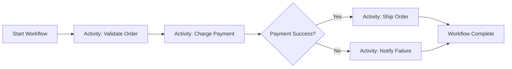
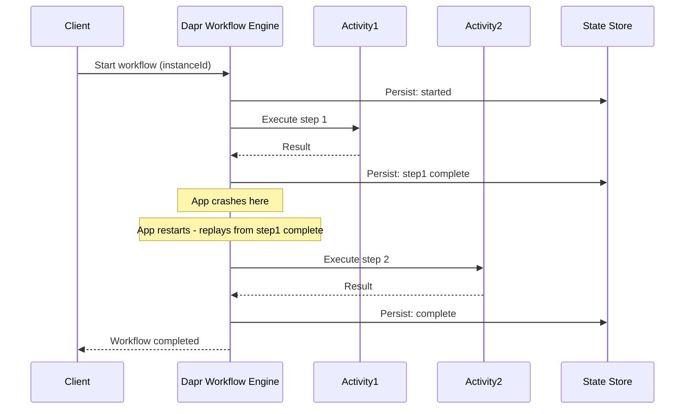

# How to Use Dapr Workflow for Long-Running Processes

Author: [nawazdhandala](https://www.github.com/nawazdhandala)

Tags: Dapr, Workflow, Orchestration, Microservice, Durability

Description: Learn how to use Dapr Workflow to build durable long-running business processes that survive failures and restarts, with step-by-step examples and configuration.

---

## Introduction

Dapr Workflow (built on Durable Task Framework) provides a durable, fault-tolerant way to write long-running business processes as code. Unlike stateless HTTP handlers, Dapr Workflow persists execution state after each step, so if your application crashes mid-workflow, execution resumes from where it left off on restart.

Dapr Workflow is ideal for:

- Multi-step order processing
- Approval workflows with human-in-the-loop steps
- Long-running data pipelines
- Compensation (saga) patterns for distributed transactions

## How Dapr Workflow Works

Workflows are implemented as orchestrator functions that coordinate activities. The Dapr workflow engine replays the orchestrator from the beginning on each step, using event sourcing to deterministically reproduce prior state without re-executing completed steps.



The workflow engine persists state after each activity:



## Prerequisites

- Dapr v1.10 or later (Workflow is GA in Dapr 1.12+)
- Dapr CLI installed and initialized
- A state store component configured
- Workflow SDK for your language (.NET, Go, Python, Java)

## Configuration

Dapr Workflow uses the Dapr state store for durability. No additional component configuration is needed beyond a standard state store:

```yaml
apiVersion: dapr.io/v1alpha1
kind: Component
metadata:
  name: statestore
  namespace: default
spec:
  type: state.redis
  version: v1
  metadata:
  - name: redisHost
    value: "redis-master:6379"
  - name: actorStateStore
    value: "true"
```

## Implementing a Workflow

### Go Example

```go
package main

import (
    "context"
    "fmt"
    "log"

    "github.com/dapr/durabletask-go/task"
    daprwf "github.com/dapr/go-sdk/workflow"
)

// Workflow definition
func OrderWorkflow(ctx *daprwf.WorkflowContext) (any, error) {
    var orderInput OrderInput
    if err := ctx.GetInput(&orderInput); err != nil {
        return nil, err
    }

    // Step 1: Validate order
    var validResult bool
    if err := ctx.CallActivity(ValidateOrder, daprwf.ActivityInput(orderInput)).Await(&validResult); err != nil {
        return nil, err
    }
    if !validResult {
        return nil, fmt.Errorf("order %s failed validation", orderInput.OrderID)
    }

    // Step 2: Process payment
    var paymentResult PaymentResult
    if err := ctx.CallActivity(ProcessPayment, daprwf.ActivityInput(orderInput)).Await(&paymentResult); err != nil {
        return nil, err
    }

    // Step 3: Ship order
    var shipResult string
    if err := ctx.CallActivity(ShipOrder, daprwf.ActivityInput(paymentResult)).Await(&shipResult); err != nil {
        return nil, err
    }

    return fmt.Sprintf("Order %s shipped: %s", orderInput.OrderID, shipResult), nil
}

// Activity definitions
func ValidateOrder(ctx context.Context, input OrderInput) (bool, error) {
    log.Printf("Validating order %s", input.OrderID)
    return input.Amount > 0, nil
}

func ProcessPayment(ctx context.Context, input OrderInput) (PaymentResult, error) {
    log.Printf("Processing payment for order %s: $%.2f", input.OrderID, input.Amount)
    return PaymentResult{TransactionID: "txn-123", Success: true}, nil
}

func ShipOrder(ctx context.Context, input PaymentResult) (string, error) {
    log.Printf("Shipping order, payment %s confirmed", input.TransactionID)
    return "tracking-XYZ-789", nil
}

type OrderInput struct {
    OrderID string  `json:"orderId"`
    Amount  float64 `json:"amount"`
}

type PaymentResult struct {
    TransactionID string `json:"transactionId"`
    Success       bool   `json:"success"`
}
```

### Python Example

```python
import dapr.ext.workflow as wf
from dapr.ext.workflow import DaprWorkflowContext, WorkflowActivityContext
import logging

wfr = wf.WorkflowRuntime()

@wfr.workflow(name='order_workflow')
def order_workflow(ctx: DaprWorkflowContext, order_input: dict):
    order_id = order_input['orderId']
    amount = order_input['amount']

    # Step 1: Validate
    is_valid = yield ctx.call_activity(validate_order, input={'orderId': order_id, 'amount': amount})
    if not is_valid:
        raise ValueError(f"Order {order_id} failed validation")

    # Step 2: Payment
    payment = yield ctx.call_activity(process_payment, input={'orderId': order_id, 'amount': amount})

    # Step 3: Ship
    tracking = yield ctx.call_activity(ship_order, input={'transactionId': payment['transactionId']})

    return {'orderId': order_id, 'trackingNumber': tracking}

@wfr.activity(name='validate_order')
def validate_order(ctx: WorkflowActivityContext, activity_input: dict) -> bool:
    logging.info(f"Validating order {activity_input['orderId']}")
    return activity_input['amount'] > 0

@wfr.activity(name='process_payment')
def process_payment(ctx: WorkflowActivityContext, activity_input: dict) -> dict:
    logging.info(f"Processing payment for order {activity_input['orderId']}")
    return {'transactionId': 'txn-123', 'success': True}

@wfr.activity(name='ship_order')
def ship_order(ctx: WorkflowActivityContext, activity_input: dict) -> str:
    logging.info(f"Shipping order for transaction {activity_input['transactionId']}")
    return 'tracking-XYZ-789'

wfr.start()
```

## Starting a Workflow via HTTP API

```bash
curl -X POST \
  http://localhost:3500/v1.0-beta1/workflows/dapr/order_workflow/start?instanceID=order-001 \
  -H "Content-Type: application/json" \
  -d '{"orderId": "order-001", "amount": 99.99}'
```

## Checking Workflow Status

```bash
curl http://localhost:3500/v1.0-beta1/workflows/dapr/order-001
```

Response:

```json
{
  "instanceID": "order-001",
  "workflowName": "order_workflow",
  "createdAt": "2026-03-31T10:00:00Z",
  "lastUpdatedAt": "2026-03-31T10:00:15Z",
  "runtimeStatus": "COMPLETED",
  "serializedOutput": "{\"orderId\":\"order-001\",\"trackingNumber\":\"tracking-XYZ-789\"}"
}
```

## Running with Dapr CLI

```bash
dapr run \
  --app-id workflow-service \
  --app-port 3000 \
  --dapr-http-port 3500 \
  -- python app.py
```

## Summary

Dapr Workflow provides a durable, event-sourced execution engine for long-running business processes. Workflows are written as code, with activities as discrete steps. State is persisted after each activity, enabling automatic recovery from failures. Start workflows via the HTTP API or SDK clients, monitor their status in real time, and implement complex patterns like retries, fan-out, and human approvals using the workflow building blocks.
