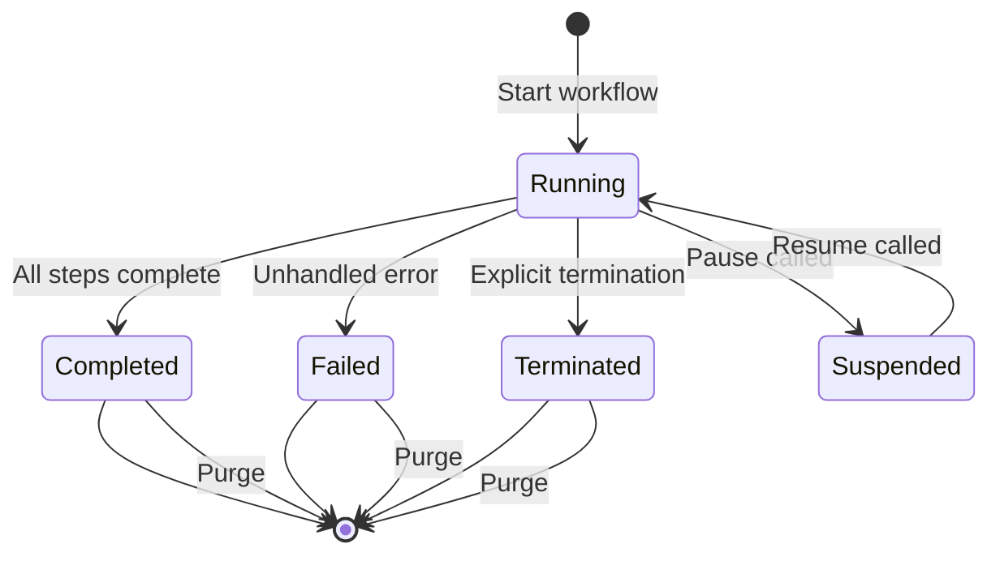

# How to Monitor Dapr Workflow Execution Status

Author: [nawazdhandala](https://www.github.com/nawazdhandala)

Tags: Dapr, Workflow, Monitoring, Status, Observability

Description: Learn how to query, monitor, and manage Dapr Workflow execution status using the HTTP API and SDK clients, including polling, purging, and terminating workflows.

---

## Introduction

Dapr Workflow provides a rich set of management and monitoring capabilities via HTTP API and SDK clients. You can query workflow status, check progress, raise external events, pause, resume, terminate, and purge workflow instances. This is essential for building workflow dashboards, handling stuck workflows, and debugging in production.

## Workflow Status States



## Prerequisites

- Dapr v1.10 or later
- A running Dapr application with workflows registered
- Access to Dapr HTTP API on port 3500

## Querying Workflow Status

### Via HTTP API

Get the current status of a workflow instance:

```bash
curl http://localhost:3500/v1.0-beta1/workflows/dapr/order-001
```

Response example:

```json
{
  "instanceID": "order-001",
  "workflowName": "fulfillment_workflow",
  "createdAt": "2026-03-31T10:00:00Z",
  "lastUpdatedAt": "2026-03-31T10:00:42Z",
  "runtimeStatus": "RUNNING",
  "properties": {
    "dapr.workflow.custom_status": "Processing payment",
    "dapr.workflow.input": "{\"orderId\":\"order-001\",\"amount\":99.99}"
  }
}
```

Possible `runtimeStatus` values:

| Status | Description |
|---|---|
| `RUNNING` | Workflow is actively executing |
| `COMPLETED` | Workflow finished successfully |
| `FAILED` | Workflow ended with an unhandled error |
| `TERMINATED` | Workflow was explicitly terminated |
| `SUSPENDED` | Workflow is paused |
| `PENDING` | Workflow is scheduled but not yet started |

### Via Go SDK

```go
package main

import (
    "context"
    "fmt"
    "log"

    dapr "github.com/dapr/go-sdk/client"
)

func checkWorkflowStatus(instanceID string) {
    client, err := dapr.NewClient()
    if err != nil {
        log.Fatal(err)
    }
    defer client.Close()

    ctx := context.Background()
    resp, err := client.GetWorkflowBeta1(ctx, &dapr.GetWorkflowRequest{
        InstanceID:        instanceID,
        WorkflowComponent: "dapr",
    })
    if err != nil {
        log.Printf("Error: %v", err)
        return
    }

    fmt.Printf("Workflow: %s\n", resp.WorkflowName)
    fmt.Printf("Status: %s\n", resp.RuntimeStatus)
    fmt.Printf("Created: %s\n", resp.CreatedAt)
    fmt.Printf("Last Updated: %s\n", resp.LastUpdatedAt)

    if resp.Properties["dapr.workflow.custom_status"] != "" {
        fmt.Printf("Custom Status: %s\n", resp.Properties["dapr.workflow.custom_status"])
    }
}
```

### Via Python SDK

```python
from dapr.clients import DaprClient

def check_workflow_status(instance_id: str):
    with DaprClient() as client:
        response = client.get_workflow(
            instance_id=instance_id,
            workflow_component='dapr'
        )
        print(f"Workflow: {response.workflow_name}")
        print(f"Status:   {response.runtime_status}")
        print(f"Created:  {response.created_at}")
        print(f"Updated:  {response.last_updated_at}")
        if response.serialized_output:
            print(f"Output:   {response.serialized_output}")
```

## Setting Custom Status

Within a workflow, you can set a human-readable custom status message to indicate progress:

```python
@wfr.workflow(name='long_running_workflow')
def long_running_workflow(ctx: DaprWorkflowContext, input: dict):
    ctx.set_custom_status("Step 1: Validating input")
    yield ctx.call_activity(validate_input, input=input)

    ctx.set_custom_status("Step 2: Processing data")
    result = yield ctx.call_activity(process_data, input=input)

    ctx.set_custom_status("Step 3: Sending notification")
    yield ctx.call_activity(send_notification, input=result)

    ctx.set_custom_status("Complete")
    return result
```

In Go:

```go
func LongRunningWorkflow(ctx *daprwf.WorkflowContext) (any, error) {
    ctx.SetCustomStatus("Step 1: Validating input")
    // ...
    ctx.SetCustomStatus("Step 2: Processing data")
    // ...
    return result, nil
}
```

## Pausing and Resuming a Workflow

Suspend a running workflow:

```bash
curl -X POST \
  http://localhost:3500/v1.0-beta1/workflows/dapr/order-001/suspend
```

Resume a suspended workflow:

```bash
curl -X POST \
  http://localhost:3500/v1.0-beta1/workflows/dapr/order-001/resume
```

## Terminating a Workflow

Terminate a stuck or unwanted workflow:

```bash
curl -X POST \
  "http://localhost:3500/v1.0-beta1/workflows/dapr/order-001/terminate" \
  -H "Content-Type: application/json" \
  -d '{"output": "Terminated by admin"}'
```

## Purging Workflow History

After a workflow completes or is terminated, purge its history to free storage:

```bash
curl -X DELETE \
  http://localhost:3500/v1.0-beta1/workflows/dapr/order-001/purge
```

## Polling Workflow Status to Completion

A simple polling pattern in Python to wait for a workflow to finish:

```python
import time
from dapr.clients import DaprClient

def wait_for_workflow(instance_id: str, poll_interval: int = 5, max_wait: int = 300):
    with DaprClient() as client:
        elapsed = 0
        while elapsed < max_wait:
            resp = client.get_workflow(instance_id=instance_id, workflow_component='dapr')
            status = resp.runtime_status

            print(f"[{elapsed}s] Status: {status} | {resp.properties.get('dapr.workflow.custom_status', '')}")

            if status in ('COMPLETED', 'FAILED', 'TERMINATED'):
                return resp

            time.sleep(poll_interval)
            elapsed += poll_interval

        raise TimeoutError(f"Workflow {instance_id} did not complete in {max_wait}s")
```

## Monitoring with Dapr Dashboard

The Dapr dashboard provides a visual view of workflow instances. Install and access it:

```bash
dapr dashboard -k
```

Then open `http://localhost:8080` to see workflow status, history, and metrics.

## Summary

Dapr Workflow provides comprehensive status monitoring via HTTP API and SDK clients. Use `GET /workflows/dapr/{instanceId}` to poll status, set custom status messages within workflows to track progress, and use suspend/resume/terminate APIs for operational control. Purge completed workflow history to keep state store usage under control. Build monitoring dashboards by polling workflow status and surfacing custom status messages to operators.
