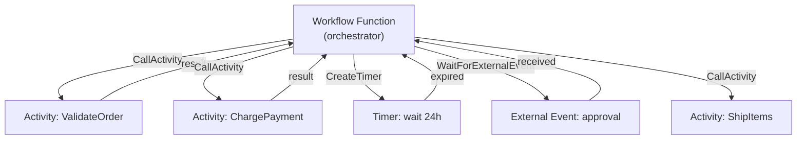

# How to Use Dapr Workflow with Temporal-Style Patterns

Author: [nawazdhandala](https://www.github.com/nawazdhandala)

Tags: Dapr, Workflow, Orchestration, Microservice, Durable

Description: Build durable, fault-tolerant workflows with Dapr using Temporal-style patterns including sequential activities, fan-out, timers, and external events.

---

## Overview

Dapr Workflow is a durable orchestration engine built on the Durable Task Framework. It shares conceptual similarities with Temporal and Azure Durable Functions: workflows are code-first, durable across process restarts, and composed of activities (individual units of work) orchestrated by a workflow function.

## Core Concepts



## Pattern 1: Sequential Activity Chain (Saga-Style)

```go
// workflow.go
package main

import (
    "github.com/dapr/durabletask-go/task"
    "github.com/microsoft/durabletask-go/backend"
)

type OrderInput struct {
    OrderID string  `json:"orderId"`
    Amount  float64 `json:"amount"`
    Items   []string `json:"items"`
}

type OrderResult struct {
    ShipmentID string `json:"shipmentId"`
    Status     string `json:"status"`
}

// OrderWorkflow is a sequential saga workflow
func OrderWorkflow(ctx *task.OrchestrationContext) (any, error) {
    var input OrderInput
    if err := ctx.GetInput(&input); err != nil {
        return nil, err
    }

    // Step 1: Validate order
    var validated bool
    if err := ctx.CallActivity(ValidateOrderActivity,
        task.WithActivityInput(input)).Await(&validated); err != nil {
        return nil, err
    }
    if !validated {
        return &OrderResult{Status: "rejected"}, nil
    }

    // Step 2: Charge payment
    var charged bool
    if err := ctx.CallActivity(ChargePaymentActivity,
        task.WithActivityInput(input)).Await(&charged); err != nil {
        // Payment failed - run compensation
        ctx.CallActivity(RefundPaymentActivity, task.WithActivityInput(input))
        return nil, err
    }

    // Step 3: Ship items
    var shipmentID string
    if err := ctx.CallActivity(ShipItemsActivity,
        task.WithActivityInput(input)).Await(&shipmentID); err != nil {
        // Shipping failed - compensate payment
        ctx.CallActivity(RefundPaymentActivity, task.WithActivityInput(input))
        return nil, err
    }

    return &OrderResult{ShipmentID: shipmentID, Status: "completed"}, nil
}
```

## Pattern 2: Fan-Out / Fan-In (Parallel Activities)

```go
func BatchProcessingWorkflow(ctx *task.OrchestrationContext) (any, error) {
    var itemIDs []string
    ctx.GetInput(&itemIDs)

    // Fan-out: launch all tasks in parallel
    tasks := make([]task.Task, len(itemIDs))
    for i, id := range itemIDs {
        tasks[i] = ctx.CallActivity(ProcessItemActivity,
            task.WithActivityInput(id))
    }

    // Fan-in: wait for all to complete
    results := make([]string, len(tasks))
    for i, t := range tasks {
        if err := t.Await(&results[i]); err != nil {
            return nil, err
        }
    }

    return results, nil
}
```

## Pattern 3: Durable Timer

```go
import "time"

func ApprovalWorkflow(ctx *task.OrchestrationContext) (any, error) {
    var requestID string
    ctx.GetInput(&requestID)

    // Send approval request
    ctx.CallActivity(SendApprovalEmailActivity, task.WithActivityInput(requestID))

    // Wait up to 48 hours for approval
    deadline := ctx.CurrentTimeUtc().Add(48 * time.Hour)
    timerTask := ctx.CreateTimer(deadline)

    approvalTask := ctx.WaitForExternalEvent("approval-received")

    // Race: approval vs timeout
    winner := task.WhenAny(approvalTask, timerTask)
    if err := winner.Await(nil); err != nil {
        return nil, err
    }

    if winner == timerTask {
        // Timed out - reject
        ctx.CallActivity(RejectRequestActivity, task.WithActivityInput(requestID))
        return map[string]string{"status": "timed_out"}, nil
    }

    // Approved
    var approved bool
    approvalTask.Await(&approved)
    if !approved {
        return map[string]string{"status": "rejected"}, nil
    }

    ctx.CallActivity(FulfillRequestActivity, task.WithActivityInput(requestID))
    return map[string]string{"status": "approved"}, nil
}
```

## Pattern 4: External Event (Human-in-the-Loop)

```go
func HumanApprovalWorkflow(ctx *task.OrchestrationContext) (any, error) {
    var orderID string
    ctx.GetInput(&orderID)

    // Notify the approver
    ctx.CallActivity(NotifyApproverActivity, task.WithActivityInput(orderID))

    // Wait indefinitely for the external event
    var approved bool
    if err := ctx.WaitForExternalEvent("order-approved").Await(&approved); err != nil {
        return nil, err
    }

    if approved {
        ctx.CallActivity(ProcessApprovedOrderActivity, task.WithActivityInput(orderID))
    } else {
        ctx.CallActivity(CancelOrderActivity, task.WithActivityInput(orderID))
    }
    return nil, nil
}
```

Raise the external event from a separate service:

```go
// Raise event via Dapr client
err = client.RaiseWorkflowEvent(ctx,
    instanceID,
    "order-approved",
    true, // approved = true
)
```

## Pattern 5: Eternal Workflow (Monitor Loop)

```go
import "time"

func MonitorWorkflow(ctx *task.OrchestrationContext) (any, error) {
    var resourceID string
    ctx.GetInput(&resourceID)

    for {
        var healthy bool
        ctx.CallActivity(CheckHealthActivity,
            task.WithActivityInput(resourceID)).Await(&healthy)

        if !healthy {
            ctx.CallActivity(AlertActivity, task.WithActivityInput(resourceID))
        }

        // Wait 30 seconds before checking again
        ctx.CreateTimer(ctx.CurrentTimeUtc().Add(30 * time.Second)).Await(nil)

        // Continue-as-new to prevent history from growing unbounded
        ctx.ContinueAsNew(resourceID)
        break
    }
    return nil, nil
}
```

## Activity Definitions

```go
// Activities are simple functions registered with the worker
func ValidateOrderActivity(ctx task.ActivityContext) (any, error) {
    var input OrderInput
    ctx.GetInput(&input)
    // Validate business rules
    return input.Amount > 0 && len(input.Items) > 0, nil
}

func ChargePaymentActivity(ctx task.ActivityContext) (any, error) {
    var input OrderInput
    ctx.GetInput(&input)
    // Call payment service
    return true, nil
}

func ShipItemsActivity(ctx task.ActivityContext) (any, error) {
    var input OrderInput
    ctx.GetInput(&input)
    // Call shipping service
    return fmt.Sprintf("shipment-%s", input.OrderID), nil
}
```

## Start the Workflow Worker

```go
func main() {
    w, err := worker.NewTaskHubWorker(backend.NewSqliteBackend("./workflow.db"))
    if err != nil {
        log.Fatal(err)
    }

    w.AddOrchestratorN("OrderWorkflow", OrderWorkflow)
    w.AddOrchestratorN("BatchProcessingWorkflow", BatchProcessingWorkflow)
    w.AddOrchestratorN("ApprovalWorkflow", ApprovalWorkflow)
    w.AddActivityN("ValidateOrderActivity", ValidateOrderActivity)
    w.AddActivityN("ChargePaymentActivity", ChargePaymentActivity)
    w.AddActivityN("ShipItemsActivity", ShipItemsActivity)

    w.Start(context.Background())
}
```

## Start and Monitor Workflows

```go
// Start a new workflow instance
instanceID, err := client.StartWorkflow(ctx, &dapr.StartWorkflowRequest{
    InstanceID:        "order-" + orderID,
    WorkflowComponent: "dapr",
    WorkflowName:      "OrderWorkflow",
    Input:             orderInput,
})

// Poll for status
status, err := client.GetWorkflow(ctx, &dapr.GetWorkflowRequest{
    InstanceID:        instanceID.InstanceID,
    WorkflowComponent: "dapr",
})
fmt.Printf("Status: %s\n", status.RuntimeStatus)
```

## Summary

Dapr Workflow supports Temporal-style patterns including sequential sagas, parallel fan-out/fan-in, durable timers, and human-in-the-loop approval flows. Workflows are code-first orchestrators that call typed activities and are durable across restarts. The `ContinueAsNew` pattern prevents history from growing unbounded in long-running monitor loops. External events let external systems inject signals into running workflows without polling.
