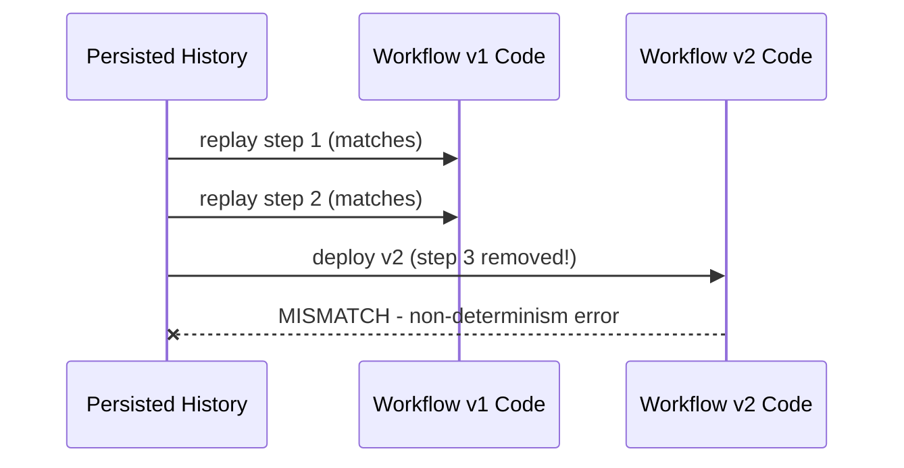

# How to Configure Dapr Workflow Versioning

Author: [nawazdhandala](https://www.github.com/nawazdhandala)

Tags: Dapr, Workflow, Versioning, Migration, Durable

Description: Manage Dapr workflow definition changes safely using versioning strategies including version guards, parallel deployment, and ContinueAsNew migration.

---

## Overview

Durable workflows persist their execution history. If you change workflow logic while instances are still running, replaying from history against new code can produce incorrect results. Dapr Workflow inherits the Durable Task Framework versioning constraints: you must ensure that running instances see consistent logic during replay.

## The Versioning Problem



## Strategy 1: New Workflow Name for Breaking Changes

The safest strategy for significant changes is to register a new workflow name:

```go
// v1 workflow - keep running for existing instances
func OrderWorkflowV1(ctx *task.OrchestrationContext) (any, error) {
    // original logic
    var input OrderInput
    ctx.GetInput(&input)

    var validated bool
    ctx.CallActivity(ValidateOrderV1Activity, task.WithActivityInput(input)).Await(&validated)

    // ... old steps
    return nil, nil
}

// v2 workflow - new instances use this
func OrderWorkflowV2(ctx *task.OrchestrationContext) (any, error) {
    // new logic with additional step
    var input OrderInput
    ctx.GetInput(&input)

    var validated bool
    ctx.CallActivity(ValidateOrderV2Activity, task.WithActivityInput(input)).Await(&validated)

    // New step added in v2
    var enriched bool
    ctx.CallActivity(EnrichOrderActivity, task.WithActivityInput(input)).Await(&enriched)

    // ... new steps
    return nil, nil
}

// Register both
executor.AddOrchestratorN("OrderWorkflow", OrderWorkflowV1)      // existing
executor.AddOrchestratorN("OrderWorkflowV2", OrderWorkflowV2)    // new
```

Start new instances with the new name:

```go
// New order submission uses V2
instanceID, err := client.StartWorkflow(ctx, &dapr.StartWorkflowRequest{
    WorkflowComponent: "dapr",
    WorkflowName:      "OrderWorkflowV2",  // Use new version
    Input:             orderInput,
})
```

## Strategy 2: Version Guard (Backward-Compatible Changes)

For additive changes (new optional steps), use a version field in the input:

```go
type OrderInput struct {
    OrderID string  `json:"orderId"`
    Amount  float64 `json:"amount"`
    Version int     `json:"version"` // 1 = original, 2 = with enrichment
}

func OrderWorkflow(ctx *task.OrchestrationContext) (any, error) {
    var input OrderInput
    ctx.GetInput(&input)

    // Always run these steps
    var validated bool
    ctx.CallActivity(ValidateOrderActivity, task.WithActivityInput(input)).Await(&validated)

    var chargeID string
    ctx.CallActivity(ChargePaymentActivity, task.WithActivityInput(input)).Await(&chargeID)

    // New step only for v2+ instances
    if input.Version >= 2 {
        var enriched bool
        ctx.CallActivity(EnrichOrderActivity, task.WithActivityInput(input)).Await(&enriched)
    }

    var shipmentID string
    ctx.CallActivity(ShipItemsActivity, task.WithActivityInput(input)).Await(&shipmentID)

    return map[string]string{
        "chargeId":   chargeID,
        "shipmentId": shipmentID,
        "status":     "completed",
    }, nil
}
```

New instances pass `Version: 2`; existing instances replay with `Version: 1` and skip the new step.

## Strategy 3: ContinueAsNew for Migration

Use `ContinueAsNew` to migrate long-running instances to new logic:

```go
type OrderInputV2 struct {
    OrderID   string  `json:"orderId"`
    Amount    float64 `json:"amount"`
    SchemaVer int     `json:"schemaVer"`
    Priority  string  `json:"priority"` // new in v2
}

func OrderWorkflowMigrated(ctx *task.OrchestrationContext) (any, error) {
    var rawInput map[string]interface{}
    ctx.GetInput(&rawInput)

    // Detect old schema (no schemaVer field)
    schemaVer, _ := rawInput["schemaVer"].(float64)
    if schemaVer < 2 {
        // Migrate: re-start as new with updated input
        newInput := OrderInputV2{
            OrderID:   rawInput["orderId"].(string),
            Amount:    rawInput["amount"].(float64),
            SchemaVer: 2,
            Priority:  "normal", // set default for migrated instances
        }
        ctx.ContinueAsNew(newInput)
        return nil, nil
    }

    // v2 logic from here
    var input OrderInputV2
    ctx.GetInput(&input)

    // ... v2 steps
    return nil, nil
}
```

## Strategy 4: Drain and Replace

For major rewrites, drain existing instances before deploying new code:

```bash
# 1. Stop accepting new workflow start requests (feature flag or ingress rule)

# 2. Wait for in-flight instances to complete
# Monitor with metadata API
curl http://localhost:3500/v1.0/metadata | jq '.activeWorkflows'

# 3. Once all instances complete, deploy new code

# 4. Re-enable new workflow start requests
```

## Strategy 5: Activity Versioning

Activities can be independently versioned by name:

```go
// Keep old activity registered for replaying old history
executor.AddActivityN("ProcessOrderActivity", ProcessOrderActivityV1)

// Register new version under a new name
executor.AddActivityN("ProcessOrderActivityV2", ProcessOrderActivityV2)

// New workflow uses V2 activities
func OrderWorkflowV2(ctx *task.OrchestrationContext) (any, error) {
    // ...
    ctx.CallActivity(ProcessOrderActivityV2, task.WithActivityInput(input)).Await(&result)
    // ...
}
```

## Versioning Checklist

| Change type | Safe strategy |
|---|---|
| Add optional step | Version guard in input |
| Remove a step | New workflow name |
| Change activity name | New workflow name |
| Change input schema | New workflow name or ContinueAsNew |
| Fix bug in activity logic | Safe (activities are not replayed from history) |
| Fix bug in orchestrator logic | Requires new workflow name |
| Add new activity to end | New workflow name (for safety) |

## Monitoring Active Instances by Version

```bash
# Query workflow status via Dapr HTTP API
curl "http://localhost:3500/v1.0-beta1/workflows/dapr/OrderWorkflow/instances" | jq '.instances[] | {id, status}'

# Check for instances still running old version
curl "http://localhost:3500/v1.0-beta1/workflows/dapr/OrderWorkflowV1/instances?runtimeStatus=RUNNING"
```

## Summary

Dapr Workflow versioning follows the same constraints as any durable workflow engine: orchestrator code must remain deterministic during replay. Safe strategies include registering new workflow names for breaking changes, using version guards in input structs for additive changes, using `ContinueAsNew` for migrating running instances, and keeping old activity registrations for history compatibility. Activities are safe to change in isolation since they are not replayed from history.
