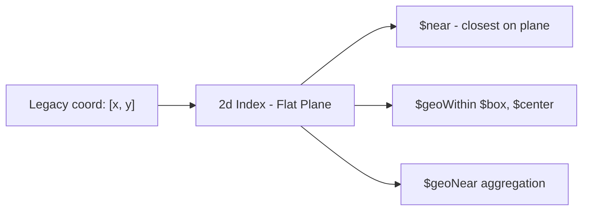

# How to Create a 2d Index in MongoDB for Planar Coordinates

Author: [nawazdhandala](https://www.github.com/nawazdhandala)

Tags: MongoDB, Index, Geospatial, 2d Index, Planar Coordinates

Description: Learn how to create a 2d index in MongoDB for querying flat plane coordinates, legacy location data, and grid-based position systems.

---

## How 2d Indexes Work

A `2d` index supports geospatial queries on flat, planar coordinate systems. Unlike the `2dsphere` index which accounts for Earth's curvature, `2d` treats coordinates as points on a flat two-dimensional plane.

Use `2d` indexes when:
- Your data uses a flat coordinate system (game maps, floor plans, image pixel coordinates)
- You are working with legacy location data stored as `[longitude, latitude]` pairs (not GeoJSON objects)
- You need simple grid-based proximity queries

For real-world geographic data on Earth, prefer the `2dsphere` index which handles the curvature of the Earth.



## Syntax

```javascript
db.collection.createIndex({ locationField: "2d" }, { min: -180, max: 180 })
```

Options:
- `min` - minimum value for a coordinate (default -180)
- `max` - maximum value for a coordinate (default 180)
- `bits` - precision of geohash stored per value (default 26)

## Coordinate Storage Formats

A `2d` index supports two coordinate storage formats:

**Legacy coordinate pair (array):**

```javascript
{ location: [longitude, latitude] }
```

**Embedded document:**

```javascript
{ location: { x: 10.5, y: 20.3 } }
```

## Examples

### Create a 2d Index

```javascript
db.locations.createIndex({ coords: "2d" })
```

With custom bounds for a game map that uses a 0-1000 grid:

```javascript
db.gameObjects.createIndex({ position: "2d" }, { min: 0, max: 1000 })
```

### Insert Documents with Legacy Coordinates

```javascript
db.locations.insertMany([
  { name: "Point A", coords: [10, 20] },
  { name: "Point B", coords: [15, 25] },
  { name: "Point C", coords: [50, 80] },
  { name: "Point D", coords: [-10, 30] }
])
```

### Find Nearest Locations

```javascript
db.locations.find({
  coords: {
    $near: [12, 22],
    $maxDistance: 10
  }
})
```

### Find Within a Box

Use `$geoWithin` with `$box` to find points in a rectangular region:

```javascript
db.locations.find({
  coords: {
    $geoWithin: {
      $box: [[0, 0], [30, 40]]  // bottom-left and top-right corners
    }
  }
})
```

### Find Within a Circle

Use `$geoWithin` with `$center` to find points within a radius on a flat plane:

```javascript
db.locations.find({
  coords: {
    $geoWithin: {
      $center: [[12, 22], 15]  // center point and radius in coordinate units
    }
  }
})
```

### Game Map Example

```javascript
const { MongoClient } = require("mongodb");

async function main() {
  const client = new MongoClient("mongodb://localhost:27017");
  await client.connect();

  const gameObjects = client.db("game").collection("objects");

  // Create 2d index for a 0-100 game grid
  await gameObjects.createIndex(
    { position: "2d" },
    { min: 0, max: 100, name: "idx_position_2d" }
  );

  // Insert game objects with positions
  await gameObjects.insertMany([
    { name: "Treasure Chest", type: "item", position: [45, 60] },
    { name: "Enemy Goblin", type: "enemy", position: [47, 63] },
    { name: "Player Base", type: "base", position: [10, 10] },
    { name: "Hidden Cave", type: "landmark", position: [80, 75] }
  ]);

  // Find all objects near player at (46, 61) within distance 5
  const nearbyObjects = await gameObjects.find({
    position: {
      $near: [46, 61],
      $maxDistance: 5
    }
  }).toArray();

  console.log("Nearby objects:");
  nearbyObjects.forEach(obj => {
    console.log(` - ${obj.name} (${obj.type}) at [${obj.position}]`);
  });

  // Find all items in a quadrant
  const quadrantItems = await gameObjects.find({
    position: {
      $geoWithin: { $box: [[40, 55], [55, 70]] }
    }
  }).toArray();

  console.log("\nItems in quadrant:");
  quadrantItems.forEach(obj => console.log(` - ${obj.name}`));

  await client.close();
}

main().catch(console.error);
```

### 2d Index in Aggregation with $geoNear

```javascript
db.locations.aggregate([
  {
    $geoNear: {
      near: [12, 22],
      distanceField: "distFromQuery",
      maxDistance: 20,
      spherical: false  // flat plane - important for 2d
    }
  }
])
```

## Differences: 2d vs 2dsphere

```text
Feature                2d Index              2dsphere Index
-----------------------------------------------------------
Coordinate system      Flat plane            Spherical (Earth)
Coordinate format      [x, y] or {x,y}       GeoJSON objects
Accuracy for Earth     Low (flat approx)     High (accurate)
Use case               Games, floor plans    Real-world geo
Operators supported    $near, $geoWithin     $near, $nearSphere,
                       $center, $box                    $geoWithin, $geoIntersects
GeoJSON support        Partial               Full
```

## Best Practices

- **Use `2dsphere` for real-world geographic data.** The `2d` index only makes sense for flat coordinate systems or legacy data.
- **Set custom `min`/`max` bounds** to match your coordinate system range (e.g., 0 to 1000 for a game map).
- **Avoid mixing `2d` and GeoJSON.** If your documents store GeoJSON, use `2dsphere`.
- **Use `$box` and `$center`** for efficient rectangular and circular range queries on flat planes.
- **Keep coordinate values within bounds.** Values outside `min`/`max` cause errors on insert.

## Summary

The `2d` index is MongoDB's geospatial index for flat plane coordinate systems. Create it with `createIndex({ field: "2d" })` and optionally set `min`/`max` bounds for your coordinate space. It supports `$near`, `$geoWithin` with `$box` and `$center`, and the `$geoNear` aggregation stage with `spherical: false`. For real-world Earth-based location data, use the `2dsphere` index instead.
