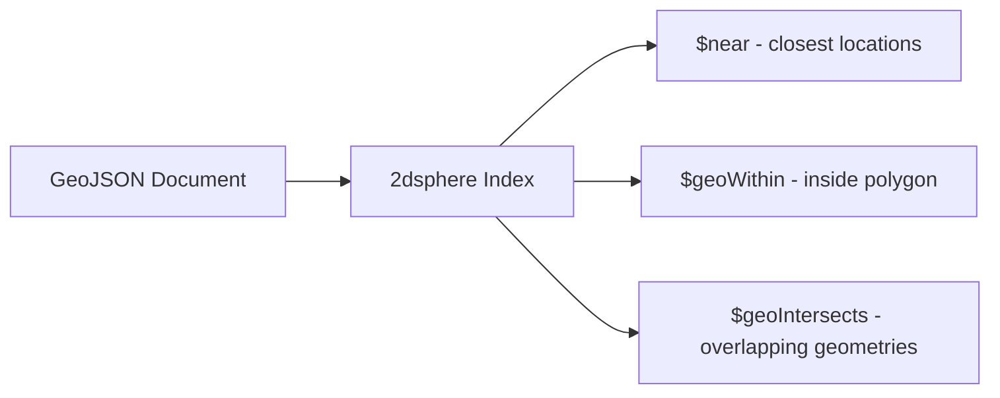

# How to Create a 2dsphere Index in MongoDB for Geospatial Queries

Author: [nawazdhandala](https://www.github.com/nawazdhandala)

Tags: MongoDB, Index, Geospatial, 2dsphere, GeoJSON

Description: Learn how to create a 2dsphere index in MongoDB to support geospatial queries on GeoJSON data, including proximity searches, polygon containment, and distance calculations.

---

## How 2dsphere Indexes Work

A `2dsphere` index supports queries on geographic data modeled as GeoJSON objects on a spherical surface (the Earth). Unlike the flat-plane `2d` index, `2dsphere` accounts for the curvature of the Earth, making it accurate for real-world location data.

The index stores GeoJSON geometry (points, lines, polygons) and supports:
- Proximity searches (`$near`, `$nearSphere`)
- Area containment queries (`$geoWithin`)
- Intersection queries (`$geoIntersects`)



## GeoJSON Format

MongoDB uses the GeoJSON standard for location data. The most common type is `Point`:

```javascript
{
  type: "Point",
  coordinates: [longitude, latitude]  // longitude first, latitude second
}
```

Note: GeoJSON always uses `[longitude, latitude]` order, which is the opposite of what many mapping APIs use.

## Syntax

```javascript
db.collection.createIndex({ locationField: "2dsphere" })
```

The value `"2dsphere"` is a string, not a number.

## Examples

### Create a 2dsphere Index

```javascript
db.places.createIndex({ location: "2dsphere" })
```

### Insert GeoJSON Documents

```javascript
db.places.insertMany([
  {
    name: "Central Park",
    location: { type: "Point", coordinates: [-73.9654, 40.7829] }
  },
  {
    name: "Times Square",
    location: { type: "Point", coordinates: [-73.9851, 40.7580] }
  },
  {
    name: "Brooklyn Bridge",
    location: { type: "Point", coordinates: [-73.9969, 40.7061] }
  }
])
```

### Find Nearby Locations with $near

Find places within 2 km of a given point, sorted by distance:

```javascript
db.places.find({
  location: {
    $near: {
      $geometry: {
        type: "Point",
        coordinates: [-73.9857, 40.7484]  // Midtown Manhattan
      },
      $maxDistance: 2000  // meters
    }
  }
})
```

### Find Locations Within a Polygon

```javascript
db.places.find({
  location: {
    $geoWithin: {
      $geometry: {
        type: "Polygon",
        coordinates: [[
          [-74.0060, 40.7128],
          [-73.9712, 40.7128],
          [-73.9712, 40.7831],
          [-74.0060, 40.7831],
          [-74.0060, 40.7128]  // close the polygon
        ]]
      }
    }
  }
})
```

### Compound Index with 2dsphere

Combine a geospatial field with other fields in a compound index:

```javascript
db.restaurants.createIndex({ location: "2dsphere", cuisine: 1 })

// Query by location and cuisine type
db.restaurants.find({
  location: {
    $near: {
      $geometry: { type: "Point", coordinates: [-73.9851, 40.7580] },
      $maxDistance: 1000
    }
  },
  cuisine: "Italian"
})
```

### Node.js Full Example

```javascript
const { MongoClient } = require("mongodb");

async function main() {
  const client = new MongoClient("mongodb://localhost:27017");
  await client.connect();
  const places = client.db("maps").collection("places");

  // Create the 2dsphere index
  await places.createIndex({ location: "2dsphere" });

  // Insert sample places
  await places.insertMany([
    { name: "Coffee Shop A", location: { type: "Point", coordinates: [-73.985, 40.748] } },
    { name: "Coffee Shop B", location: { type: "Point", coordinates: [-73.990, 40.752] } },
    { name: "Coffee Shop C", location: { type: "Point", coordinates: [-74.010, 40.710] } }
  ]);

  // Find coffee shops within 1 km
  const nearby = await places.find({
    location: {
      $near: {
        $geometry: { type: "Point", coordinates: [-73.986, 40.749] },
        $maxDistance: 1000
      }
    }
  }).toArray();

  console.log("Nearby places:");
  nearby.forEach(p => console.log(" -", p.name));

  await client.close();
}

main().catch(console.error);
```

### Calculate Distance with $geoNear Aggregation

The `$geoNear` aggregation stage adds a calculated distance field to each result:

```javascript
db.places.aggregate([
  {
    $geoNear: {
      near: { type: "Point", coordinates: [-73.9851, 40.7580] },
      distanceField: "distanceMeters",
      maxDistance: 2000,
      spherical: true
    }
  },
  { $project: { name: 1, distanceMeters: { $round: ["$distanceMeters", 0] } } }
])
```

## Supported Geometry Types

A `2dsphere` index supports all GeoJSON geometry types:

```text
Point         - a single coordinate
MultiPoint    - multiple coordinates
LineString    - a sequence of coordinates
MultiLineString
Polygon       - a closed area with optional holes
MultiPolygon
GeometryCollection
```

## Best Practices

- **Store coordinates as GeoJSON** (`{ type: "Point", coordinates: [lng, lat] }`) for forward compatibility with all geospatial operators.
- **Remember longitude before latitude** in GeoJSON coordinates - this is the opposite of most mapping APIs.
- **Validate coordinate ranges**: longitude must be between -180 and 180, latitude between -90 and 90.
- **Use `$maxDistance` and `$minDistance`** in `$near` queries to bound results and prevent full-collection scans.
- **Use `$geoNear` in aggregation** when you need the calculated distance as a field in your result documents.
- **Compound the index** with frequently filtered fields (like `category` or `city`) to narrow the geospatial scan.

## Summary

A `2dsphere` index enables accurate spherical geospatial queries on GeoJSON data in MongoDB. Create it with `createIndex({ field: "2dsphere" })` and store coordinates in GeoJSON format with longitude before latitude. It powers `$near`, `$geoWithin`, and `$geoIntersects` queries. For distance calculations in aggregations, use the `$geoNear` stage with `spherical: true`.
