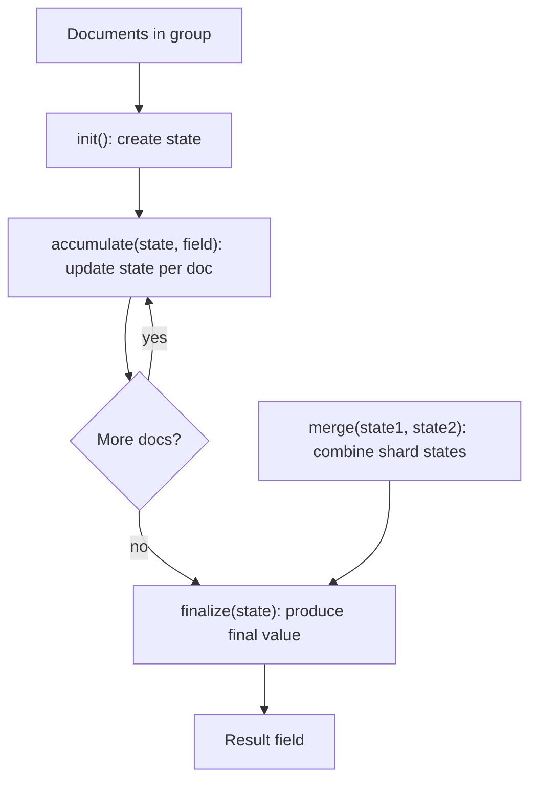

# How to Use $accumulator for Custom Aggregation Logic in MongoDB

Author: [nawazdhandala](https://www.github.com/nawazdhandala)

Tags: MongoDB, Aggregation, Pipeline, Accumulator, JavaScript

Description: Learn how to use $accumulator in MongoDB 4.4+ to write custom JavaScript accumulation logic in $group stages when built-in accumulators are not sufficient.

---

## Overview

`$accumulator` lets you define a custom accumulator operator for `$group` using JavaScript functions. It was introduced in MongoDB 4.4. Use it only when no built-in accumulator (`$sum`, `$avg`, `$push`, `$addToSet`, etc.) covers your logic, because JavaScript execution carries significant performance overhead compared to native operators.



## Syntax

```javascript
{
  $accumulator: {
    init: <JavaScript function or string>,
    initArgs: [ <expression>, ... ],        // optional
    accumulate: <JavaScript function or string>,
    accumulateArgs: [ <expression>, ... ],
    merge: <JavaScript function or string>,
    finalize: <JavaScript function or string>, // optional
    lang: "js"
  }
}
```

- `init` - creates and returns the initial accumulator state; called once per group
- `accumulate` - called for each document; receives the current state and one or more field values; must return the updated state
- `merge` - combines two partial states (required for sharded clusters or `$setWindowFields`)
- `finalize` - transforms the final state into the output value (optional)
- `accumulateArgs` - array of expressions passed as additional arguments to `accumulate`

## Examples

### Example 1 - Custom Weighted Average

Calculate a weighted average that is not available as a built-in operator:

```javascript
db.products.aggregate([
  {
    $group: {
      _id: "$category",
      weightedAvgPrice: {
        $accumulator: {
          init: function() {
            return { totalWeight: 0, weightedSum: 0 };
          },
          accumulate: function(state, price, quantity) {
            return {
              totalWeight: state.totalWeight + quantity,
              weightedSum: state.weightedSum + price * quantity
            };
          },
          accumulateArgs: ["$price", "$quantity"],
          merge: function(state1, state2) {
            return {
              totalWeight: state1.totalWeight + state2.totalWeight,
              weightedSum: state1.weightedSum + state2.weightedSum
            };
          },
          finalize: function(state) {
            if (state.totalWeight === 0) return 0;
            return state.weightedSum / state.totalWeight;
          },
          lang: "js"
        }
      }
    }
  }
])
```

### Example 2 - Collect Unique Values with a Custom Threshold

Collect distinct tags per category but cap the set at 5:

```javascript
db.articles.aggregate([
  {
    $group: {
      _id: "$category",
      topTags: {
        $accumulator: {
          init: function() { return []; },
          accumulate: function(state, tags) {
            tags.forEach(function(t) {
              if (state.indexOf(t) === -1 && state.length < 5) {
                state.push(t);
              }
            });
            return state;
          },
          accumulateArgs: ["$tags"],
          merge: function(state1, state2) {
            state2.forEach(function(t) {
              if (state1.indexOf(t) === -1 && state1.length < 5) {
                state1.push(t);
              }
            });
            return state1;
          },
          lang: "js"
        }
      }
    }
  }
])
```

### Example 3 - Running Median

Accumulate all values then compute the median in `finalize`:

```javascript
db.measurements.aggregate([
  {
    $group: {
      _id: "$sensorId",
      medianReading: {
        $accumulator: {
          init: function() { return []; },
          accumulate: function(state, val) {
            state.push(val);
            return state;
          },
          accumulateArgs: ["$value"],
          merge: function(s1, s2) { return s1.concat(s2); },
          finalize: function(state) {
            if (state.length === 0) return null;
            state.sort(function(a, b) { return a - b; });
            var mid = Math.floor(state.length / 2);
            return state.length % 2 !== 0
              ? state[mid]
              : (state[mid - 1] + state[mid]) / 2;
          },
          lang: "js"
        }
      }
    }
  }
])
```

### Example 4 - Pass initArgs for Parameterized Initialization

Initialize state with a parameter from a pipeline variable:

```javascript
db.events.aggregate([
  {
    $group: {
      _id: "$userId",
      recentEvents: {
        $accumulator: {
          init: function(limit) { return { limit: limit, events: [] }; },
          initArgs: [10],
          accumulate: function(state, ts, type) {
            state.events.push({ ts: ts, type: type });
            return state;
          },
          accumulateArgs: ["$timestamp", "$eventType"],
          merge: function(s1, s2) {
            return {
              limit: s1.limit,
              events: s1.events.concat(s2.events)
            };
          },
          finalize: function(state) {
            state.events.sort(function(a, b) { return b.ts - a.ts; });
            return state.events.slice(0, state.limit);
          },
          lang: "js"
        }
      }
    }
  }
])
```

## Requirements and Limitations

- MongoDB version 4.4 or later
- Requires `--enableMajorityReadConcern` is not disabled
- Server-side JavaScript must be enabled (`security.javascriptEnabled: true` in `mongod.conf`)
- Significantly slower than built-in accumulators; use only when necessary
- Cannot access external resources or perform I/O inside the functions

## When to Use $accumulator vs. $function

| Operator | Stage | Use For |
|---|---|---|
| `$accumulator` | `$group`, `$setWindowFields` | Stateful aggregation across multiple documents |
| `$function` | `$project`, `$addFields`, `$match` | Per-document JavaScript transformation |

## Summary

`$accumulator` extends MongoDB's `$group` stage with custom JavaScript-powered accumulation. Define an `init` function to set initial state, an `accumulate` function to update state per document, a `merge` function to combine partial states from shards, and an optional `finalize` function to transform the final state into the desired output. Use it as a last resort when no combination of built-in accumulators covers your logic, and prefer native operators whenever possible to maintain performance.
