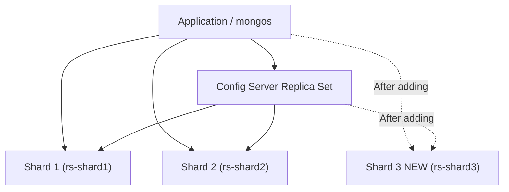

# How to Add Shards to a MongoDB Cluster

Author: [OneUptime](https://www.github.com/oneuptime)

Tags: MongoDB, Sharding, Cluster, Scalability, Operations

Description: Learn how to add new shards to a running MongoDB sharded cluster, verify balancer activity, and confirm that chunks migrate to the new shard.

---

## Introduction

Adding a shard to an existing MongoDB sharded cluster increases storage capacity and distributes query load. MongoDB's balancer automatically migrates chunks to the new shard after it is added. You can add a standalone mongod or a replica set as a shard - replica sets are strongly recommended for production.

## Before You Add a Shard

Verify the current cluster state:

```javascript
// Connect to mongos
sh.status()
```

Check balancer status:

```javascript
sh.getBalancerState()
// Should return true for auto-balancing
```

## Architecture: Adding a New Shard Replica Set



## Step 1: Start the New Shard Replica Set

On the new shard nodes, configure and start mongod:

```yaml
# /etc/mongod.conf on each new shard node
net:
  port: 27017
  bindIp: 0.0.0.0

replication:
  replSetName: "rs-shard3"

sharding:
  clusterRole: shardsvr

storage:
  dbPath: /var/lib/mongodb

security:
  keyFile: /etc/mongodb/keyfile
```

```bash
sudo systemctl start mongod
```

Initiate the new replica set:

```javascript
// Connect to shard3-node1
rs.initiate({
  _id: "rs-shard3",
  members: [
    { _id: 0, host: "shard3-node1.example.com:27017" },
    { _id: 1, host: "shard3-node2.example.com:27017" },
    { _id: 2, host: "shard3-node3.example.com:27017" }
  ]
})
```

Wait for the primary to be elected:

```javascript
rs.status()
```

## Step 2: Add the Shard to the Cluster

Connect to a mongos router and add the shard:

```javascript
// Connect to mongos
sh.addShard("rs-shard3/shard3-node1.example.com:27017,shard3-node2.example.com:27017,shard3-node3.example.com:27017")
```

Verify the shard was added:

```javascript
db.adminCommand({ listShards: 1 })
```

Expected output:

```javascript
{
  shards: [
    { _id: "rs-shard1", host: "rs-shard1/...", state: 1 },
    { _id: "rs-shard2", host: "rs-shard2/...", state: 1 },
    { _id: "rs-shard3", host: "rs-shard3/shard3-node1.example.com:27017,...", state: 1 }
  ],
  ok: 1
}
```

## Step 3: Confirm the Balancer Is Active

The balancer automatically starts migrating chunks to the new shard:

```javascript
sh.getBalancerState()        // true = enabled
sh.isBalancerRunning()       // true = currently migrating
```

Check balancer lock status in the config database:

```javascript
use config
db.locks.find({ _id: "balancer" }).pretty()
```

## Step 4: Monitor Chunk Distribution

Watch chunks being distributed to the new shard:

```javascript
// See chunk counts per shard for each collection
use config
db.chunks.aggregate([
  { $group: { _id: "$shard", count: { $sum: 1 } } },
  { $sort: { count: -1 } }
])
```

Wait for the distribution to even out. This can take time for large clusters.

## Step 5: Verify with sh.status()

```javascript
sh.status()
// Look for the new shard in the shards section
// Check that chunks are distributed under the databases section
```

## Step 6: (Optional) Drain a Shard Before Removal

If you later need to drain a shard (remove it), mark it for draining:

```javascript
db.adminCommand({ removeShard: "rs-shard1" })
// Repeat this command until you see "state: completed"
```

## Troubleshooting

```javascript
// Check balancer log for migration errors
use config
db.changelog.find({ what: { $regex: /moveChunk/ } }).sort({ time: -1 }).limit(10)

// Check for failed migrations
db.changelog.find({ what: "moveChunk.from", "details.errmsg": { $exists: true } }).limit(5)

// If balancer is stuck, check for lock
db.locks.find({ _id: "balancer", state: 2 })
```

## Summary

Adding a shard to a MongoDB cluster involves starting a new replica set with `clusterRole: shardsvr`, using `sh.addShard()` from a mongos router, and then letting the balancer redistribute chunks automatically. Always add shards as replica sets in production, confirm the shard appears in `listShards`, and monitor chunk distribution with `sh.status()` and `config.chunks` queries to ensure even data distribution.
