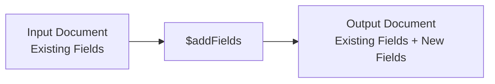

# How to Use $addFields in MongoDB Aggregation

Author: [nawazdhandala](https://www.github.com/nawazdhandala)

Tags: MongoDB, Aggregation, $addFields, Pipeline, Stage

Description: Learn how to use the $addFields stage in MongoDB aggregation to add new computed fields to documents without removing existing fields.

---

## How $addFields Works

The `$addFields` stage adds new fields to documents. Output documents contain all existing fields from the input documents plus the newly specified fields. Unlike `$project`, you do not need to explicitly list every field you want to keep - all existing fields are preserved automatically.

`$addFields` is equivalent to `$project` with all existing fields set to `1` plus your new fields added.



## Syntax

```javascript
{
  $addFields: {
    <newField1>: <expression1>,
    <newField2>: <expression2>,
    ...
  }
}
```

You can also use `$addFields` to overwrite an existing field by specifying its name.

## Examples

### Input Documents

```javascript
[
  { _id: 1, firstName: "Alice", lastName: "Smith", salary: 75000, hoursPerWeek: 40 },
  { _id: 2, firstName: "Bob",   lastName: "Jones", salary: 60000, hoursPerWeek: 35 }
]
```

### Example 1 - Add a Computed Field

Add a `fullName` field without dropping any existing fields:

```javascript
db.employees.aggregate([
  {
    $addFields: {
      fullName: { $concat: ["$firstName", " ", "$lastName"] }
    }
  }
])
```

Output:

```javascript
[
  { _id: 1, firstName: "Alice", lastName: "Smith", salary: 75000, hoursPerWeek: 40, fullName: "Alice Smith" },
  { _id: 2, firstName: "Bob",   lastName: "Jones", salary: 60000, hoursPerWeek: 35, fullName: "Bob Jones"   }
]
```

### Example 2 - Add Multiple Fields

Add both `fullName` and `annualBonus` in a single stage:

```javascript
db.employees.aggregate([
  {
    $addFields: {
      fullName: { $concat: ["$firstName", " ", "$lastName"] },
      annualBonus: { $multiply: ["$salary", 0.10] },
      hourlyRate: { $divide: ["$salary", { $multiply: ["$hoursPerWeek", 52] }] }
    }
  }
])
```

Output:

```javascript
[
  {
    _id: 1, firstName: "Alice", lastName: "Smith",
    salary: 75000, hoursPerWeek: 40,
    fullName: "Alice Smith", annualBonus: 7500,
    hourlyRate: 36.06
  },
  {
    _id: 2, firstName: "Bob", lastName: "Jones",
    salary: 60000, hoursPerWeek: 35,
    fullName: "Bob Jones", annualBonus: 6000,
    hourlyRate: 32.97
  }
]
```

### Example 3 - Overwrite an Existing Field

Overwrite `salary` to convert it to thousands:

```javascript
db.employees.aggregate([
  {
    $addFields: {
      salary: { $divide: ["$salary", 1000] }
    }
  }
])
```

Output:

```javascript
[
  { _id: 1, firstName: "Alice", lastName: "Smith", salary: 75, hoursPerWeek: 40 },
  { _id: 2, firstName: "Bob",   lastName: "Jones", salary: 60, hoursPerWeek: 35 }
]
```

### Example 4 - Add a Field Based on a Condition

Add a `salaryTier` label based on the salary value:

```javascript
db.employees.aggregate([
  {
    $addFields: {
      salaryTier: {
        $switch: {
          branches: [
            { case: { $gte: ["$salary", 70000] }, then: "High" },
            { case: { $gte: ["$salary", 50000] }, then: "Medium" }
          ],
          default: "Low"
        }
      }
    }
  }
])
```

Output:

```javascript
[
  { _id: 1, firstName: "Alice", salary: 75000, salaryTier: "High"   },
  { _id: 2, firstName: "Bob",   salary: 60000, salaryTier: "Medium" }
]
```

### Example 5 - Add a Field from an Array

Add a field containing the first element of an array:

```javascript
// Input: { _id: 1, scores: [85, 92, 78] }
db.students.aggregate([
  {
    $addFields: {
      firstScore: { $arrayElemAt: ["$scores", 0] },
      avgScore:   { $avg: "$scores" }
    }
  }
])
```

### Example 6 - Multiple $addFields Stages

You can chain multiple `$addFields` stages. The second stage can reference fields added by the first:

```javascript
db.employees.aggregate([
  {
    $addFields: {
      fullName: { $concat: ["$firstName", " ", "$lastName"] }
    }
  },
  {
    $addFields: {
      greeting: { $concat: ["Hello, ", "$fullName", "!"] }
    }
  }
])
```

## $addFields vs $project

| Feature | $addFields | $project |
|---|---|---|
| Preserves existing fields | Yes (automatically) | Only listed fields |
| Can add new fields | Yes | Yes |
| Can overwrite existing fields | Yes | Yes |
| Can exclude fields | No | Yes (set to 0) |

Use `$addFields` when you want to augment documents and `$project` when you want precise control over the output shape.

## Use Cases

- Adding computed fields (totals, averages, formatted strings) to documents
- Enriching pipeline documents before a `$group` or `$sort` stage
- Normalizing data by overwriting fields with cleaned values
- Adding conditional classification labels (tier, category, status)

## Summary

The `$addFields` stage adds new fields to each document while preserving all existing fields. It supports any aggregation expression including arithmetic, string operations, conditionals, and array functions. Unlike `$project`, you never need to list existing fields - they are always carried forward. Chain multiple `$addFields` stages when later computed fields depend on earlier ones.
