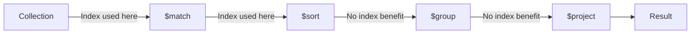
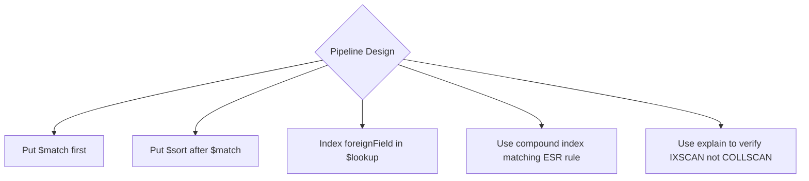

# How to Use Aggregation Pipeline Indexes in MongoDB

Author: [nawazdhandala](https://www.github.com/nawazdhandala)

Tags: MongoDB, Aggregation, Index, Query Optimization, Performance

Description: Learn how MongoDB uses indexes in aggregation pipelines, which stages benefit from indexes, how to verify index usage with explain, and how to structure pipelines for best performance.

---

## How Indexes Work in Aggregation Pipelines

MongoDB's aggregation pipeline processes documents stage by stage. Indexes are most valuable at the beginning of the pipeline - primarily in `$match` and `$sort` stages - because they reduce the number of documents that flow into subsequent stages. Once documents pass through stages like `$unwind`, `$group`, or `$project`, indexes generally cannot be used for those operations.



## Setting Up the Example

```javascript
db.orders.insertMany([
  { customerId: "c1", status: "shipped",  region: "us-east", amount: 250, createdAt: new Date("2024-01-10") },
  { customerId: "c1", status: "pending",  region: "eu-west", amount: 100, createdAt: new Date("2024-02-01") },
  { customerId: "c2", status: "shipped",  region: "us-east", amount: 500, createdAt: new Date("2024-02-15") },
  { customerId: "c3", status: "canceled", region: "ap-south", amount: 75, createdAt: new Date("2024-03-01") }
]);

// Create indexes to support aggregation
db.orders.createIndex({ status: 1, createdAt: -1 });
db.orders.createIndex({ customerId: 1 });
db.orders.createIndex({ region: 1, amount: -1 });
```

## The $match Stage and Indexes

The `$match` stage at the start of the pipeline uses indexes exactly like a `find()` filter:

```javascript
db.orders.aggregate([
  { $match: { status: "shipped" } },  // uses index on status
  { $group: {
    _id: "$customerId",
    totalAmount: { $sum: "$amount" }
  }}
]);
```

Placing `$match` as the first stage is critical. MongoDB can then limit the documents it reads from disk:

```javascript
// GOOD: $match first
db.orders.aggregate([
  { $match: { status: "shipped", createdAt: { $gte: new Date("2024-01-01") } } },
  { $sort: { createdAt: -1 } },
  { $limit: 10 }
]);

// BAD: $match after $group - forces full scan, then filters
db.orders.aggregate([
  { $group: { _id: "$customerId", total: { $sum: "$amount" } } },
  { $match: { total: { $gt: 200 } } }
]);
```

## The $sort Stage and Indexes

When `$sort` immediately follows `$match` (with no intervening stages that change the document set), MongoDB can use the index to return documents in sorted order without a separate sort step:

```javascript
db.orders.aggregate([
  { $match: { status: "shipped" } },
  { $sort: { createdAt: -1 } },       // uses index status_1_createdAt_-1
  { $limit: 5 }
]);
```

The compound index `{ status: 1, createdAt: -1 }` satisfies both the match and the sort in this pipeline.

## Verifying Index Usage with explain()

```javascript
db.orders.explain("executionStats").aggregate([
  { $match: { status: "shipped" } },
  { $sort: { createdAt: -1 } },
  { $group: { _id: "$customerId", count: { $sum: 1 } } }
]);
```

Look for `IXSCAN` in the `stages` output. If you see `COLLSCAN`, no index is being used for that stage.

```javascript
// Simplified relevant output:
{
  "stages": [
    {
      "$cursor": {
        "queryPlanner": {
          "winningPlan": {
            "stage": "FETCH",
            "inputStage": {
              "stage": "IXSCAN",
              "keyPattern": { "status": 1, "createdAt": -1 }
            }
          }
        }
      }
    },
    { "$group": { ... } }
  ]
}
```

## The $lookup Stage and Indexes

`$lookup` joins documents from another collection. An index on the `foreignField` in the joined collection dramatically speeds up the join:

```javascript
// Index on the foreignField in the joined collection
db.customers.createIndex({ _id: 1 });  // usually already exists

db.orders.aggregate([
  { $match: { status: "shipped" } },
  {
    $lookup: {
      from: "customers",
      localField: "customerId",
      foreignField: "_id",
      as: "customerInfo"
    }
  }
]);
```

## Pipeline Optimization: ESR Rule in Aggregation

For compound indexes used in aggregation, follow the ESR rule (Equality, Sort, Range):

```javascript
// Create an ESR-ordered compound index
db.orders.createIndex({ status: 1, createdAt: -1, amount: 1 });

// Pipeline that benefits from the ESR index
db.orders.aggregate([
  { $match: {
    status: "shipped",               // Equality on status (E)
    createdAt: { $gte: new Date("2024-01-01") }  // Range on createdAt (R)
  }},
  { $sort: { createdAt: -1 } },     // Sort on createdAt (S)
  { $group: { _id: "$region", total: { $sum: "$amount" } } }
]);
```

## Using $match After $unwind

When you unwind an array and then match on array elements, an index on the array field (multikey index) helps at the initial `$match` but not after `$unwind`:

```javascript
db.products.createIndex({ "tags": 1 });  // multikey index

db.products.aggregate([
  { $match: { tags: "electronics" } },  // uses multikey index
  { $unwind: "$tags" },
  { $match: { tags: { $in: ["electronics", "gadgets"] } } }  // in-memory filter
]);
```

## Covered Aggregation (Index-Only Scan)

If a `$project` stage exposes only indexed fields, MongoDB may satisfy the aggregation from the index without reading the full documents:

```javascript
db.orders.createIndex({ status: 1, customerId: 1 });

db.orders.aggregate([
  { $match: { status: "shipped" } },
  { $project: { _id: 0, customerId: 1, status: 1 } }  // only indexed fields
]);
// May use a covered scan if no other fields are needed
```

## Hint in Aggregation

Force a specific index when the planner makes a poor choice:

```javascript
db.orders.aggregate(
  [
    { $match: { region: "us-east" } },
    { $sort: { amount: -1 } },
    { $limit: 10 }
  ],
  { hint: { region: 1, amount: -1 } }
);
```

## Common Pitfalls

```javascript
// Pitfall 1: Unanchored $match loses index benefit
db.orders.aggregate([
  { $project: { customerId: 1, status: 1 } },  // changes doc shape
  { $match: { status: "shipped" } }             // loses index after $project
]);

// Fix: Move $match before $project
db.orders.aggregate([
  { $match: { status: "shipped" } },
  { $project: { customerId: 1, status: 1 } }
]);
```



## Summary

MongoDB uses indexes in aggregation pipelines primarily in the `$match` and `$sort` stages. Placing `$match` as the first stage allows MongoDB to use an index to limit documents before any other processing occurs. A `$sort` immediately after `$match` can use the same compound index if the key order matches. Use `explain("executionStats")` on your aggregation to confirm index scans are happening, and apply the hint option when you need to override the planner's choice.
