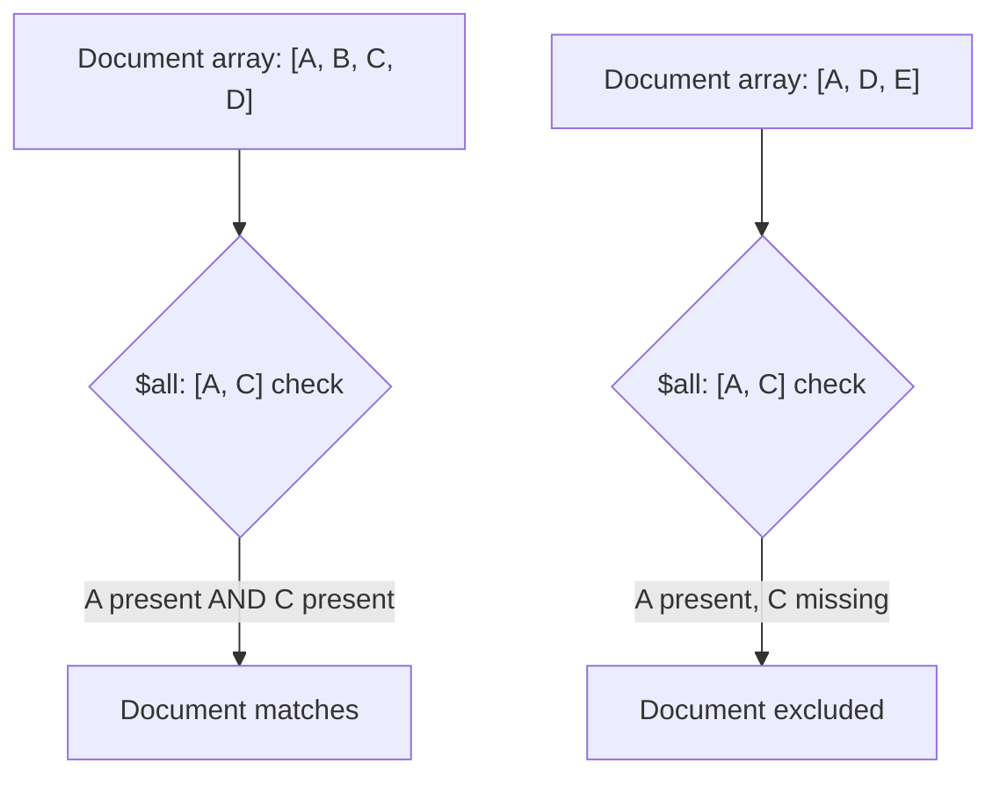

# How to Use $all Operator in MongoDB to Match Array Elements

Author: [nawazdhandala](https://www.github.com/nawazdhandala)

Tags: MongoDB, $all, Array, Query, Operator

Description: Learn how to use MongoDB's $all operator to find documents where an array field contains all specified values, regardless of order or additional elements.

---

## How $all Works

The `$all` operator matches documents where the value of a field is an array that contains all the specified elements. The array may contain additional elements beyond those specified - what matters is that every element in the `$all` list is present in the document's array. Order does not matter.



## Syntax

```javascript
{ field: { $all: [value1, value2, ...] } }
```

## Basic Example

Find articles that have all specified tags:

```javascript
db.articles.insertMany([
  { title: "Intro to MongoDB", tags: ["mongodb", "nosql", "database"] },
  { title: "MongoDB Performance", tags: ["mongodb", "performance", "indexing"] },
  { title: "SQL vs NoSQL", tags: ["sql", "nosql", "database"] }
])

// Find articles tagged with BOTH "mongodb" AND "nosql"
db.articles.find({ tags: { $all: ["mongodb", "nosql"] } })
```

This returns only "Intro to MongoDB" because "MongoDB Performance" has "mongodb" but not "nosql".

## $all vs $in Comparison

```javascript
// $in: matches if the array contains AT LEAST ONE of the specified values
db.articles.find({ tags: { $in: ["mongodb", "nosql"] } })
// Returns all 3 documents

// $all: matches only if the array contains ALL specified values
db.articles.find({ tags: { $all: ["mongodb", "nosql"] } })
// Returns only "Intro to MongoDB"
```

## Matching Exact Array Contents

To find documents with an array that contains exactly the specified elements (no more, no less), combine `$all` with `$size`:

```javascript
// Find documents where tags is exactly ["mongodb", "nosql"]
db.articles.find({
  tags: { $all: ["mongodb", "nosql"] },
  tags: { $size: 2 }
})
```

Note: In practice, use `$eq` on the array for exact matching:

```javascript
// Exact array match (order matters)
db.articles.find({ tags: ["mongodb", "nosql"] })

// Exact array match regardless of order - use $all + $size
db.articles.find({
  $and: [
    { tags: { $all: ["mongodb", "nosql"] } },
    { tags: { $size: 2 } }
  ]
})
```

## Using $all with $elemMatch

Combine `$all` and `$elemMatch` when the array contains embedded documents:

```javascript
db.courses.insertMany([
  {
    title: "Web Development Bootcamp",
    requirements: [
      { skill: "HTML", level: "beginner" },
      { skill: "CSS", level: "beginner" },
      { skill: "JavaScript", level: "intermediate" }
    ]
  }
])

// Find courses requiring HTML at beginner level AND JavaScript at intermediate level
db.courses.find({
  requirements: {
    $all: [
      { $elemMatch: { skill: "HTML", level: "beginner" } },
      { $elemMatch: { skill: "JavaScript", level: "intermediate" } }
    ]
  }
})
```

## Querying for All of a Single Value

Using `$all` with a single-element array is functionally equivalent to a simple equality check on the array:

```javascript
// These are equivalent
db.articles.find({ tags: "mongodb" })
db.articles.find({ tags: { $all: ["mongodb"] } })
```

## Combining $all with Other Operators

```javascript
// Find active products with all required certifications
db.products.find({
  status: "active",
  certifications: { $all: ["ISO-9001", "CE", "FCC"] }
})

// Find users who have all required permissions
db.users.find({
  active: true,
  permissions: { $all: ["read", "write", "admin"] }
})
```

## Use Cases

- Finding articles or products with all required tags
- Checking if a user has all required roles or permissions
- Verifying a checklist where all items must be present
- Finding orders containing all specified product IDs
- Querying configuration documents that include all required feature flags

## Summary

The `$all` operator finds documents where an array field contains every element in the specified list, regardless of array order or extra elements. It is the AND equivalent for array membership checks, compared to `$in` which is the OR equivalent. For matching embedded objects in arrays, combine `$all` with `$elemMatch` inside the array. Use `$all` with `$size` when you need to ensure the array contains exactly and only the specified elements.
