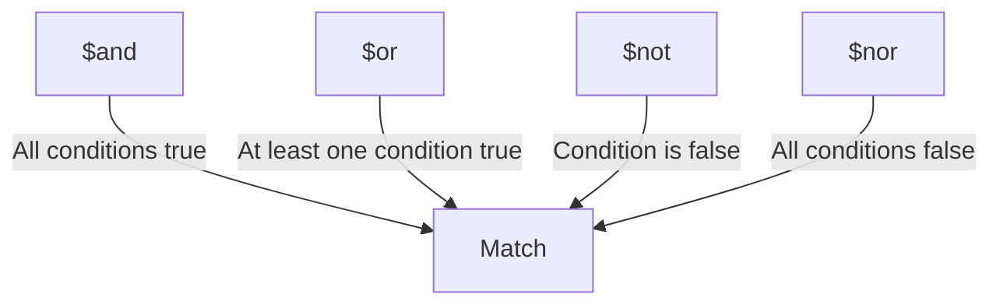

# How to Use $and, $or, $not, $nor in MongoDB Queries

Author: [nawazdhandala](https://www.github.com/nawazdhandala)

Tags: MongoDB, $and, $or, $not, $nor, Query, Logical Operator

Description: Learn how to combine query conditions in MongoDB using logical operators $and, $or, $not, and $nor for building complex filter expressions.

---

## How Logical Operators Work

MongoDB's logical operators let you combine multiple query conditions into a single filter. They accept an array of conditions (or a single condition for `$not`) and return documents based on the logical result.



## $and Operator

`$and` returns documents where all specified conditions are true. MongoDB evaluates conditions from left to right and short-circuits on the first false condition.

The explicit `$and` is necessary when you need to apply multiple conditions on the same field:

```javascript
// Explicit $and - required when same field appears multiple times
db.products.find({
  $and: [
    { price: { $gte: 10 } },
    { price: { $lte: 100 } }
  ]
})
```

For conditions on different fields, implicit AND (comma-separated) is equivalent and more readable:

```javascript
// Implicit AND (shorthand) - preferred for different fields
db.users.find({
  status: "active",
  role: "admin",
  emailVerified: true
})
```

When you need multiple conditions on the same operator, use explicit `$and`:

```javascript
// Find documents matching two separate $or conditions simultaneously
db.products.find({
  $and: [
    { $or: [{ category: "Electronics" }, { category: "Computers" }] },
    { $or: [{ inStock: true }, { backorderAvailable: true }] }
  ]
})
```

## $or Operator

`$or` returns documents where at least one of the specified conditions is true:

```javascript
// Find users who are admin OR whose account is premium
db.users.find({
  $or: [
    { role: "admin" },
    { accountType: "premium" }
  ]
})
```

Combining `$or` with other conditions:

```javascript
db.orders.find({
  customerId: ObjectId("64a1b2c3d4e5f6789012345a"),
  $or: [
    { status: "pending" },
    { status: "processing" },
    { priority: "high" }
  ]
})
```

## $not Operator

`$not` inverts the effect of a condition. It returns documents that do not match the given expression, including documents where the field does not exist:

```javascript
// Find products NOT priced above $100
db.products.find({
  price: { $not: { $gt: 100 } }
})

// Equivalent to $lte: 100 plus documents without a price field
```

`$not` can also be used with regular expressions:

```javascript
// Find emails not ending in @gmail.com
db.users.find({
  email: { $not: /gmail\.com$/ }
})
```

## $nor Operator

`$nor` returns documents where none of the specified conditions are true. It is the inverse of `$or`:

```javascript
// Find users who are neither admin nor banned
db.users.find({
  $nor: [
    { role: "admin" },
    { status: "banned" }
  ]
})
```

`$nor` also matches documents where the field does not exist:

```javascript
// Matches docs where deletedAt doesn't exist OR deletedAt is not a real date
db.records.find({
  $nor: [
    { deletedAt: { $exists: true } }
  ]
})
```

## Nesting Logical Operators

Logical operators can be nested for complex conditions:

```javascript
db.products.find({
  $and: [
    {
      $or: [
        { brand: "Apple" },
        { brand: "Samsung" }
      ]
    },
    {
      $or: [
        { category: "Phone" },
        { category: "Tablet" }
      ]
    },
    { price: { $lt: 1000 } }
  ]
})
```

## Operator Comparison

```text
Operator  | Returns documents where...
----------|-------------------------------------------
$and      | ALL conditions are true
$or       | AT LEAST ONE condition is true
$not      | The condition is FALSE (inverts one condition)
$nor      | NONE of the conditions are true
```

## Use Cases

- `$and`: Validating multiple required business rules simultaneously
- `$or`: Searching across multiple fields (name, email, phone)
- `$not`: Excluding a pattern or range from results
- `$nor`: Ensuring a document falls outside multiple forbidden states

## Summary

MongoDB's logical operators enable you to construct complex, multi-condition queries. Use implicit AND for simple multi-field filters, explicit `$and` when you need multiple conditions on the same field or operator, `$or` for at-least-one matching, `$not` to invert a single condition, and `$nor` to require all conditions to be false. These operators can be nested to any depth, allowing arbitrarily complex query logic.
